<div align="center">

# PCIe Transaction Layer — Request/Response Verification

### A beginner-friendly tour of a PCIe-style packet protocol — built in SystemVerilog, verified with UVM


</div>

---

## How to read this

No hardware background needed. Part 1 is a 5-minute tour; Part 2 is an optional deep dive into every mechanism. Every diagram uses the same color code:

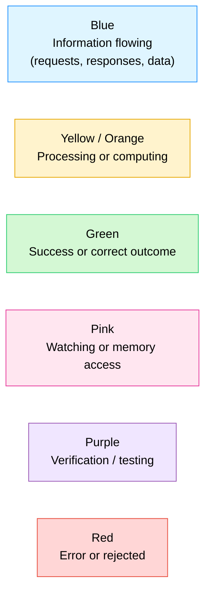

> [!NOTE]
> Real PCIe (Peripheral Component Interconnect Express) is the high-speed highway inside a computer connecting the CPU to graphics cards, SSDs, and network cards. It's a huge spec with multiple layers. This project models **one simplified slice** of it — the Transaction Layer — just enough to learn the single hardest thing about verifying it: **responses can come back late, and out of order.**

## Explain it like I'm 10

Picture a busy restaurant. You don't stand at the counter waiting — you place your order, get handed a **buzzer with a number on it**, and go sit down. The kitchen cooks everyone's food in whatever order is fastest, not necessarily the order people ordered in. When a buzzer goes off, you know it's *your* food because of the **number**, not because of *when* you ordered.

PCIe completions work exactly like that:

1. **You (the CPU)** send a request — "read this address" or "write this data" — labeled with a **tag** (the buzzer number).
2. **The device (DUT)** works on it and replies later, whenever it's ready — maybe quickly, maybe slowly, maybe before someone else's order that was placed earlier.
3. **The checker (scoreboard)** never assumes "the next response belongs to the next request." It always looks at the tag.

> [!NOTE]
> This single idea — *match by tag, never by order* — is the whole point of this project. Get comfortable with it and the rest of this README is just plumbing.

---

## The big picture

```mermaid
flowchart LR
    A["Test Sequence\n(the orders to place)"] --> B["Driver\n(places one order\nat a time)"]
    B --> C["PCIe DUT\n(the kitchen)"]
    C --> D["Response\n(food + buzzer number)"]
    B -.watched by.-> M["Monitor\n(neutral observer)"]
    D -.watched by.-> M
    M --> SB["Scoreboard\n(matches by tag,\nchecks the answer)"]
    SB --> R{"Correct?"}
    R -->|Yes| PASS["PASS"]
    R -->|No| FAIL["FAIL + exact mismatch"]

    style A fill:#f0e6ff,stroke:#9b59b6,color:#000
    style B fill:#dff5ff,stroke:#1e90ff,color:#000
    style C fill:#fff3cd,stroke:#e6a700,color:#000
    style D fill:#dff5ff,stroke:#1e90ff,color:#000
    style M fill:#ffe6f0,stroke:#e6399b,color:#000
    style SB fill:#f0e6ff,stroke:#9b59b6,color:#000
    style PASS fill:#d4f8d4,stroke:#2ecc71,color:#000
    style FAIL fill:#ffd6d6,stroke:#e74c3c,color:#000
```

---

## What's in this folder

Just two files — small on the outside, dense on the inside.

| File | Role |
|---|---|
| [`design.sv`](design.sv) | The **interface** (the wiring between tester and device) + the **DUT** — a toy PCIe-style memory device that accepts requests and sends back delayed, sometimes out-of-order, responses. |
| [`testbench.sv`](testbench.sv) | The entire **UVM environment** — sequence, driver, monitor, scoreboard, coverage — plus `tb_top`, which wires everything together and starts the simulation. |

| Inside `design.sv` | Lines | What it is |
|---|---|---|
| `interface pcie_tlp_if` | [design.sv:18-75](design.sv#L18-L75) | The shared wires + two clocking blocks |
| `module pcie_tlp_dut` | [design.sv:89-251](design.sv#L89-L251) | The "kitchen" — memory, rule-checking, delayed responses |

| Inside `testbench.sv` | Lines | What it is |
|---|---|---|
| `pcie_tlp` (sequence item) | [testbench.sv:27-85](testbench.sv#L27-L85) | One randomized order |
| `pcie_tlp_rsp` (response item) | [testbench.sv:92-120](testbench.sv#L92-L120) | One observed reply |
| `pcie_tlp_driver` | [testbench.sv:142-220](testbench.sv#L142-L220) | Places orders on the wire |
| `pcie_tlp_monitor` | [testbench.sv:227-313](testbench.sv#L227-L313) | Watches the wires, reports what really happened |
| `pcie_tlp_coverage` | [testbench.sv:320-383](testbench.sv#L320-L383) | Checklist of "did we test enough variety?" |
| `pcie_tlp_scoreboard` | [testbench.sv:406-650](testbench.sv#L406-L650) | The tag-matching judge |
| `pcie_tlp_agent` / `pcie_tlp_env` | [testbench.sv:655-717](testbench.sv#L655-L717) | Wires driver+monitor, then scoreboard+coverage, together |
| `pcie_tlp_main_seq` | [testbench.sv:728-867](testbench.sv#L728-L867) | The actual test script — what orders get placed |
| `tb_top` | [testbench.sv:913-960](testbench.sv#L913-L960) | Clock, reset, and "go" button |

---

## Concept 1 — What is a TLP?

A **TLP (Transaction Layer Packet)** is one sealed "order ticket" sent over PCIe. This project supports two kinds:

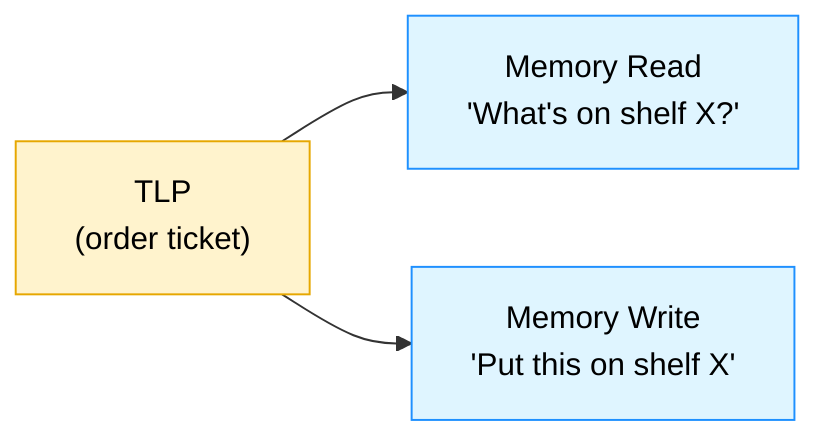

Every ticket carries:

| Field | Meaning | Everyday version |
|---|---|---|
| `tlp_type` | Read or Write | What kind of order |
| `addr` | Memory address | Which shelf |
| `length_dw` | Length in DW (1 DW = 4 bytes = 32 bits) | How many boxes |
| `tag` | An 8-bit ID, chosen by the sender | The buzzer number |
| `payload` | Data, only present on writes | What's inside the boxes |
| `malformed` | "This ticket is deliberately broken" | A torn-up order slip |

A response carries far less: just `tag`, `status` (OK or ERROR), and — for reads — the data that was found.

---

## Concept 2 — The interface: two channels, two clocking blocks

[`pcie_tlp_if`](design.sv#L18-L75) is the bundle of wires connecting tester and device. It has a **request channel** (tester to device) and a **response channel** (device to tester), plus a `valid`/`ready` handshake on the request side — the tester only places an order when it has one (`valid`), the kitchen only accepts it when free (`ready`).

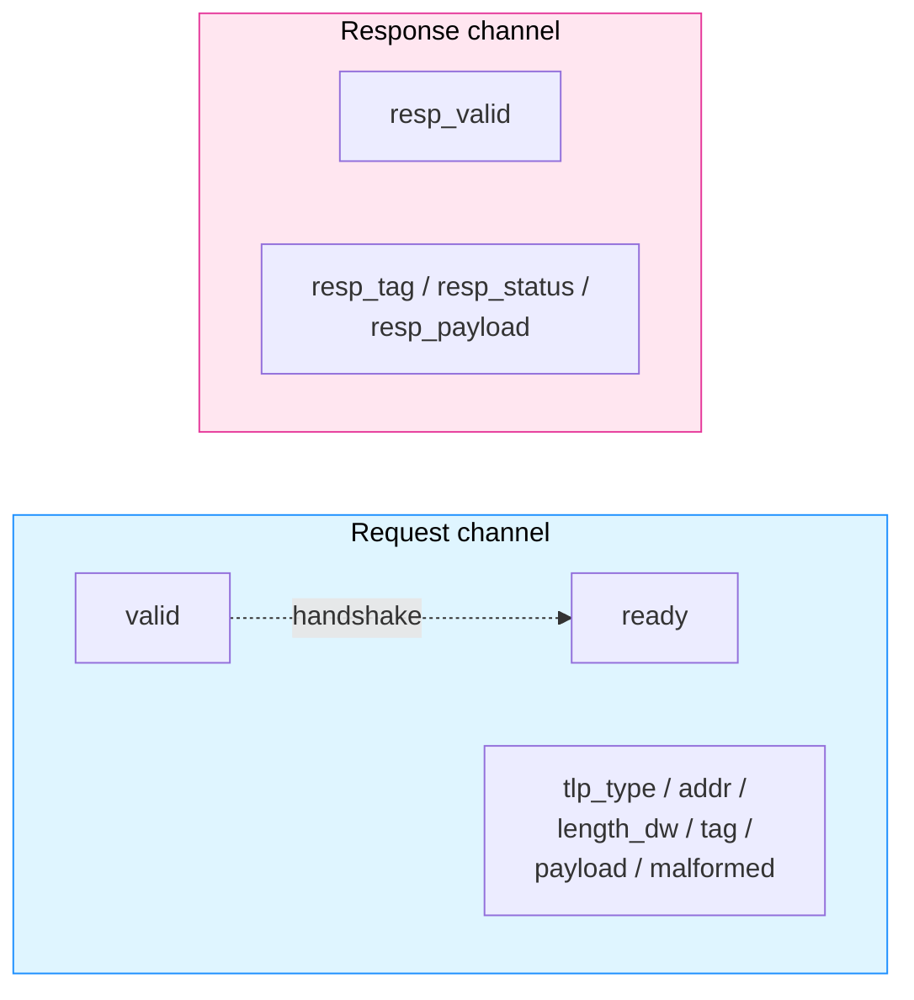

Two **clocking blocks** keep the driver and the monitor from racing the clock edge:

- `drv_cb` — the driver only *drives* through this. Outputs change a hair after the clock tick, inputs are sampled a hair before — so there's never any ambiguity about which value "wins" right at the edge.
- `mon_cb` — read-only. The monitor only ever watches through this; it can never accidentally drive a signal.

---

## Concept 3 — The DUT: a toy PCIe device

[`pcie_tlp_dut`](design.sv#L89-L251) is the "kitchen." It holds a 256-word memory (`mem[0:255]`) and reacts to every accepted request in three steps.

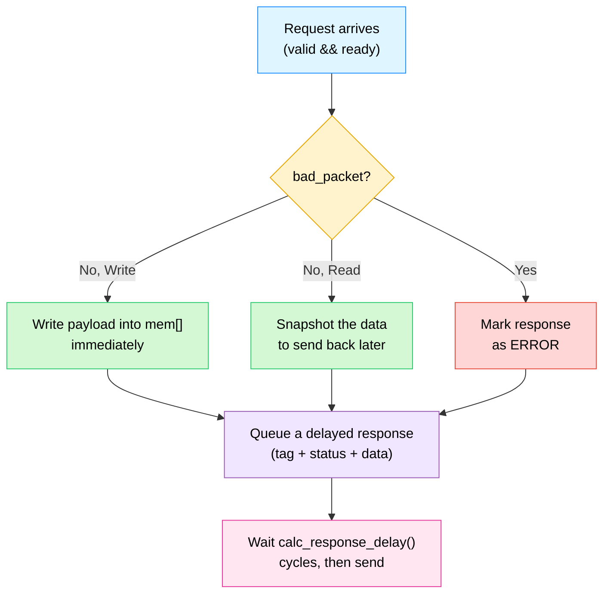

**What makes a packet "bad"** ([design.sv:119-125](design.sv#L119-L125)) — any one of these is enough:

| Rule | Why |
|---|---|
| `malformed` bit set | The tester deliberately marked it broken |
| `addr[1:0] != 00` | Address isn't on a 4-byte boundary — shelves only exist at multiples of 4 |
| `length_dw == 0` | An order for zero boxes makes no sense |
| `length_dw > 32` | Bigger than the 1024-bit payload bus can carry (32 DW x 32 bits = 1024 bits) |
| Unknown `tlp_type` | Not a recognized order type |

**Why responses are delayed and can overtake each other** — real devices don't answer instantly, and don't necessarily answer in the order they were asked. This DUT models both, on purpose, via [`calc_response_delay()`](design.sv#L129-L144):

```systemverilog
delay_value = 4'(1 + (tag[2:0] % 5));   // 1 to 5 cycles, depends on the tag
if (tlp_type == TLP_MEM_RD)
  delay_value = delay_value + 1;         // reads take a little longer than writes
```

The DUT can juggle **up to 16 orders at once** (`pending_rsp[0:15]`) and, when several are ready in the same cycle, it deliberately scans from the highest slot to the lowest — one more nudge away from "first in, first out."

---

## Concept 4 — The UVM pieces, end to end

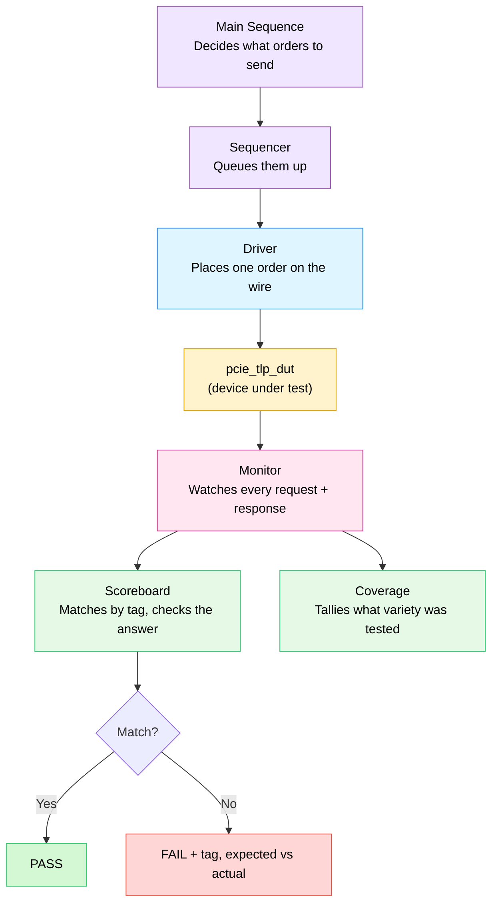

| Block | Job |
|---|---|
| **Sequence** | Writes the test script — a handful of directed orders, then 80 randomized ones. |
| **Sequencer** | Queue between sequence and driver. |
| **Driver** | Drives one `pcie_tlp` onto the interface, waits for `ready`, repeats. |
| **Monitor** | Independently watches the wires; builds its own record of every request and response. |
| **Scoreboard** | Keeps a shadow memory and an "outstanding orders" table keyed by tag; checks every reply. |
| **Coverage** | Confirms testing actually hit reads, writes, short/long packets, aligned/misaligned addresses, good and bad packets. |

---

## Concept 5 — Why matching by tag is the whole point

Three directed reads in [the main sequence](testbench.sv#L777-L814) prove it. Same address, three different tags, sent back-to-back:

| Sent | Tag | `calc_response_delay()` | Arrives after |
|---|---|---|---|
| 1st | `0x13` | `1 + (3 % 5) + 1` (read) | **5** cycles |
| 2nd | `0x10` | `1 + (0 % 5) + 1` (read) | **2** cycles |
| 3rd | `0x11` | `1 + (1 % 5) + 1` (read) | **3** cycles |

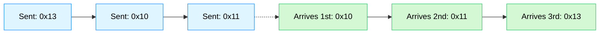

Sent order: `0x13, 0x10, 0x11`. Arrival order: `0x10, 0x11, 0x13`. A scoreboard that assumed "replies come back in the order I sent them" would mismatch every single one. The real [`pcie_tlp_scoreboard`](testbench.sv#L406-L650) never makes that assumption — it keeps an `outstanding[tag]` table and looks up the tag on every response, so the shuffled order doesn't matter at all.

---

## Full end-to-end flow

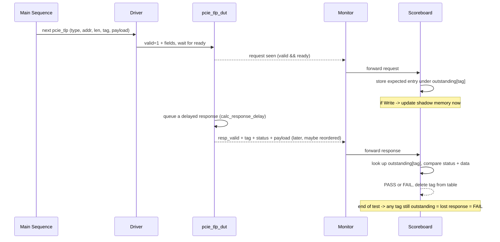

---

## What the test actually does

| # | Scenario | Purpose |
|---|---|---|
| 1 | Directed write, 4 DW to address `0x40` | Basic write path |
| 2 | Directed read of the same address | Confirms the read sees what the write stored |
| 3 | Three reads, same address, tags `0x13`/`0x10`/`0x11` | Forces out-of-order completions ([Concept 5](#concept-5--why-matching-by-tag-is-the-whole-point)) |
| 4 | Write to an unaligned address (`0x43`) | Confirms a malformed packet is rejected with `ERROR` |
| 5 | Read with `length_dw = 0` | Confirms another malformed rule is caught |
| 6 | 80 randomized packets, unique sequential tags | Broad stress test — mixes reads, writes, valid and malformed traffic |

---

## Functional coverage

Passing every test only proves the packets you *tried* were handled correctly. Coverage tracks whether you tried enough variety in the first place ([testbench.sv:329-361](testbench.sv#L329-L361)):

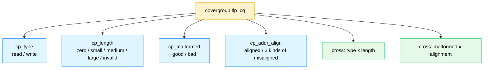

The cross coverage is what catches gaps the simple coverpoints miss — e.g. you could hit "malformed" and "misaligned" often separately while never once testing a packet that's *both* a misaligned address *and* an otherwise-valid write.

---

## Why build this

Real PCIe completions genuinely do return out of order — that's not a simplification for teaching purposes, it's how the real protocol behaves under load. The hardest, most realistic part of verifying any tag-based protocol (PCIe, AXI with multiple outstanding transactions, any request/response bus) is exactly the discipline this project drills: **never trust order, always trust the ID.** Everything else here — the interface, the driver, the delayed DUT — exists to create a believable situation where that discipline actually gets tested.

---
---

# PART 2 — The Deep Dive

> Part 1 above is the tour. Below is a section-by-section walk through every mechanism in this design and its testbench.

### Table of contents

0. [Tiny foundations — DW, tags, and handshakes](#0-tiny-foundations--dw-tags-and-handshakes)
1. [The interface, in depth](#1-the-interface-in-depth)
2. [The DUT, in depth](#2-the-dut-in-depth)
3. [The sequence item & its constraints, in depth](#3-the-sequence-item--its-constraints-in-depth)
4. [The driver, in depth](#4-the-driver-in-depth)
5. [The monitor, in depth](#5-the-monitor-in-depth)
6. [The scoreboard's tag table, in depth](#6-the-scoreboards-tag-table-in-depth)
7. [Functional coverage, in depth](#7-functional-coverage-in-depth)
8. [The test script, line by line](#8-the-test-script-line-by-line)
9. [Worked example — tracing the out-of-order burst](#9-worked-example--tracing-the-out-of-order-burst)
10. [Glossary](#10-glossary)

---

## 0. Tiny foundations — DW, tags, and handshakes

> [!IMPORTANT]
> If "DWORD," "tag," and "valid/ready handshake" already feel comfortable, skip to [§1](#1-the-interface-in-depth).

**A DW (DWORD)** is 4 bytes = 32 bits — the basic unit PCIe measures packet length in. `length_dw = 4` means "4 lots of 32 bits," i.e. 16 bytes.

**A tag** is just a number the requester picks and stamps on its own request — not assigned by the device. The only rule (enforced by [the scoreboard](#6-the-scoreboards-tag-table-in-depth)) is: don't reuse a tag while a request using it is still waiting for its response. As long as that holds, the device is free to answer in any order.

**A valid/ready handshake** is how two sides agree "a transfer happened" without a shared clock-perfect schedule:

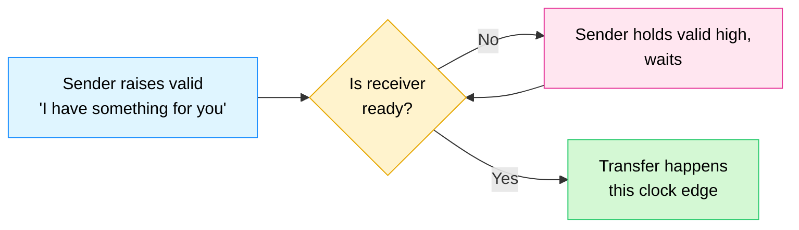

Both sides can independently decide when they're ready — neither is ever forced to act before it's able to.

---

## 1. The interface, in depth

[`pcie_tlp_if`](design.sv#L18-L75) takes a single input — `clk` — and exposes everything else as wires shared between tester and DUT.

**Request channel fields:**

| Signal | Width | Meaning |
|---|---|---|
| `valid` / `ready` | 1 bit each | The handshake |
| `tlp_type` | 2 bits | `0` = Memory Read, `1` = Memory Write |
| `addr` | 32 bits | Byte address |
| `length_dw` | 10 bits | Length, in DWORDs |
| `tag` | 8 bits | Sender-chosen ID |
| `payload` | 1024 bits | Up to 32 DW of write data |
| `malformed` | 1 bit | Deliberate "treat me as broken" flag |

**Response channel fields:** `resp_valid`, `resp_tag`, `resp_status` (0 = OK, 1 = ERROR), `resp_payload`.

**The two clocking blocks** ([design.sv:39-73](design.sv#L39-L73)):

```systemverilog
clocking drv_cb @(posedge clk);
  default input #1step output #1ns;
  output valid, tlp_type, addr, length_dw, tag, payload, malformed;
  input  ready, rst_n;
endclocking
```

`#1step` / `#1ns` is the part doing the actual work: every input the driver reads through `drv_cb` is sampled *just before* the clock edge (`#1step`), and every output it drives lands *just after* (`#1ns`). That ordering guarantees the driver always reads the value the DUT saw on the *previous* cycle and always writes a value the DUT will see cleanly on the *next* one — no race, no guessing about simulation event order. `mon_cb` mirrors the same idea but is 100% `input` — the monitor is structurally incapable of driving anything, which is exactly what you want from a component whose entire job is "watch, never touch."

---

## 2. The DUT, in depth

[`pcie_tlp_dut`](design.sv#L89-L251) is one `always_ff` block plus a couple of helper functions. Internally it carries:

- `mem[0:255]` — 256 words of storage (1 KB, addressed in DWORDs).
- `pending_rsp[0:15]` — up to 16 responses that have been computed but not yet sent, each tagged with how many cycles are left before it should fire.

### Step 1 — every cycle, age the queue

```systemverilog
for (i = 0; i < 16; i++)
  if (pending_rsp[i].valid && pending_rsp[i].delay > 0)
    pending_rsp[i].delay <= pending_rsp[i].delay - 1;
```

### Step 2 — every cycle, maybe fire one response

```systemverilog
for (i = 15; i >= 0; i--)
  if (pending_rsp[i].valid && pending_rsp[i].delay == 0 && send_slot == -1)
    send_slot = i;
```

Scanning **high-to-low** instead of low-to-high is a deliberate, tiny act of "unfairness" — it stops the response order from accidentally always matching the order requests were stored in, which would quietly undermine the whole point of this exercise.

### Step 3 — every cycle, maybe accept one new request

```systemverilog
if (vif.valid && vif.ready) begin
  // good write -> update mem[] right now
  // good read  -> snapshot the data right now (read_payload)
  // either way -> find a free pending_rsp slot, fill it in,
  //               stamp delay = calc_response_delay(tag, tlp_type)
end
```

> [!NOTE]
> Notice the **write itself is never delayed** — only the *response* is. `mem[]` is updated the instant a good write is accepted. This matters for the scoreboard ([§6](#6-the-scoreboards-tag-table-in-depth)): it updates its own shadow memory at the same moment, not when the write's completion eventually arrives.

A **read** is different: the value can't wait, because by the time the delayed response is ready to send, a *later* write might have already changed that same address. So the read snapshots `read_payload` from `mem[]` **at request time**, freezing in the answer the instant it's known to be correct — exactly what the scoreboard does too ([§6](#6-the-scoreboards-tag-table-in-depth)).

If all 16 `pending_rsp` slots are full when a new request arrives, the DUT just prints a console error and silently drops the new response — a capacity limit, modeling the fact that no real device buffers infinitely.

---

## 3. The sequence item & its constraints, in depth

[`pcie_tlp`](testbench.sv#L27-L85) is the randomizable order ticket. Its constraint block ([testbench.sv:44-63](testbench.sv#L44-L63)) is worth reading slowly:

```systemverilog
constraint c_packet_shape {
  malformed dist {0 := 85, 1 := 15};   // 15% deliberately broken

  if (!malformed) {
    addr[1:0] == 2'b00;                 // aligned
    length_dw inside {[1:8]};           // sane length
    tlp_type inside {TLP_MEM_RD, TLP_MEM_WR};
  } else {
    length_dw inside {0, [1:8], [33:40]};
    ((addr[1:0] != 2'b00) || (length_dw == 0) || (length_dw > 32));
  }

  if ((tlp_type == TLP_MEM_WR) && (length_dw inside {[1:32]}))
    payload.size() == length_dw;
  else
    payload.size() == 0;
}
```

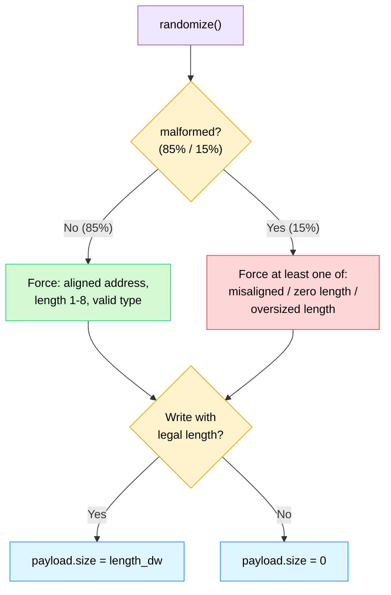

Why force the malformed *cause* explicitly, rather than just setting the `malformed` bit alone? Because the DUT's `bad_packet` check ([§2](#2-the-dut-in-depth)) and the scoreboard's `expected_error()` ([§6](#6-the-scoreboards-tag-table-in-depth)) both look at the *actual field values*, not at some hidden "I meant to be bad" flag — so a malformed packet has to be malformed for a *real, checkable* reason, every time.

---

## 4. The driver, in depth

[`pcie_tlp_driver`](testbench.sv#L142-L220) does three things, forever: get an item, drive it, signal done.

```systemverilog
task run_phase(uvm_phase phase);
  ...
  wait (vif.rst_n == 1'b1);
  forever begin
    seq_item_port.get_next_item(tx);
    drive_one_tlp(tx);
    seq_item_port.item_done();
  end
endtask
```

`drive_one_tlp` ([testbench.sv:194-218](testbench.sv#L194-L218)) packs the item's dynamic `payload[]` array into the fixed 1024-bit bus width (`pack_payload`), raises `valid` with every field set, then **polls** until `ready` appears:

```systemverilog
do begin
  @(vif.drv_cb);
end while (vif.drv_cb.ready !== 1'b1);
```

Only one order is ever in flight from the driver's point of view at a time — it won't fetch the next item until `item_done()`. That's intentional simplicity: the *driver* is sequential, but the *DUT* and *responses* are not, which is exactly the asymmetry this whole project is built to explore.

---

## 5. The monitor, in depth

[`pcie_tlp_monitor`](testbench.sv#L227-L313) is the only component allowed to declare "this is what actually happened." It never trusts the driver's intentions — only the wires.

```systemverilog
task run_phase(uvm_phase phase);
  forever begin
    @(vif.mon_cb);
    if (vif.mon_cb.rst_n) begin
      if (vif.mon_cb.valid && vif.mon_cb.ready) capture_request();
      if (vif.mon_cb.resp_valid)                capture_response();
    end
  end
endtask
```

Both checks run **every single cycle**, independently — a request and a response can be seen in the *same* cycle (one TLP being accepted while a completely different one's reply fires), and the monitor catches both without missing either. `capture_request()` rebuilds a fresh `pcie_tlp` object straight from the wires (not a copy of whatever the driver had); `capture_response()` does the same for replies. Each is pushed out through its own `uvm_analysis_port` (`req_ap`, `rsp_ap`) — broadcast to anyone listening, which today means the scoreboard and (for requests only) the coverage collector.

---

## 6. The scoreboard's tag table, in depth

This is the heart of the whole project. [`pcie_tlp_scoreboard`](testbench.sv#L406-L650) runs two parallel loops:

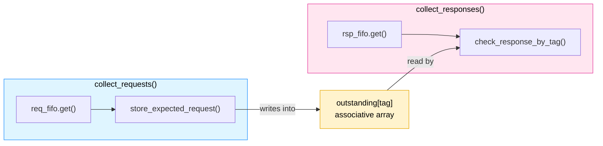

### On every request — `store_expected_request()` ([testbench.sv:510-554](testbench.sv#L510-L554))

1. Recompute, independently, whether this packet *should* error — `expected_error()` ([testbench.sv:459-467](testbench.sv#L459-L467)) checks the exact same five rules the DUT does, in a completely separate piece of code.
2. If it's a good read, precompute the expected payload **right now**, from the scoreboard's own shadow memory (`exp_mem`) — mirroring the DUT's "snapshot at request time" behavior ([§2](#2-the-dut-in-depth)).
3. If it's a good write, update `exp_mem` **right now** too — same reasoning.
4. File the whole thing under `outstanding[req.tag]`. If that tag is already occupied, that's an error by itself — a tag must never be reused while its previous request is still in flight.

### On every response — `check_response_by_tag()` ([testbench.sv:556-625](testbench.sv#L556-L625))

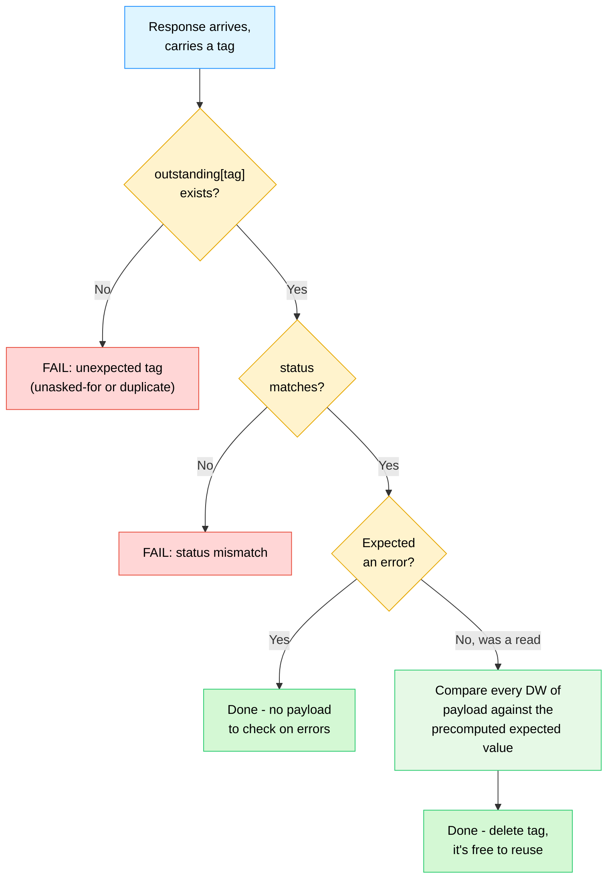

Notice the lookup is `outstanding[rsp.tag]` — never an index, never a queue position. The order responses physically arrive in literally cannot affect this logic, by construction.

### At the end of the test — `report_phase()` ([testbench.sv:627-648](testbench.sv#L627-L648))

If anything is still sitting in `outstanding` when the test ends, that's a **lost response** — a request that was accepted but never answered — and it's reported as an error even though no single response was ever "wrong." This is the only way to catch a silently-dropped reply.

---

## 7. Functional coverage, in depth

[`pcie_tlp_coverage`](testbench.sv#L320-L383) is a `uvm_subscriber` — it listens to the same `req_ap` the scoreboard does, but only to count, never to judge.

```systemverilog
function void write(pcie_tlp t);
  cov_type      = t.tlp_type;
  cov_length_dw = t.length_dw;
  cov_malformed = t.malformed;
  cov_addr_lsb  = t.addr[1:0];
  tlp_cg.sample();
endfunction
```

Each coverpoint buckets one field into named bins (e.g. `cp_length` has `zero_len`, `small_len {[1:2]}`, `medium_len {[3:8]}`, `large_len {[9:32]}`, `invalid_len {[33:1023]}`); a bin counts as covered the first time it's hit, no matter how many more times after. The two **cross** coverpoints (`type x length`, `malformed x alignment`) exist because the individual coverpoints can each look 100% covered while still missing realistic *combinations* — e.g. plenty of misaligned packets and plenty of malformed packets, but never one packet that's misaligned *and* otherwise well-formed in every other field.

---

## 8. The test script, line by line

[`pcie_tlp_main_seq`](testbench.sv#L728-L867) is a flat list, run top to bottom:

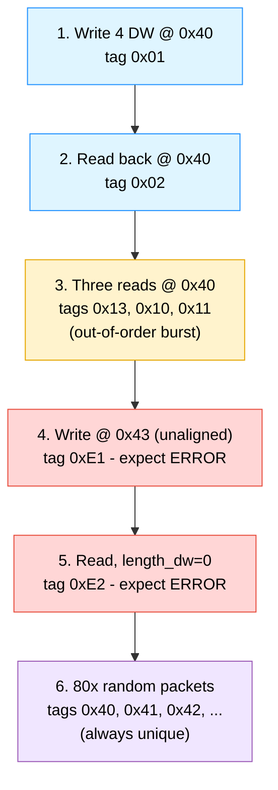

Step 6's tags start at `0x40` and increment by one **every single iteration**, regardless of what randomize() picked — a deliberate side-step around the "never reuse an outstanding tag" rule, since with up to 16 requests potentially in flight at once, randomly picking tags could otherwise collide.

---

## 9. Worked example — tracing the out-of-order burst

Walking through scenario 3 from [§8](#8-the-test-script-line-by-line) end to end:

| Step | What happens |
|---|---|
| Send | `tag=0x13` request goes out, accepted by DUT |
| Send | `tag=0x10` request goes out, accepted next |
| Send | `tag=0x11` request goes out, accepted next |
| Scoreboard | All three filed: `outstanding[0x13]`, `outstanding[0x10]`, `outstanding[0x11]`, each with its expected read data already snapshotted |
| DUT internally | Computes delays — `0x13` -> 5 cycles, `0x10` -> 2 cycles, `0x11` -> 3 cycles ([Concept 5](#concept-5--why-matching-by-tag-is-the-whole-point)) |
| Response arrives | `tag=0x10` first — scoreboard looks up `outstanding[0x10]`, checks it, deletes it |
| Response arrives | `tag=0x11` next — same process against `outstanding[0x11]` |
| Response arrives | `tag=0x13` last — same process against `outstanding[0x13]` |
| End of test | `outstanding` table is empty -> nothing lost -> PASS |

At no point does the scoreboard ever ask "is this the response I expected *next*?" — only "is this tag in my table, and does its data match what I precomputed for it?" That question has the same answer no matter what order the three responses arrive in, which is the entire reason this design is correct.

---

## 10. Glossary

| Term | Plain meaning |
|---|---|
| **TLP** | Transaction Layer Packet — one request or response "envelope" |
| **DW / DWORD** | 4 bytes / 32 bits — PCIe's unit of length |
| **Tag** | Sender-chosen ID linking a response back to its request |
| **Completion** | PCIe's name for a response to a request |
| **Outstanding** | Sent, but not yet answered |
| **Malformed** | Deliberately or accidentally breaks a packet-shape rule |
| **Scoreboard** | The independent judge that recomputes the right answer and compares |
| **Coverage** | A tally of which kinds of packets were actually tried |
