<div align="center">

# RISC-V 5-Stage Pipelined CPU

### A beginner-friendly tour of a real CPU — built in SystemVerilog, verified with UVM


-orange?style=for-the-badge)


</div>

---

## How to read this

No hardware background needed. Part 1 is a 5-minute tour; Part 2 is an optional deep dive into every mechanism. Every diagram uses the same color code:

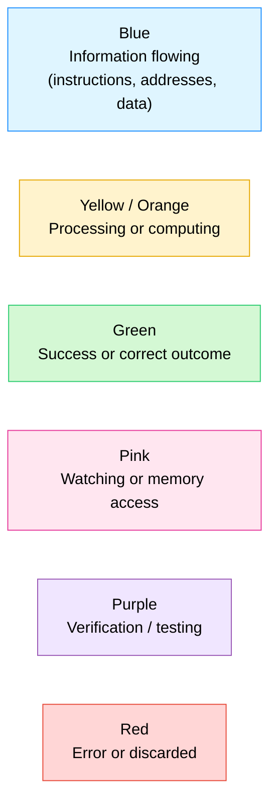

## Explain it like I'm 10

A CPU is a tiny, literal-minded factory worker: you hand it instructions written as 1s and 0s, and it does exactly what they say — add these numbers, save this value, jump elsewhere if two numbers match. This repository has two halves:

1. **A CPU** (`riscv_core.sv`) — reads instructions and executes them, five at a time, assembly-line style.
2. **A robotic inspector** (the UVM testbench) — watches everything the CPU does, independently redoes the math, and raises an alarm the instant the two disagree.

> [!NOTE]
> Like checking a calculator's answer by doing the sum yourself — except the inspector re-checks every single instruction, automatically, thousands of times a second.

---

## The big picture

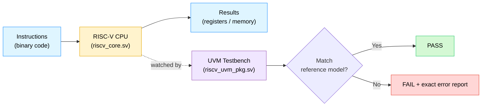

---

## What's in this folder

| File | Role |
|---|---|
| [`riscv_pkg.sv`](riscv_pkg.sv) | Helper functions that build 32-bit instructions and decode their fields. |
| [`riscv_core.sv`](riscv_core.sv) | The CPU itself — pipeline, register file, ALU, built-in self-checks. |
| [`cpu_mem_if.sv`](cpu_mem_if.sv) | Instruction + data memory and the wires the CPU plugs into. |
| [`riscv_uvm_pkg.sv`](riscv_uvm_pkg.sv) | The UVM testbench — generates programs, watches output, judges pass/fail. |
| [`tb_top.sv`](tb_top.sv) | Top-level: wires the CPU to memory and starts the testbench. |

---

## Concept 1 — Pipelining

A non-pipelined CPU finishes one instruction completely before starting the next — one chef cooking an entire meal alone. This CPU uses **5 stages**, like 5 chefs on an assembly line, each doing one job and passing the dish down.

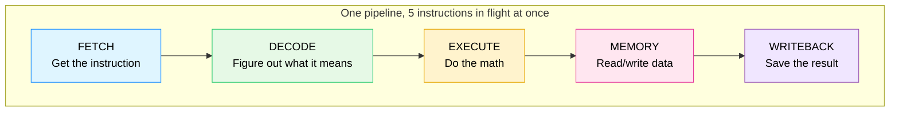

Roughly 5x faster than one instruction at a time — but it creates a new problem: what if instruction 2 needs an answer instruction 1 hasn't finished computing yet?

---

## Concept 2 — Hazards

**Data hazard -> forwarding.** *"I need the value you just calculated — don't make me wait for you to write it down, just hand it to me directly."*

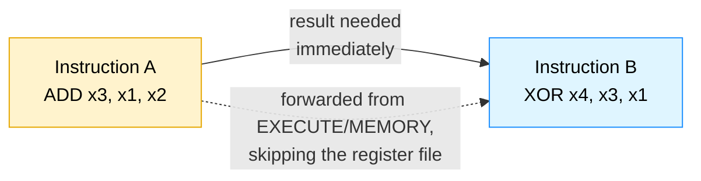

**Load-use hazard -> 1-cycle stall.** A value coming from memory isn't ready in time to forward, so the pipeline freezes the next instruction for exactly one cycle.

**Control hazard -> flush + redirect.** A branch/jump is only resolved in Execute — by then the wrong next instruction has already been fetched.

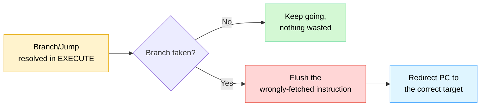

---

## Concept 3 — Exceptions

If handed a nonsense instruction, or an `ecall` ("I'm done"), the CPU doesn't crash — it raises a `trap`, stops retiring new instructions, and halts cleanly.

---

## Concept 4 — UVM, piece by piece

UVM (Universal Verification Methodology) structures a checker out of reusable blocks:

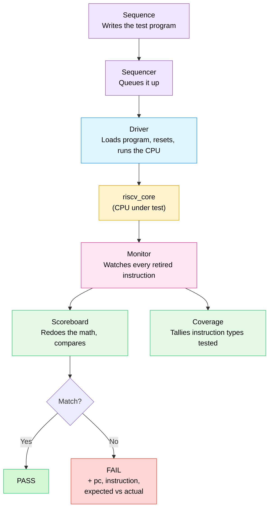

| Block | Job |
|---|---|
| **Sequence** | Decides what program to run — a fixed one (`riscv_directed_seq`) or 25 randomized hazard-triggering patterns (`riscv_random_seq`). |
| **Sequencer** | Queue between sequence and driver. |
| **Driver** | Loads instructions into memory, resets the CPU, runs it until halt or timeout. |
| **Monitor** | Watches the CPU's output pins and records every retired instruction. |
| **Scoreboard** | Keeps its own independent model of registers/memory, recomputes the expected result, compares field-by-field. |
| **Coverage** | Checklist tracker confirming random testing hit every instruction type. Target: 90%+. |

---

## Full end-to-end flow


---

## Instruction set

| Category | Instructions | What it does |
|---|---|---|
| Arithmetic / Logic | `ADD`, `SUB`, `AND`, `OR`, `XOR` | Combine two register values |
| Immediate | `ADDI` | Add a constant baked into the instruction |
| Memory | `LW` (load word) | Read 4 bytes from memory into a register |
| Memory | `SW` (store word) | Write a register's value into memory |
| Branch | `BEQ`, `BNE` | Jump if two registers are equal / not equal |
| Jump | `JAL` | Unconditional jump, saving the return address |
| System | `ECALL` | Cleanly halt the CPU |

`x0` is hard-wired to always read `0` — a real RISC-V rule, checked every cycle by a dedicated assertion.

---

## Built-in safety nets (assertions)

On top of the UVM scoreboard, `riscv_core.sv` carries live, always-on checks:

- `x0` never becomes non-zero.
- A branch/jump redirect always lands the PC on the exact target, next cycle.
- A load-use stall freezes the PC for exactly one cycle.
- A load-use stall also freezes the fetched instruction during that cycle.

---

## Why build this

A hands-on way to learn how real CPUs work — not by reading about pipelining and hazards, but by building the actual mechanisms (forwarding, stalls, flushes) and proving, instruction by instruction, that they work. It mirrors how real chip teams verify silicon before it's manufactured: build the design, then build an independent judge smarter than blind trust.

---
---

# PART 2 — The Deep Dive

> Part 1 above is the tour. Below is a detailed, section-by-section walk through every mechanism in this CPU and its testbench.

### Table of contents

**Warm-up**
0. [Tiny foundations — bits, registers, memory, and the clock](#0-tiny-foundations--bits-registers-memory-and-the-clock)

**How the CPU itself works**
1. [The 5 stages, in depth](#1-the-5-stages-in-depth)
2. [Pipeline registers — the conveyor belts between stages](#2-pipeline-registers--the-conveyor-belts-between-stages)
3. [Reading registers & the register file](#3-reading-registers--the-register-file)
4. [Data dependencies & the RAW hazard problem](#4-data-dependencies--the-raw-hazard-problem)
5. [Forwarding, in depth](#5-forwarding-in-depth)
6. [The load-use hazard & stalling, in depth](#6-the-load-use-hazard--stalling-in-depth)
7. [Branching & control flow, in depth](#7-branching--control-flow-in-depth)
8. [Memory ordering](#8-memory-ordering)
9. [Exception handling](#9-exception-handling)
10. [Write-back, in depth](#10-write-back-in-depth)

**How we prove it's correct**
11. [Assertions, in depth](#11-assertions-in-depth)
12. [Functional coverage, in depth](#12-functional-coverage-in-depth)
13. [The UVM testbench, component by component](#13-the-uvm-testbench-component-by-component)
14. [The directed test, instruction by instruction](#14-the-directed-test-instruction-by-instruction)
15. [The random test — all 8 hazard patterns explained](#15-the-random-test--all-8-hazard-patterns-explained)
16. [A full worked example — one pipeline, cycle by cycle](#16-a-full-worked-example--one-pipeline-cycle-by-cycle)

**Wrap-up**
17. [Quick check — test yourself!](#quick-check--test-yourself)
18. [Glossary](#18-glossary)

---

## 0. Tiny foundations — bits, registers, memory, and the clock

> [!IMPORTANT]
> If "register," "clock cycle," and "binary" already feel comfortable, skip to [§1](#1-the-5-stages-in-depth).

**A bit** is the smallest piece of information possible: **0** or **1**, like a light switch that's off or on. A CPU is built entirely out of tiny electronic switches, so it can only ever store and move patterns of 0s and 1s.

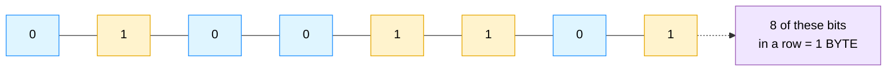

This CPU works with groups of **32 bits at a time** (a **word**): every instruction, every register, every memory address is 32 bits. Different *patterns* of bits mean different things — a number, an instruction, an address — depending on context.

**A register** is a tiny, named storage box holding one 32-bit number, readable/writable almost instantly. This CPU has **32 of them**, named `x0` through `x31` — like 32 small lockers right next to the worker's hands.

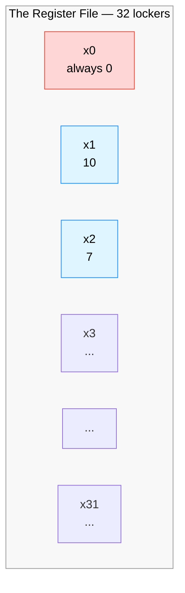

**Memory** is a big warehouse shelf, further away than registers — it holds far more data (this project's toy memory holds 256 words) but takes longer to reach. A CPU pulls data into registers first, works on it there, and only visits memory to `load` (read) or `store` (write).

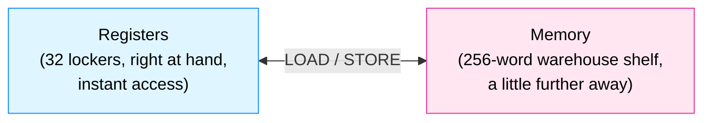

**A clock cycle** is one tick of the CPU's electrical heartbeat (`always #5 clk = ~clk;` in [tb_top.sv](tb_top.sv) — flips every 5 nanoseconds). On every tick, every storage element updates once, then holds still until the next tick. That's why this document keeps saying "cycle 1, cycle 2, cycle 3..." — a cycle is the basic unit of time every diagram below measures.

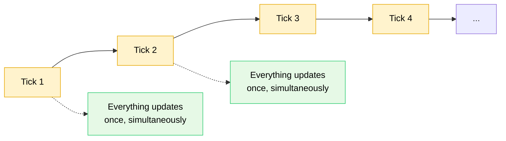

---

## 1. The 5 stages, in depth

Every instruction walks through the **same 5 rooms, in the same order**, one room per clock cycle — like a relay race with 5 runners: once runner 1 (Fetch) hands off the baton, they immediately start again for the *next* instruction, while runner 2 (Decode) carries on with the first.

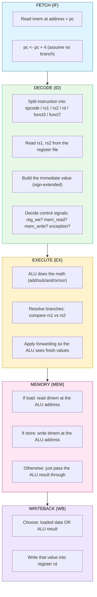

### FETCH (IF) — go get the next instruction

The CPU uses its program counter (`pc` — the address of the instruction about to run) to read one 32-bit word out of instruction memory (`imem`).

**In the code** ([riscv_core.sv:110](riscv_core.sv#L110)):
```systemverilog
assign imem_addr = pc;
```
Fetch is just "point the address bus at `pc`." The capture happens on every clock edge (unless stalled or flushed):
```systemverilog
pc          <= pc + 32'd4;     // move to the next instruction...
if_id_valid <= 1'b1;
if_id_pc    <= pc;             // ...but remember which pc THIS instruction had
if_id_instr <= imem_rdata;     // ...and capture the word that came back
```

Every instruction is exactly 4 bytes wide, so the next one always lives 4 addresses later — unless a branch/jump says otherwise ([§7](#7-branching--control-flow-in-depth)). `pc` is captured alongside the instruction because by the time it reaches later stages, the real `pc` register has already moved on — each stage needs its own copy, which is the whole reason pipeline registers exist ([§2](#2-pipeline-registers--the-conveyor-belts-between-stages)).

### DECODE (ID) — figure out what this instruction is asking for

The raw 32-bit word is taken apart, field by field, and translated into intentions — which registers it reads, which one it writes, what operation, what immediate constant.

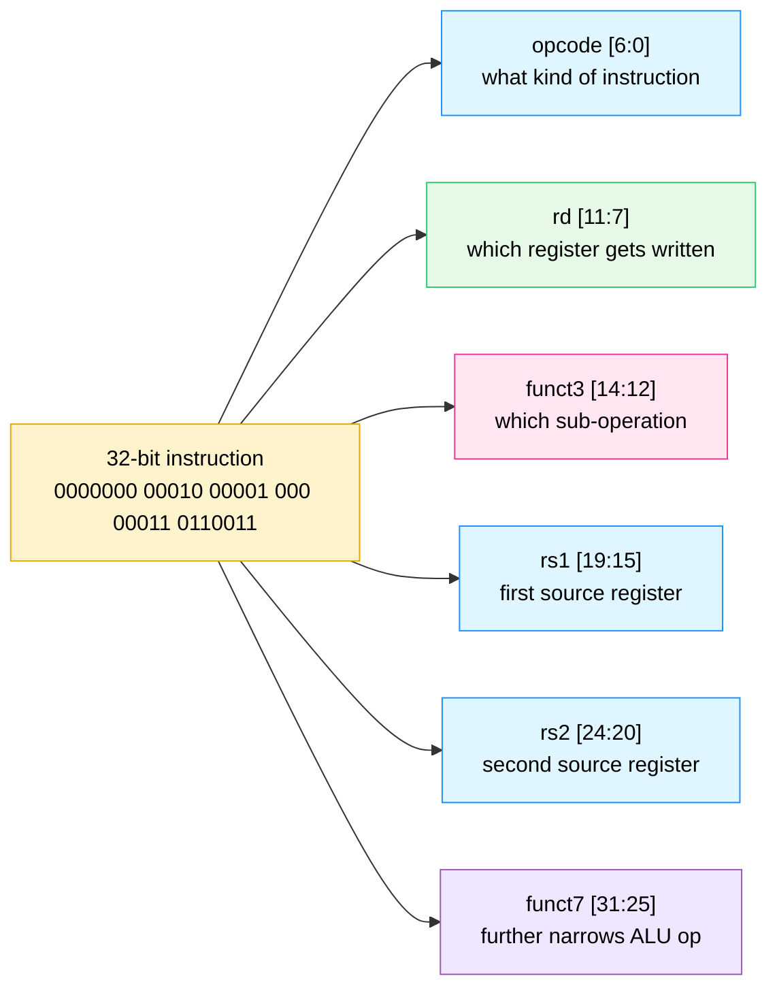

This happens combinationally in [riscv_core.sv:183-220](riscv_core.sv#L183-L220):
- `dec_rs1`/`dec_rs2`/`dec_rd` are plain wire taps off fixed bit positions.
- `decode_op(...)` reads `opcode`+`funct3`+`funct7` together and returns one enum value like `OP_ADD` or `OP_LW`, which the rest of the pipeline switches on instead of re-decoding raw bits everywhere.
- The immediate is rebuilt and sign-extended (`imm_i`, `imm_s`, `imm_b`, `imm_j` in [riscv_pkg.sv](riscv_pkg.sv)) — RISC-V scatters immediate bits around the word to keep `rs1`/`rs2`/`rd` in fixed positions across instruction types, so these functions stitch the bits back into a normal signed number.
- The two source registers are read here, combinationally, via `read_reg_with_wb(dec_rs1)`/`read_reg_with_wb(dec_rs2)` — see [§3](#3-reading-registers--the-register-file) for why.

### EXECUTE (EX) — do the actual math

The ALU (a calculator built out of logic gates) performs the operation this instruction asked for, using values **forwarded** in if necessary (see [§5](#5-forwarding-in-depth)).

From [riscv_core.sv:249-282](riscv_core.sv#L249-L282), the ALU is just one big `case` statement keyed on the operation type:
```systemverilog
case (id_ex_op)
  OP_ADD:  ex_alu_result = ex_rs1_val + ex_rs2_val;
  OP_SUB:  ex_alu_result = ex_rs1_val - ex_rs2_val;
  OP_AND:  ex_alu_result = ex_rs1_val & ex_rs2_val;
  OP_OR:   ex_alu_result = ex_rs1_val | ex_rs2_val;
  OP_XOR:  ex_alu_result = ex_rs1_val ^ ex_rs2_val;
  OP_ADDI: ex_alu_result = ex_rs1_val + id_ex_imm;
  OP_LW:   ex_alu_result = ex_rs1_val + id_ex_imm;   // address calculation!
  OP_SW:   ex_alu_result = ex_rs1_val + id_ex_imm;   // address calculation!
  ...
```
Notice `LW`/`SW` also go through the *adder* here — "load from memory" doesn't have its own special hardware for computing an address, it just reuses the same adder that `ADD`/`ADDI` use (`base register + offset`). This is a classic RISC trick: reuse one ALU for everything instead of building a separate address unit.

This stage is also where **branches are decided** (`OP_BEQ`/`OP_BNE` compare `ex_rs1_val` vs `ex_rs2_val`) and where **JAL's target address** is computed (`id_ex_pc + id_ex_imm`) — see [§7](#7-branching--control-flow-in-depth) for the full story.

### MEMORY (MEM) — touch data memory, if needed

Only `LW` and `SW` do anything here; every other instruction just carries its already-computed ALU result through.

```systemverilog
assign dmem_valid = ex_mem_valid && (ex_mem_mem_read || ex_mem_mem_write);
assign dmem_we    = ex_mem_mem_write;
assign dmem_addr  = ex_mem_alu_result;   // the address EX computed last cycle
assign dmem_wdata = ex_mem_store_data;   // rs2's value, captured back in EX
```
A **store** writes `ex_mem_store_data` (rs2's value, captured back in EX) into `dmem` at `dmem_addr`. A **load**'s `dmem_rdata` becomes available but isn't captured into the pipeline register until the next clock edge (`mem_wb_wb_data <= dmem_rdata`) — conceptually the start of Writeback.

### WRITEBACK (WB) — save the final result

Whichever value this instruction produced — a loaded word or an ALU result — gets written into `rd`, unless `rd` is `x0` ([§3](#3-reading-registers--the-register-file)) or the instruction had an exception.

```systemverilog
if (mem_wb_valid && mem_wb_reg_we && (mem_wb_rd != 5'd0) && !mem_wb_exception) begin
  regs[mem_wb_rd] <= mem_wb_wb_data;
end
```
This is the last thing that happens to an instruction — once it executes, the result is permanently visible to every future instruction via a normal register read. Before this point, only forwarding ([§5](#5-forwarding-in-depth)) could see it.

---

## 2. Pipeline registers — the conveyor belts between stages

The **pipeline registers** are the conveyor belts between stages — they carry an instruction's information from one stage to the next, one clock edge at a time. There are 4, named after the two stages they sit between:

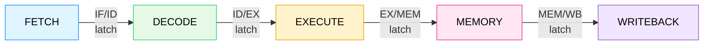

Each is a bundle of flip-flops updated on every `posedge clk`. What each one carries (from [riscv_core.sv:47-85](riscv_core.sv#L47-L85)):

| Register | Carries | Why it needs to |
|---|---|---|
| **IF/ID** | `if_id_valid`, `if_id_pc`, `if_id_instr` | The raw fetched instruction and the address it came from, so Decode has something to chew on. |
| **ID/EX** | `id_ex_op`, `id_ex_rs1/rs2/rd`, `id_ex_rs1_val/rs2_val`, `id_ex_imm`, `id_ex_reg_we`, `id_ex_mem_read/write`, `id_ex_exception`, plus `id_ex_pc`/`id_ex_instr` | Everything Decode figured out — the operation, the register *numbers* (still needed for forwarding comparisons), the register *values* it read, the immediate, and all the control flags. |
| **EX/MEM** | `ex_mem_op`, `ex_mem_rd`, `ex_mem_alu_result`, `ex_mem_store_data`, `ex_mem_reg_we`, `ex_mem_mem_read/write`, `ex_mem_exception`, plus pc/instr | The ALU's answer, and (for stores) a snapshot of the value to write to memory. |
| **MEM/WB** | `mem_wb_op`, `mem_wb_rd`, `mem_wb_wb_data`, `mem_wb_reg_we`, `mem_wb_exception`, plus pc/instr | The *final* value — either the loaded memory word or the carried-through ALU result — ready to be written to the register file. |

`valid` is carried because a stage can be occupied by a **bubble** — a do-nothing instruction inserted by a stall, flush, or pipeline fill. The `*_valid` bit tells the next stage "there's no real instruction here," e.g. `if (mem_wb_valid && mem_wb_reg_we && ...)` — every side effect is gated by a `*_valid` bit upstream.

A bubble is encoded as `0000_0013` (`ADDI x0, x0, 0`, a real harmless no-op), so even a misread `valid` bit only causes a meaningless add-zero-to-zero — not a crash or illegal-instruction trap. This is visible wherever a register resets, e.g. `if_id_instr <= 32'h0000_0013;`.

---

## 3. Reading registers & the register file

The **register file** is 32 slots of 32-bit storage (`logic [31:0] regs [0:31];`), named `x0` through `x31`. Every instruction's job boils down to: read some registers, compute something, write one register.

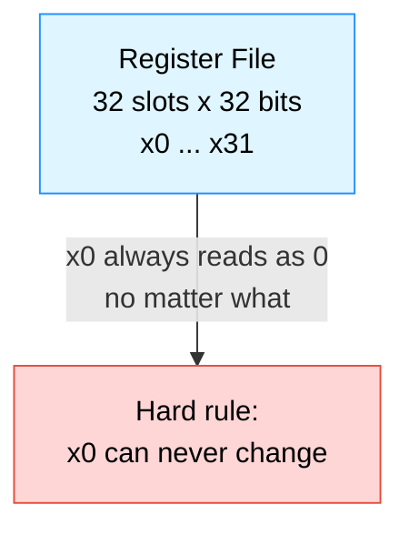

### Why is `x0` special?

RISC-V dedicates one register to permanently hold `0`. This means the instruction set never needs a special "load zero" or "discard result" instruction — you just target `x0` and the hardware throws the value away. The rule is enforced in three places:
1. **Every cycle, unconditionally:** `regs[0] <= 32'h0;` ([riscv_core.sv:347](riscv_core.sv#L347)), and the writeback condition itself excludes it: `(mem_wb_rd != 5'd0)`.
2. **Every read**, via `read_reg_with_wb()`: `if (idx == 5'd0) read_reg_with_wb = 32'h0;`.
3. **An always-on assertion** ([§11](#11-assertions-in-depth)) continuously checks `regs[0] == 0`.

### Why isn't a register read just `regs[idx]`?

A subtle timing problem: if instruction A finishes Writeback the same cycle instruction D starts Decode and reads the register A is about to write, a plain `regs[idx]` read would see the **old** value — A's write doesn't land until the next clock edge. This is a **same-cycle hazard**.

The fix is `read_reg_with_wb()` ([riscv_core.sv:173-181](riscv_core.sv#L173-L181)):
```systemverilog
function automatic logic [31:0] read_reg_with_wb(input logic [4:0] idx);
  if (idx == 5'd0) begin
    read_reg_with_wb = 32'h0;                              // x0 is always 0
  end else if (mem_wb_valid && mem_wb_reg_we && (mem_wb_rd == idx)) begin
    read_reg_with_wb = mem_wb_wb_data;                      // "peek" the value about to be written
  end else begin
    read_reg_with_wb = regs[idx];                           // normal case: just read the array
  end
endfunction
```
This is the first and simplest forwarding path in the design — it forwards from Writeback directly into Decode's register read, so a read always sees the latest value even before it's physically written. The remaining forwarding paths ([§5](#5-forwarding-in-depth)) handle the case where the consumer is in *Execute* instead of Decode.

---

## 4. Data dependencies & the RAW hazard problem

A **data dependency** means instruction B needs a value instruction A produces. The dangerous version is **RAW — Read After Write** (B reads a register after A writes it) — dangerous because pipelining runs A and B at the same time in different stages, so "after" isn't guaranteed unless the hardware enforces it.

Picture this pair with no fix applied:

```
ADD x3, x1, x2      ; x3 = x1 + x2
XOR x4, x3, x1       ; x4 = x3 + x1   <-- needs x3, produced by the line above!
```

| Cycle | 1 | 2 | 3 | 4 | 5 |
|---|---|---|---|---|---|
| `ADD` (produces x3) | IF | ID | **EX** | MEM | **WB** ← x3 finally lands here |
| `XOR` (needs x3) | | IF | ID ← **reads x3 here, too early!** | EX | MEM |

By the time `ADD` writes `x3` (cycle 5), `XOR` already read it back in cycle 3 — two cycles too early. Without a fix, `XOR` would silently compute garbage using `x3`'s stale value.

There are two fixes, and this CPU uses both, depending on the situation:

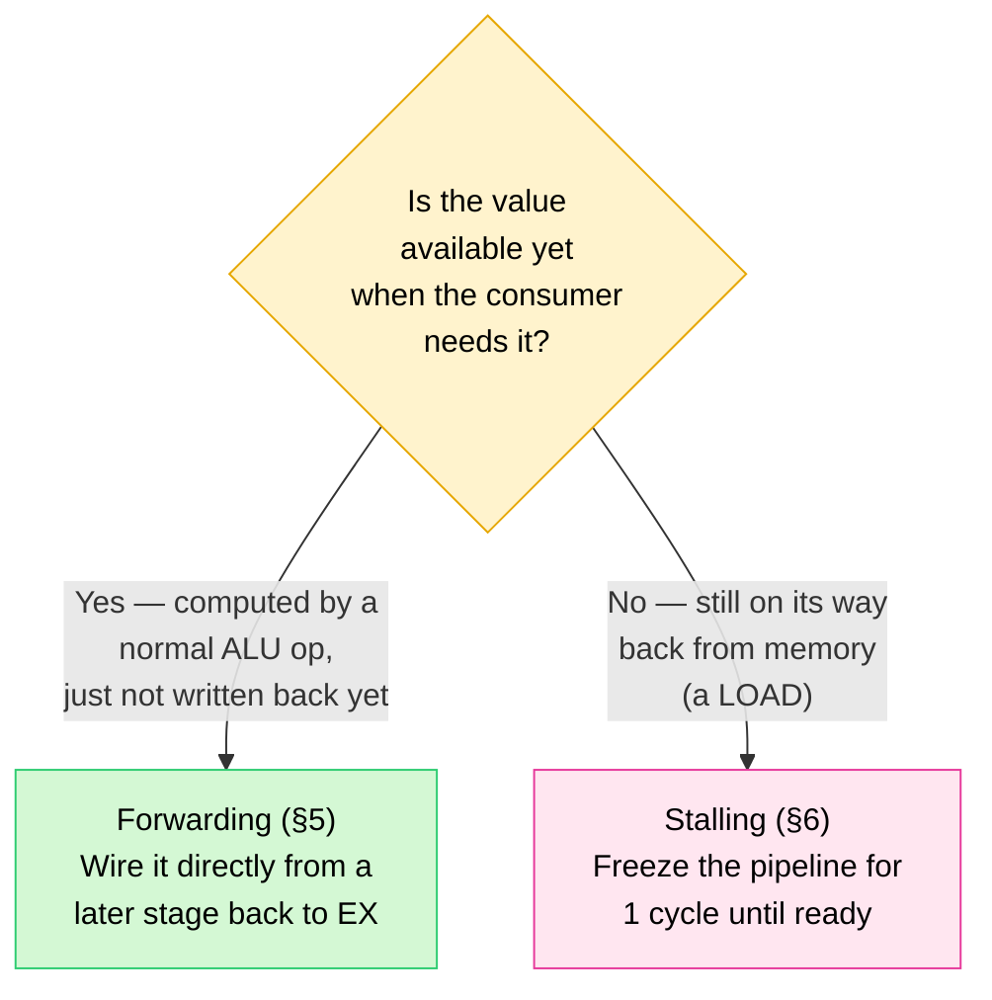

The next two sections explain each fix.

---

## 5. Forwarding, in depth

A value computed by the ALU is electrically available the instant it's computed — it doesn't need to wait for the slow trip through Memory and Writeback before another instruction can use it. Forwarding is extra wiring that taps the result early and routes it to wherever it's needed, bypassing the register file entirely.

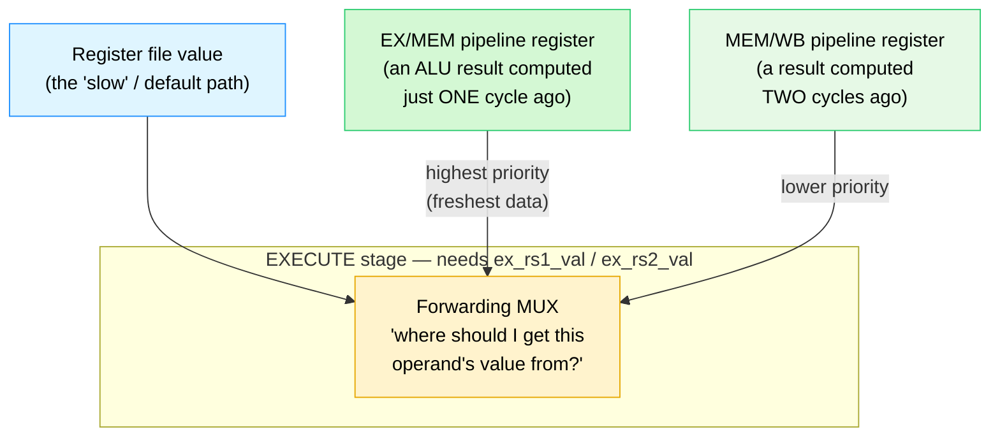

### The actual logic ([riscv_core.sv:232-247](riscv_core.sv#L232-L247))

```systemverilog
always_comb begin
  ex_rs1_val = id_ex_rs1_val;   // default: the value Decode read, cycle(s) ago
  ex_rs2_val = id_ex_rs2_val;

  // Priority 1: forward from EX/MEM (the freshest possible result)
  if (ex_mem_valid && ex_mem_reg_we && !ex_mem_mem_read &&
      (ex_mem_rd != 5'd0) && (ex_mem_rd == id_ex_rs1)) begin
    ex_rs1_val = ex_mem_alu_result;
  end
  // Priority 2: otherwise, forward from MEM/WB (one cycle older)
  else if (mem_wb_valid && mem_wb_reg_we &&
           (mem_wb_rd != 5'd0) && (mem_wb_rd == id_ex_rs1)) begin
    ex_rs1_val = mem_wb_wb_data;
  end
  // (same pattern repeated for ex_rs2_val / id_ex_rs2)
  ...
end
```

This decision tree runs fresh every cycle, for both source operands independently:

1. Is there an instruction in EX/MEM about to write the exact register needed, and is it not itself a pending load (`!ex_mem_mem_read`)? → grab `ex_mem_alu_result` directly — highest priority, most recently computed.
2. Else, is there an instruction in MEM/WB about to write that register? → grab `mem_wb_wb_data`.
3. Else → no hazard, use the value Decode originally read (`id_ex_rs1_val`/`id_ex_rs2_val`).

`!ex_mem_mem_read` is excluded from the EX/MEM path because if that instruction is a `LW`, `ex_mem_alu_result` is just the memory *address*, not the loaded data — the real data (`dmem_rdata`) doesn't exist yet. Forwarding the address would silently corrupt the result; this is exactly the case forwarding can't solve at all (the load-use hazard, [§6](#6-the-load-use-hazard--stalling-in-depth)).

EX/MEM outranks MEM/WB when both match because it's more recent — if two pipeline stages carry instructions that wrote the same register, the one closer to "now" (EX/MEM) holds the architecturally correct value.

### Forwarding, traced cycle by cycle

Revisiting the `ADD`/`XOR` example from [§4](#4-data-dependencies--the-raw-hazard-problem), now with forwarding active:

| Cycle | `ADD x3,x1,x2` | `XOR x4,x3,x1` | What's happening |
|---|---|---|---|
| 1 | IF | | `ADD` fetched |
| 2 | ID | IF | `ADD` reads x1, x2; `XOR` fetched |
| 3 | **EX** (computes x3) | ID (reads stale x3 from regfile — ignored) | `ADD`'s result is about to latch into EX/MEM |
| 4 | MEM (x3 in EX/MEM now) | **EX** ← mux sees `ex_mem_rd == 3`, grabs `ex_mem_alu_result` | Forwarding happens here — `XOR` gets the correct value one cycle before it would reach the register file |
| 5 | WB (x3 written to regfile) | MEM | |

`XOR` gets the right answer in cycle 4, a full cycle before `ADD`'s result is written to the register file in cycle 5 — no stalling, no wasted cycles, no wrong answers.

---

## 6. The load-use hazard & stalling, in depth

Forwarding solves the RAW hazard only if the value already exists somewhere in the pipeline. A `LW` doesn't have its data yet in the EX stage — EX only computes the address. The data doesn't show up until the Memory stage reads `dmem`. That one-cycle gap is unavoidable, and it's exactly long enough to break forwarding.

```
LW  x5, 0(x0)       ; x5 = dmem[0]      <- data only exists AFTER the MEM stage
ADD x6, x5, x1       ; x6 = x5 + x1     <- needs x5 immediately!
```

| Cycle | `LW x5` | `ADD x6,x5,x1` | What's happening |
|---|---|---|---|
| 1 | IF | | |
| 2 | ID | IF | |
| 3 | EX (computes address, not data) | ID ← tries to read x5 here — doesn't exist yet, not even via forwarding | Even the fastest forwarding path (EX/MEM) can't help |
| 4 | MEM (data arrives from `dmem_rdata`) | *(would be EX here, but too early)* | |

No wire is fast enough to get the loaded value to `ADD` in time if it proceeds normally. The only fix is to buy one more cycle by freezing the pipeline.

### Detecting the hazard ([riscv_core.sv:222-230](riscv_core.sv#L222-L230))

```systemverilog
always_comb begin
  load_use_stall = 1'b0;
  if (if_id_valid && id_ex_valid && id_ex_mem_read && (id_ex_rd != 5'd0)) begin
    if ((instr_uses_rs1(if_id_instr) && (if_id_instr[19:15] == id_ex_rd)) ||
        (instr_uses_rs2(if_id_instr) && (if_id_instr[24:20] == id_ex_rd))) begin
      load_use_stall = 1'b1;
    end
  end
end
```
If a `LW` is sitting in EX (`id_ex_mem_read`) and the instruction in Decode (`if_id_instr`) needs that exact register as a source, raise `load_use_stall`. (`instr_uses_rs1`/`instr_uses_rs2`, from [riscv_pkg.sv:126-142](riscv_pkg.sv#L126-L142), know which instruction types actually have an `rs1`/`rs2` worth checking — e.g. `JAL` reads no registers, so it can never trigger this.)

### What a stall actually does — insert a "bubble"

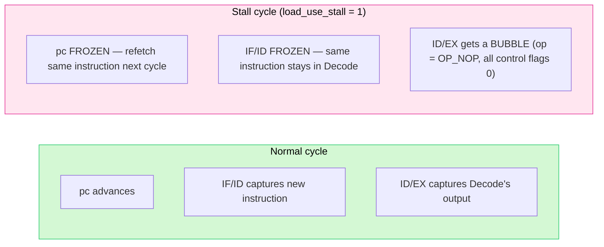

From the sequential block ([riscv_core.sv:381-433](riscv_core.sv#L381-L433)), when `load_use_stall` is true:
- **ID/EX gets cleared** to a bubble (`id_ex_valid <= 1'b0`, op forced to `OP_NOP`).
- **`pc` and `if_id_*` are held at their current values** (`pc <= pc; if_id_valid <= if_id_valid; ...`) — Fetch and Decode are frozen for one cycle, so next cycle they retry, by which point the load's data has arrived and forwarding can do its job.

### Traced cycle by cycle, with the stall in place

| Cycle | `LW x5` | `ADD x6,x5,x1` | Note |
|---|---|---|---|
| 1 | IF | | |
| 2 | ID | IF | |
| 3 | EX | ID (stall detected) | |
| 4 | MEM (`dmem_rdata` now valid) | **ID again** (frozen) | bubble sits in EX this cycle |
| 5 | WB | **EX** ← now forwards from MEM/WB successfully | forwarding finally succeeds, one cycle late but correct |

The cost: one wasted cycle every time a load's result is used by the very next instruction — the textbook tradeoff of a 5-stage in-order pipeline, and why real-world compilers try to reorder something unrelated right after a load.

Two always-on assertions in `riscv_core.sv` police this mechanism ([§11](#11-assertions-in-depth)): one proves `pc` truly freezes during a stall, the other proves `if_id_instr` does too.

---

## 7. Branching & control flow, in depth

**Control flow** is what determines which instruction runs next. Normally it's just `pc + 4`. But `BEQ`, `BNE`, and `JAL` can redirect execution — and that's painful for a pipeline because the CPU doesn't know a branch is taken until it reaches the EX stage, by which point it has already optimistically fetched the next instruction in line.

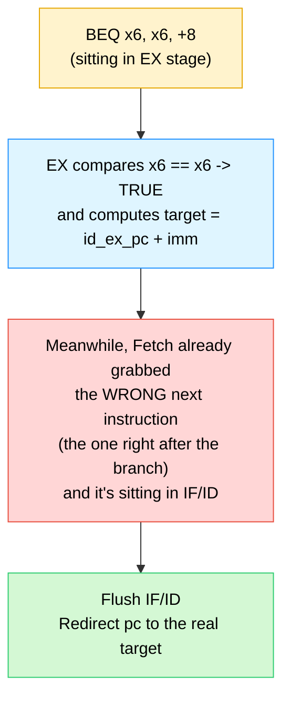

### How each branching instruction is resolved ([riscv_core.sv:249-282](riscv_core.sv#L249-L282))

```systemverilog
OP_BEQ: begin
  if (ex_rs1_val == ex_rs2_val) begin
    ex_redirect    = id_ex_valid;
    ex_redirect_pc = id_ex_pc + id_ex_imm;   // pc-relative target
  end
end
OP_BNE: begin
  if (ex_rs1_val != ex_rs2_val) begin
    ex_redirect    = id_ex_valid;
    ex_redirect_pc = id_ex_pc + id_ex_imm;
  end
end
OP_JAL: begin
  ex_alu_result  = id_ex_pc + 32'd4;          // the "return address" gets written to rd
  ex_redirect    = id_ex_valid;                // JAL ALWAYS redirects — it's unconditional
  ex_redirect_pc = id_ex_pc + id_ex_imm;
end
```

A few details worth noticing:
- `BEQ`/`BNE` use the **forwarded** operand values (`ex_rs1_val`/`ex_rs2_val`), not the raw ones read in Decode — so a branch depending on a value from the immediately preceding instruction still gets a correct comparison, via the same forwarding muxes as [§5](#5-forwarding-in-depth).
- The branch target is `id_ex_pc + id_ex_imm` — relative to the branch's own address, not the current `pc` (which has already raced ahead).
- `JAL` is unconditional and also writes `rd = pc + 4` (the return address), which is what lets RISC-V implement function calls.

### The flush — throwing away the wrong guess ([riscv_core.sv:413-417](riscv_core.sv#L413-L417))

```systemverilog
if (ex_redirect) begin
  pc          <= ex_redirect_pc;   // jump to the real target
  if_id_valid <= 1'b0;              // the instruction Fetch just grabbed was WRONG — discard it
  if_id_pc    <= 32'h0;
  if_id_instr <= 32'h0000_0013;     // replace it with a harmless bubble
end
```
Only one instruction ever needs to be thrown away — the one sitting in IF/ID — because EX is only one stage ahead of it. That's the **branch penalty**: exactly 1 wasted cycle per taken branch in this 5-stage design.

### Traced cycle by cycle — branch taken

```
BEQ x6, x6, +8        ; always true here, jumps forward 8 bytes (skips 1 instruction)
ADDI x7, x0, 99        ; <-- should NEVER execute (it's the "wrong path")
ADDI x8, x0, 123        ; <-- this is the real branch target
```

| Cycle | `BEQ` | `ADDI x7` (wrong-path) | `ADDI x8` (real target) |
|---|---|---|---|
| 1 | IF | | |
| 2 | ID | IF ← fetched speculatively, turns out wrong | |
| 3 | **EX** ← branch resolved: taken, `ex_redirect=1` | *(would be ID, but...)* | |
| 4 | MEM | flushed — never reaches ID | **IF** ← `pc` was redirected here instead |
| 5 | WB | | ID |

### Traced cycle by cycle — branch not taken

```
BNE x6, x6, +8        ; always FALSE here (x6 always equals itself)
ADDI x7, x6, 2          ; executes completely normally, no penalty at all
```

| Cycle | `BNE` | `ADDI x7` |
|---|---|---|
| 1 | IF | |
| 2 | ID | IF |
| 3 | EX ← resolved: **not taken**, `ex_redirect=0` | ID |
| 4 | MEM | EX |
| 5 | WB | MEM |

When a branch isn't taken, the pipeline never notices anything special — the instruction behind it was the correct guess, so it keeps flowing normally. This CPU doesn't predict branches; it always assumes "not taken" and pays a fixed 1-cycle penalty whenever that guess is wrong.

### Interaction with exceptions

One more redirect-like case: `ex_exception_now` (an illegal instruction or `ecall` reaching EX) also flushes IF/ID, but deliberately does not change `pc` (`pc <= pc;`) — once an exception is in flight, the CPU is on its way to halting ([§9](#9-exception-handling)), not jumping anywhere new.

---

## 8. Memory ordering

Memory ordering asks: if instruction A and instruction B both touch memory, are their effects guaranteed to happen in program order? This matters for a pipeline because A and B physically execute at the same time, in different stages.

This CPU sidesteps almost every classic memory-ordering bug by being a strictly **in-order, single-issue, single-memory-port** pipeline:

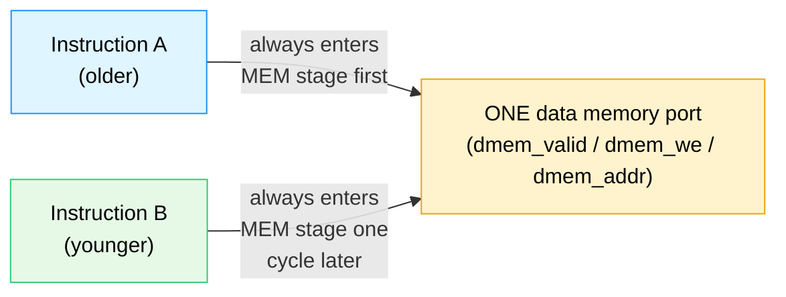

Concrete guarantees this design relies on:

- **Instructions enter and leave every stage in strict program order.** Nothing is out-of-order or superscalar — exactly one instruction per stage, marching forward in lockstep (or freezing together during a stall). So if `SW` is older than a later `LW` to the same address, the store reaches the MEM stage — and `dmem` — before the load does. The load always sees the store's data.
- **Only one instruction touches `dmem` per cycle**, since only the instruction in EX/MEM can assert `dmem_valid` ([riscv_core.sv:112-115](riscv_core.sv#L112-L115)). No possibility of two in-flight memory operations racing each other.
- **Stores write synchronously, on the clock edge**, inside `cpu_mem_if.sv`:
  ```systemverilog
  always @(posedge clk) begin
    if (rst_n && dmem_valid && dmem_ready && dmem_we) begin
      dmem[dmem_addr[9:2]] <= dmem_wdata;
    end
  end
  ```
  and **loads read combinationally** (`assign dmem_rdata = dmem[dmem_addr[9:2]];`), with `dmem_ready` tied permanently high — this is a teaching memory, not a realistic cache-backed one.
- **The scoreboard's reference model relies on exactly this ordering** — it updates its own shadow memory (`ref_mem`) the instant a store retires, in the same program order the real CPU retires instructions in ([§13](#13-the-uvm-testbench-component-by-component)).

This design doesn't have to worry about store-to-load forwarding bugs, out-of-order completion, multiple outstanding memory transactions, or cache coherency — all sidestepped by being deliberately simple.

---

## 9. Exception handling

An **exception** (or **trap**) is the CPU's way of saying "I was asked to do something I can't or was told to stop, so I'll stop cleanly instead of guessing." Two things cause one:

```mermaid
flowchart LR
    I["Instruction reaches\nDecode"] --> CHECK{What is it?}
    CHECK -->|"Unrecognized opcode/funct3/funct7\ncombination"| ILLEGAL["OP_ILLEGAL"]
    CHECK -->|"The exact bit pattern\nfor ECALL (0x00000073)"| ECALL["OP_ECALL"]
    CHECK -->|"Anything else"| NORMAL["Decoded normally,\nno exception"]
    ILLEGAL --> TRAP["dec_exception = 1"]
    ECALL --> TRAP

    style ILLEGAL fill:#ffd6d6,stroke:#e74c3c,color:#000
    style ECALL fill:#fff3cd,stroke:#e6a700,color:#000
    style NORMAL fill:#d4f8d4,stroke:#2ecc71,color:#000
    style TRAP fill:#ffe6f0,stroke:#e6399b,color:#000
```

### How the exception flag travels through the pipeline

`dec_exception` is set the instant Decode sees `OP_ECALL` or `OP_ILLEGAL` ([riscv_core.sv:214](riscv_core.sv#L214)). From there it's carried along like any other pipeline baggage — `id_ex_exception` → `ex_mem_exception` → `mem_wb_exception` — on the same conveyor belts as [§2](#2-pipeline-registers--the-conveyor-belts-between-stages), until it reaches Writeback:

```systemverilog
assign trap_valid = mem_wb_valid && mem_wb_exception && !halted;
assign will_halt   = mem_wb_valid && mem_wb_exception && !halted;
```

It waits until Writeback to act because the pipeline must stay strictly in-order — older instructions already in EX/MEM need to finish naturally first. Acting in Writeback guarantees every older instruction has completed and nothing younger corrupts state — the standard contract for precise exceptions.

### Halting — how the CPU stops without "crashing"

```systemverilog
if (will_halt) begin
  halted <= 1'b1;
end

if (!halted && !will_halt) begin
  ... normal pipeline advance ...
end else begin
  mem_wb_valid <= 1'b0;
  ex_mem_valid <= 1'b0;
  id_ex_valid  <= 1'b0;
  if_id_valid  <= 1'b0;
end
```
Once `halted` latches to `1`, it stays `1` forever (only reset clears it), and every stage's `valid` bit is forced to `0` every subsequent cycle — the CPU is now permanently idle. This is also the signal the UVM driver watches for to know a test program has finished (`wait (vif.halted === 1'b1);`, [§13](#13-the-uvm-testbench-component-by-component)).

`retire_valid` (`assign retire_valid = mem_wb_valid && !halted;`) deliberately excludes the excepting instruction itself from "retired" — its `trap_valid` pulse is what the scoreboard checks instead, avoiding double-counting.

---

## 10. Write-back, in depth

Writeback looks simple but is where three concerns converge: selecting the right value, gating whether a write happens, and exposing the result for checking.

```mermaid
flowchart TB
    Q1{"Was this a LOAD\n(mem_wb came from dmem)?"}
    Q1 -->|Yes| LOADVAL["mem_wb_wb_data\n= dmem_rdata\n(captured back in MEM stage)"]
    Q1 -->|No| ALUVAL["mem_wb_wb_data\n= ex_mem_alu_result\n(carried through from EX)"]
    LOADVAL --> GATE
    ALUVAL --> GATE
    GATE{"mem_wb_valid AND\nmem_wb_reg_we AND\nrd != x0 AND\nNOT mem_wb_exception?"}
    GATE -->|Yes| WRITE["regs[mem_wb_rd] <- mem_wb_wb_data"]
    GATE -->|No| SKIP["No write happens\n(bubble / x0 target / trap)"]
    WRITE --> EXPOSE["Exposed externally as\nretire_valid / retire_rd / retire_wdata\nfor the UVM monitor to observe"]

    style Q1 fill:#fff3cd,stroke:#e6a700,color:#000
    style GATE fill:#fff3cd,stroke:#e6a700,color:#000
    style WRITE fill:#d4f8d4,stroke:#2ecc71,color:#000
    style SKIP fill:#ffd6d6,stroke:#e74c3c,color:#000
    style EXPOSE fill:#f0e6ff,stroke:#9b59b6,color:#000
```

**Where the value comes from** ([riscv_core.sv:366-367](riscv_core.sv#L366-L367)) is decided one stage earlier, transitioning from EX/MEM into MEM/WB:
```systemverilog
if (ex_mem_mem_read) mem_wb_wb_data <= dmem_rdata;   // LW: take the freshly-read memory word
else                 mem_wb_wb_data <= ex_mem_alu_result;  // everything else: the ALU's answer
```

**The gate that decides whether a real write happens** ([riscv_core.sv:349](riscv_core.sv#L349)):
```systemverilog
if (mem_wb_valid && mem_wb_reg_we && (mem_wb_rd != 5'd0) && !mem_wb_exception) begin
  regs[mem_wb_rd] <= mem_wb_wb_data;
end
```
All four conditions must hold: a real instruction (`mem_wb_valid`), one that actually writes a register (`mem_wb_reg_we` — not `SW`/`BEQ`), a destination that isn't `x0`, and no exception.

`retire_valid`/`retire_*` are exposed as separate top-level ports ([riscv_core.sv:117-122](riscv_core.sv#L117-L122)) rather than letting the testbench peek at `regs[]` directly — this mirrors real verification practice: the only legitimate way to observe a CPU is through its architecturally-visible interface, never internal implementation details.

---

## 11. Assertions, in depth

An **assertion** is a machine-checked promise: this property must always be true, and the moment it isn't, stop and report it. Unlike the UVM scoreboard (which checks results after the fact), assertions check internal behavior continuously, every clock cycle — catching bugs the scoreboard might never notice since it only looks at each instruction's final outcome.

All four live in `riscv_core.sv`, guarded by `` `ifndef SYNTHESIS `` (assertions are simulation-only):

```mermaid
flowchart TB
    A1["Assertion 1\nx0 stays zero"]
    A2["Assertion 2\nRedirect -> PC updates correctly"]
    A3["Assertion 3\nStall -> PC freezes"]
    A4["Assertion 4\nStall -> IF/ID instruction freezes"]

    A1 -.checks every cycle.-> CORE["riscv_core internals"]
    A2 -.checks every cycle.-> CORE
    A3 -.checks every cycle.-> CORE
    A4 -.checks every cycle.-> CORE

    style A1 fill:#ffd6d6,stroke:#e74c3c,color:#000
    style A2 fill:#dff5ff,stroke:#1e90ff,color:#000
    style A3 fill:#ffe6f0,stroke:#e6399b,color:#000
    style A4 fill:#fff3cd,stroke:#e6a700,color:#000
    style CORE fill:#f0e6ff,stroke:#9b59b6,color:#000
```

### Assertion 1 — `x0` must always stay zero ([riscv_core.sv:454-459](riscv_core.sv#L454-L459))
```systemverilog
always @(posedge clk) begin
  if (rst_n) begin
    assert (regs[0] == 32'h0000_0000)
    else $error("ASSERTION FAILED: x0 register changed from zero");
  end
end
```
Catches any code path that accidentally lets a writeback target `regs[0]` — e.g. a future refactor of [§10](#10-write-back-in-depth)'s gating logic that drops the `rd != 5'd0` check. Without this, such a bug could silently corrupt every instruction that reads `x0` expecting zero.

### Assertion 2 — a redirect must actually move the PC to the right place ([riscv_core.sv:464-471](riscv_core.sv#L464-L471))
```systemverilog
property p_redirect_updates_pc;
  @(posedge clk) disable iff (!rst_n)
  ex_redirect |=> (pc == $past(ex_redirect_pc));
endproperty
assert property (p_redirect_updates_pc)
else $error("ASSERTION FAILED: Branch/JAL redirect PC update is wrong");
```
SVA syntax: `|=>` means "if the left side is true this cycle, the right side must hold next cycle"; `$past(x)` means "the value `x` had one cycle ago." In plain terms: whenever a branch/JAL fires a redirect, next cycle's `pc` must equal the computed target. Catches an off-by-one in redirect timing or a typo wiring `ex_redirect_pc` to the wrong adder.

### Assertion 3 — a stall must freeze the PC ([riscv_core.sv:475-482](riscv_core.sv#L475-L482))
```systemverilog
property p_load_use_stall_freezes_pc;
  @(posedge clk) disable iff (!rst_n)
  load_use_stall |=> (pc == $past(pc));
endproperty
```
Whenever a load-use stall is detected, next cycle's `pc` must be unchanged. Catches a case where `pc <= pc + 4;` accidentally executes during a stall, corrupting the instruction stream — a bug that might only show up sporadically deep into a long random test.

### Assertion 4 — a stall must also freeze the fetched instruction ([riscv_core.sv:486-493](riscv_core.sv#L486-L493))
```systemverilog
property p_load_use_stall_freezes_ifid;
  @(posedge clk) disable iff (!rst_n)
  load_use_stall |=> (if_id_instr == $past(if_id_instr));
endproperty
```
Freezing `pc` alone isn't enough — `if_id_instr` (the instruction waiting in Decode) must also stay the same, or the stalled instruction could get silently corrupted while it waits. This pairs with Assertion 3 to check both halves of "freeze the pipeline."

### Why have both assertions AND a scoreboard?

```mermaid
flowchart LR
    BUG["A hardware bug"] --> Q{"Does it change\nthe FINAL result\nof an instruction?"}
    Q -->|Yes| SCB["Scoreboard catches it\n(wrong register value, wrong pc, etc.)"]
    Q -->|"Maybe not —\nit might 'accidentally'\nproduce the right answer\nfor THIS test"| ASSERT["Assertions catch it\n(wrong internal behavior,\neven if today's test\nhappened not to expose it)"]

    style BUG fill:#ffd6d6,stroke:#e74c3c,color:#000
    style SCB fill:#e6f9e6,stroke:#2ecc71,color:#000
    style ASSERT fill:#dff5ff,stroke:#1e90ff,color:#000
```
Assertions are a second, independent safety net — they catch mechanism bugs even when the final architectural result happens to come out correct by coincidence for a particular test. A scoreboard alone can be "lucky"; a violated assertion never lies about what happened inside the design. The `final` block at the bottom of `riscv_core.sv` ([riscv_core.sv:497-504](riscv_core.sv#L497-L504)) also prints a tally (`x0_check_count`, `redirect_check_count`, `stall_check_count`) at the end of every run, showing how many times each scenario was actually exercised.

---

## 12. Functional coverage, in depth

Passing every test tells you the CPU got every attempted instruction right. It says nothing about whether you tried every kind of instruction in the first place. **Functional coverage** answers that — an automatically tallied checklist of which scenarios the test suite actually exercised.

```mermaid
flowchart TB
    RETIRE["Every retired instruction\n(from the monitor)"] --> CG["covergroup cg\n(riscv_coverage class)"]
    CG --> CP1["cp_opcode\nalu_reg / alu_imm / load /\nstore / branch / jal / system"]
    CG --> CP2["cp_funct3\nf0 / f1 / f2 / f4 / f6 / f7"]
    CG --> CP3["cp_reg_we\nno_write / write"]
    CG --> CP4["cp_trap\nno_trap / trap_seen"]
    CG --> CROSS["cross cp_opcode x cp_reg_we\n(combinations of the two)"]

    style RETIRE fill:#f0e6ff,stroke:#9b59b6,color:#000
    style CG fill:#fff3cd,stroke:#e6a700,color:#000
    style CP1 fill:#dff5ff,stroke:#1e90ff,color:#000
    style CP2 fill:#dff5ff,stroke:#1e90ff,color:#000
    style CP3 fill:#dff5ff,stroke:#1e90ff,color:#000
    style CP4 fill:#dff5ff,stroke:#1e90ff,color:#000
    style CROSS fill:#e6f9e6,stroke:#2ecc71,color:#000
```

### The mechanics ([riscv_uvm_pkg.sv:369-446](riscv_uvm_pkg.sv#L369-L446))

`riscv_coverage` is a `uvm_subscriber` — it passively listens to whatever the monitor broadcasts, with no ability to influence the test. Every retired instruction triggers `cg.sample()`:
```systemverilog
function void write(riscv_retire_item t);
  opcode = t.instr[6:0];
  funct3 = t.instr[14:12];
  reg_we = t.reg_we;
  trap   = t.trap;
  cg.sample();   // tick the checklist boxes that apply to THIS instruction
endfunction
```

**Coverpoints** (`cp_opcode`, `cp_funct3`, `cp_reg_we`, `cp_trap`) each define **bins** — named buckets values get sorted into. `cp_opcode`'s `bins branch = {OPCODE_BRANCH};` means "count at least one sample where the opcode was a branch." A bin only needs to be hit once to count as covered — coverage measures breadth, not frequency.

**Cross coverage** (`cross cp_opcode, cp_reg_we`) generates a bin for every combination of the two coverpoints — `(alu_reg, write)`, `(alu_reg, no_write)`, `(branch, write)`, `(branch, no_write)`, etc. This catches gaps the individual coverpoints alone would miss — e.g. covering "branch" and "no_write" separately many times while never covering the combination "a branch correctly not writing a register."

### What "90% target" actually means ([riscv_uvm_pkg.sv:426-444](riscv_uvm_pkg.sv#L426-L444))

```systemverilog
cov = cg.get_inst_coverage();
if (cov < 90.0) `uvm_warning("COVERAGE", "Coverage below target")
else             `uvm_info("COVERAGE", "Coverage target achieved", UVM_LOW)
```
`get_inst_coverage()` returns the percentage of all bins hit at least once. 90% is a conventional bar — chasing the last few percent (often genuinely impossible combinations, like "a store that also writes a register") usually isn't worth it. Coverage is reported once at the end of the run, in `report_phase`, after all randomization is done.

A random test could, by bad luck, generate 3,000 instructions that are all `ADD`/`ADDI` and never try a `BNE` or a `store`. The scoreboard would report "100% pass" — technically true but misleading, since large parts of the design were never exercised. Coverage tells you whether a passing test suite is trustworthy or just lucky.

---

## 13. The UVM testbench, component by component

UVM organizes a testbench as a **tree of components**, built once at the start of simulation and left running for the whole test. Here's the actual tree this project builds, with every class named:

```mermaid
flowchart TB
    TOP["tb_top\n(plain SystemVerilog module)"]
    TOP -->|"instantiates"| IF["cpu_mem_if\n(memories + wires)"]
    TOP -->|"instantiates"| DUT["riscv_core\n(the CPU)"]
    TOP -->|"uvm_config_db::set\n'here is the virtual interface'"| TEST["riscv_base_test\n(or _directed_test / _random_test)"]
    TEST --> ENV["riscv_env"]
    ENV --> SQR["riscv_sequencer"]
    ENV --> DRV["riscv_driver"]
    ENV --> MON["riscv_monitor"]
    ENV --> SCB["riscv_scoreboard"]
    ENV --> COV["riscv_coverage"]
    TEST -.starts.-> SEQ["riscv_directed_seq\nor riscv_random_seq"]
    SEQ -.items flow through.-> SQR
    SQR -.items flow through.-> DRV
    DRV -.drives signals onto.-> IF
    IF -.connected to.-> DUT
    DRV -.signals read back from.-> MON
    MON -.retire_ap analysis port.-> SCB
    MON -.retire_ap analysis port.-> COV

    style TOP fill:#dff5ff,stroke:#1e90ff,color:#000
    style DUT fill:#fff3cd,stroke:#e6a700,color:#000
    style ENV fill:#f0e6ff,stroke:#9b59b6,color:#000
    style SQR fill:#f0e6ff,stroke:#9b59b6,color:#000
    style DRV fill:#dff5ff,stroke:#1e90ff,color:#000
    style MON fill:#ffe6f0,stroke:#e6399b,color:#000
    style SCB fill:#e6f9e6,stroke:#2ecc71,color:#000
    style COV fill:#e6f9e6,stroke:#2ecc71,color:#000
```

### How `tb_top` hands the interface to UVM

UVM components are built generically — they don't know at compile time which exact wires they'll talk to. The bridge is the **config database**, a global key-value store:
```systemverilog
// in tb_top.sv — "here is the interface, anyone who asks for 'vif' may have it"
uvm_config_db#(virtual cpu_mem_if)::set(null, "*", "vif", mem_if);
```
```systemverilog
// in riscv_driver / riscv_monitor build_phase — "give me whatever was stored under 'vif'"
if (!uvm_config_db#(virtual cpu_mem_if)::get(this, "", "vif", vif)) begin
  `uvm_fatal("NOVIF", "virtual cpu_mem_if was not set")
end
```
This indirection lets the same driver/monitor code run against different physical setups without being rewritten — a core UVM reusability idea that pays off on large projects with many testbenches sharing components.

### `riscv_instr_mem_item` & `riscv_retire_item` — the two "envelope" data types

Plain `uvm_sequence_item`s — structured packets of data passed between components:
- **`riscv_instr_mem_item`**: carries a whole program — `bit [31:0] instr_mem[$]` plus `max_cycles` (a timeout). One represents one entire test run.
- **`riscv_retire_item`**: carries one completed instruction's observable result — `valid`, `pc`, `instr`, `rd`, `wdata`, `reg_we`, `trap`. One is created every time the CPU finishes an instruction.

### `riscv_sequencer` — the traffic controller

```systemverilog
class riscv_sequencer extends uvm_sequencer #(riscv_instr_mem_item);
```
This class has almost no custom code — that's intentional. A sequencer's whole job is queuing: it sits between a sequence (decides what to send) and a driver (consumes what's sent), handling the handshake (`get_next_item`/`item_done`) so neither side needs to know the other's timing.

### `riscv_driver` — turns a program into real pin wiggles ([riscv_uvm_pkg.sv:42-94](riscv_uvm_pkg.sv#L42-L94))

```mermaid
flowchart TD
    GET["get_next_item()\nreceive a riscv_instr_mem_item"] --> CLEAR["vif.clear_mem()\nwipe imem (fill with ECALL) and dmem (zero)"]
    CLEAR --> LOADI["write_imem() for every\ninstruction in the program"]
    LOADI --> LOADD["pre-load dmem[0..63]\nwith known values\n(0x1000_0000 + i)"]
    LOADD --> RESET["apply_reset(5)\npulse rst_n low, then high"]
    RESET --> WAIT["fork/join_any: wait for\nEITHER vif.halted==1\nOR max_cycles timeout"]
    WAIT --> DONE["item_done()\nready for the next program"]

    style GET fill:#f0e6ff,stroke:#9b59b6,color:#000
    style CLEAR fill:#dff5ff,stroke:#1e90ff,color:#000
    style LOADI fill:#dff5ff,stroke:#1e90ff,color:#000
    style LOADD fill:#dff5ff,stroke:#1e90ff,color:#000
    style RESET fill:#fff3cd,stroke:#e6a700,color:#000
    style WAIT fill:#ffe6f0,stroke:#e6399b,color:#000
    style DONE fill:#d4f8d4,stroke:#2ecc71,color:#000
```
`dmem[0..63]` is pre-loaded with `0x1000_0000 + i` rather than left at zero so `LW` instructions have distinguishable values — a bug that reads the wrong address produces an obviously wrong value instead of silently matching by coincidence.

`fork ... join_any ... disable fork` runs two competing waits at once — "the CPU halts" vs. "we hit the cycle budget" — whichever happens first wins and cancels the other. This prevents a genuinely broken CPU (stuck in an infinite mis-fetch loop) from hanging the simulation; it gets flagged with `uvm_error("TIMEOUT", ...)` instead.

### `riscv_monitor` — a passive observer ([riscv_uvm_pkg.sv:96-134](riscv_uvm_pkg.sv#L96-L134))

```systemverilog
task run_phase(uvm_phase phase);
  forever begin
    @(posedge vif.clk);
    if (vif.rst_n && vif.retire_valid) begin
      riscv_retire_item item = riscv_retire_item::type_id::create("item", this);
      item.valid = vif.retire_valid; item.pc = vif.retire_pc; ...
      retire_ap.write(item);   // broadcast to anyone listening
    end
  end
endtask
```
The monitor never drives anything — it only reads signals and packages them up. This separation (driver drives, monitor observes) means the same monitor could in principle watch a real chip running the same protocol with zero changes. The `retire_ap` (analysis port) is a broadcast mechanism — `mon.retire_ap.connect(scb.retire_export)` and `mon.retire_ap.connect(cov.analysis_export)` both subscribe to the same stream of retirements, independently of each other.

### `riscv_scoreboard` — the independent judge, in full detail ([riscv_uvm_pkg.sv:136-368](riscv_uvm_pkg.sv#L136-L368))

The most important piece of the testbench. What it does for one instruction:

```mermaid
flowchart TB
    IN["Receives a riscv_retire_item\n(what the REAL cpu did)"] --> DECODE["Decodes opcode/funct3/funct7\nfrom t.instr — completely\nindependently of riscv_core.sv"]
    DECODE --> READ["Reads ITS OWN shadow\nregisters (ref_regs[]) for\nrs1/rs2 — NOT the real CPU's"]
    READ --> COMPUTE["Recomputes, by hand, in a\ncase statement, what the\nresult SHOULD be"]
    COMPUTE --> COMPARE["Compares: pc, reg_we,\nwdata, trap — field by field"]
    COMPARE -->|all match| PASS["pass_count++"]
    COMPARE -->|any mismatch| FAIL["fail_count++\n`uvm_error` with full detail"]
    PASS --> UPDATE["Updates ITS OWN shadow\nstate (ref_regs / ref_mem / ref_pc)\nto stay in sync for the NEXT instruction"]
    FAIL --> UPDATE

    style IN fill:#f0e6ff,stroke:#9b59b6,color:#000
    style DECODE fill:#dff5ff,stroke:#1e90ff,color:#000
    style READ fill:#dff5ff,stroke:#1e90ff,color:#000
    style COMPUTE fill:#fff3cd,stroke:#e6a700,color:#000
    style COMPARE fill:#ffe6f0,stroke:#e6399b,color:#000
    style PASS fill:#d4f8d4,stroke:#2ecc71,color:#000
    style FAIL fill:#ffd6d6,stroke:#e74c3c,color:#000
    style UPDATE fill:#e6f9e6,stroke:#2ecc71,color:#000
```

The scoreboard keeps its own `ref_regs[]`/`ref_mem[]`/`ref_pc` instead of reading the real CPU's internal `regs[]` directly — the single most important design decision in the testbench. If it read the DUT's own state, a bug that corrupts the DUT's register file would corrupt the "expected" value too, and the bug would compare against itself and silently pass. A completely independent model, written by simpler logic, can only agree with the DUT if the DUT is actually correct, not merely self-consistent.

**A concrete worked example — checking one `ADD x3, x1, x2`:**
```systemverilog
src1_val = read_ref_reg(rs1);            // scoreboard's OWN copy of x1
src2_val = read_ref_reg(rs2);            // scoreboard's OWN copy of x2
case ({funct7, funct3})
  {7'b0000000, 3'b000}: expected_wdata = src1_val + src2_val;   // re-derives the ADD, independently
...
if (t.wdata !== expected_wdata) begin
  `uvm_error("WDATA_MISMATCH", $sformatf("pc=0x%08h ... DUT_wdata=0x%08h EXPECTED_wdata=0x%08h", ...));
end
...
write_ref_reg(rd, expected_wdata);       // keep the shadow model in sync, using the EXPECTED value
ref_pc = expected_next_pc;               // advance the shadow pc too
```
Four things are checked on every retirement: `t.pc` (did it execute at the right address — catches branch/redirect bugs), `t.reg_we` (did it correctly decide whether to write a register), `t.wdata` (is the value correct), and `t.trap` (did it correctly recognize an exception). A mismatch in any one fails that instruction, with a precise error (`PC_MISMATCH` / `REGWE_MISMATCH` / `WDATA_MISMATCH` / `TRAP_MISMATCH`) showing expected versus seen.

### `riscv_env` — wiring it all together ([riscv_uvm_pkg.sv:447-474](riscv_uvm_pkg.sv#L447-L474))

`build_phase` constructs every component; `connect_phase` wires their ports together (`drv.seq_item_port.connect(sqr.seq_item_export)`, `mon.retire_ap.connect(scb.retire_export)`, `mon.retire_ap.connect(cov.analysis_export)`). This build-then-connect split is a standard UVM pattern that avoids ordering problems.

### The tests — `riscv_base_test` / `riscv_directed_test` / `riscv_random_test` ([riscv_uvm_pkg.sv:649-695](riscv_uvm_pkg.sv#L649-L695))

```mermaid
flowchart LR
    BASE["riscv_base_test\nbuilds env,\nruns riscv_directed_seq\nby default"]
    DIRECTED["riscv_directed_test\n(inherits base as-is)"]
    RANDOM["riscv_random_test\n(overrides run_phase\nto run riscv_random_seq\ninstead)"]
    BASE -->|extends| DIRECTED
    BASE -->|extends, overrides run_phase| RANDOM

    style BASE fill:#dff5ff,stroke:#1e90ff,color:#000
    style DIRECTED fill:#d4f8d4,stroke:#2ecc71,color:#000
    style RANDOM fill:#fff3cd,stroke:#e6a700,color:#000
```
`run_test()` (called from `tb_top.sv`) picks which test class to instantiate — normally passed on the simulator's command line (e.g. `+UVM_TESTNAME=riscv_random_test`), so which test runs is a runtime choice, not baked into the compiled testbench.

`raise_objection()`/`drop_objection()` tell UVM's phasing engine "don't end run_phase yet, I'm still working" / "okay, I'm done" — without them, UVM would consider the test instantly finished before the sequence got a chance to run.

---

## 14. The directed test, instruction by instruction

`riscv_directed_seq` ([riscv_uvm_pkg.sv:476-510](riscv_uvm_pkg.sv#L476-L510)) is a small, fixed, hand-written program — predictable by design, so a human can verify the expected outcome by hand before running the simulation. Every instruction, traced one at a time:

| # | PC | Instruction | What it does | Registers / memory after |
|---|---|---|---|---|
| 1 | `0x00` | `ADDI x1, x0, 10` | x1 = 0 + 10 | **x1 = 10** |
| 2 | `0x04` | `ADDI x2, x0, 7` | x2 = 0 + 7 | **x2 = 7** |
| 3 | `0x08` | `ADD x3, x1, x2` | x3 = 10 + 7 | **x3 = 17** |
| 4 | `0x0C` | `SUB x4, x3, x2` | x4 = 17 − 7 | **x4 = 10** |
| 5 | `0x10` | `SW x3, 0(x0)` | dmem[0] = x3 | **dmem[0] = 17** |
| 6 | `0x14` | `LW x5, 0(x0)` | x5 = dmem[0] | **x5 = 17** |
| 7 | `0x18` | `ADD x6, x5, x1` | x6 = 17 + 10 | **x6 = 27** |
| 8 | `0x1C` | `BEQ x6, x6, +8` | x6 == x6 -> always taken, jump to `0x1C + 8 = 0x24` | pc -> `0x24` |
| ~~9~~ | ~~`0x20`~~ | ~~`ADDI x7, x0, 99`~~ | never executes — flushed, this is the "wrong path" the CPU speculatively fetched | **x7 stays 0** |
| 10 | `0x24` | `ADDI x8, x0, 123` | the real branch target | **x8 = 123** |
| 11 | `0x28` | `ECALL` | clean halt | `halted = 1` |

**Final state, checked against the scoreboard:** `x1=10, x2=7, x3=17, x4=10, x5=17, x6=27, x7=0 (unchanged), x8=123`, with `dmem[0]=17`. This short program already exercises: immediate arithmetic, register-register ALU ops, a forwarding chain (x3 feeds SUB one instruction later), a full store→load round trip through memory, a second forwarding chain (x5 feeds ADD immediately), a taken branch with a flush, and a clean halt — a dense, deterministic stress test in 11 instructions.

---

## 15. The random test — all 8 hazard patterns explained

`riscv_random_seq` ([riscv_uvm_pkg.sv:512-647](riscv_uvm_pkg.sv#L512-L647)) first sets up 8 known register values (`x1=5` through `x8=40`), then loops 25 times, each iteration randomly picking one of 8 instruction patterns, before finally appending `ECALL`. Each kind is designed to provoke one specific pipeline mechanism:

```mermaid
flowchart TB
    R["$urandom_range(0,7)\npicked 25 times"] --> K0
    R --> K1
    R --> K2
    R --> K3
    R --> K4
    R --> K5
    R --> K6
    R --> K7

    K0["Kind 0\nRAW forwarding"]
    K1["Kind 1\nLoad-use stall"]
    K2["Kind 2\nStore-after-ALU forwarding"]
    K3["Kind 3\nBranch taken"]
    K4["Kind 4\nBranch NOT taken"]
    K5["Kind 5\nJAL redirect"]
    K6["Kind 6\nADDI->OR forwarding"]
    K7["Kind 7\nDouble/chained forwarding"]

    style R fill:#f0e6ff,stroke:#9b59b6,color:#000
    style K0 fill:#dff5ff,stroke:#1e90ff,color:#000
    style K1 fill:#ffe6f0,stroke:#e6399b,color:#000
    style K2 fill:#dff5ff,stroke:#1e90ff,color:#000
    style K3 fill:#fff3cd,stroke:#e6a700,color:#000
    style K4 fill:#d4f8d4,stroke:#2ecc71,color:#000
    style K5 fill:#fff3cd,stroke:#e6a700,color:#000
    style K6 fill:#dff5ff,stroke:#1e90ff,color:#000
    style K7 fill:#dff5ff,stroke:#1e90ff,color:#000
```

| Kind | Pattern (code) | What it actually tests |
|---|---|---|
| **0** — RAW forwarding ([:570-573](riscv_uvm_pkg.sv#L570-L573)) | `ADD rd,rs1,rs2` → `XOR use_rd,rd,rs1` | The result of `ADD` is consumed by the very next instruction — forces the EX/MEM forwarding path from [§5](#5-forwarding-in-depth). |
| **1** — Load-use ([:577-583](riscv_uvm_pkg.sv#L577-L583)) | `SW rs2,imm(x0)` → `LW rd,imm(x0)` → `ADD use_rd,rd,rs2` | A value is stored, immediately reloaded, and immediately consumed — forces the stall scenario from [§6](#6-the-load-use-hazard--stalling-in-depth). |
| **2** — Store-after-ALU ([:587-593](riscv_uvm_pkg.sv#L587-L593)) | `ADDI rs2,rs2,1` → `SW rs2,imm(x0)` → `LW rd,imm(x0)` | `SW` needs `rs2`'s brand-new value from the preceding `ADDI` (forwarding into a store's data operand) — then `LW` proves the value round-trips through memory. |
| **3** — Branch taken ([:597-601](riscv_uvm_pkg.sv#L597-L601)) | `BEQ rs1,rs1,+8` → `ADDI (skipped)` → `ADDI (target)` | `rs1 == rs1` is always true, guaranteeing a taken branch — forces the flush/redirect mechanism from [§7](#7-branching--control-flow-in-depth). |
| **4** — Branch not taken ([:605-608](riscv_uvm_pkg.sv#L605-L608)) | `BNE rs1,rs1,+8` → `ADDI rd,rs1,2` | `rs1 != rs1` is always false — proves the no-penalty path also works. |
| **5** — JAL redirect ([:612-616](riscv_uvm_pkg.sv#L612-L616)) | `JAL rd,+8` → `ADDI (skipped)` → `ADDI (target)` | Unconditional jump — also checks `rd` correctly receives the return address (`pc+4`). |
| **6** — ADDI→OR forwarding ([:619-624](riscv_uvm_pkg.sv#L619-L624)) | `ADDI rd,rs1,imm` → `OR use_rd,rd,rs2` | Same forwarding idea as Kind 0, starting from an immediate instruction instead of register-register. |
| **7** — Mixed ALU / chained forwarding ([:627-631](riscv_uvm_pkg.sv#L627-L631)) | `AND rd,rs1,rs2` → `OR use_rd,rd,rs1` → `XOR rnz(),use_rd,rs2` | Two forwarding hazards back to back — the closest thing in the suite to a worst-case forwarding stress test. |

**Why 8 hand-curated patterns instead of pure unconstrained randomness?** This is **constrained-random testing**. Fully unconstrained random instructions would mostly generate boring, independent instructions with no hazards — statistically unlikely to stress the hardest mechanisms. Constraining the randomness to 8 patterns, each guaranteed to trigger a specific hazard, means every one of the 25 picks per run is a meaningful test, while which pattern, registers, and immediates are used still varies randomly across runs — reliability and breadth together.

---

## 16. A full worked example — one pipeline, cycle by cycle

This is the classic "pipeline diagram" — instructions down the side, clock cycles across the top, each cell showing which stage that instruction occupies that cycle. Tracing instructions 1 through 7 of the directed test ([§14](#14-the-directed-test-instruction-by-instruction)) through the real pipeline, including the load-use stall at the end:

| Instruction | C1 | C2 | C3 | C4 | C5 | C6 | C7 | C8 | C9 | C10 | C11 | C12 |
|---|---|---|---|---|---|---|---|---|---|---|---|---|
| `ADDI x1,x0,10` | IF | ID | EX | MEM | WB | | | | | | | |
| `ADDI x2,x0,7` | | IF | ID | EX | MEM | WB | | | | | | |
| `ADD x3,x1,x2` | | | IF | ID | EX | MEM | WB | | | | | |
| `SUB x4,x3,x2` | | | | IF | ID | EX | MEM | WB | | | | |
| `SW x3,0(x0)` | | | | | IF | ID | EX | MEM | WB | | | |
| `LW x5,0(x0)` | | | | | | IF | ID | EX | MEM | WB | | |
| `ADD x6,x5,x1` | | | | | | | IF | ID | **ID** (frozen) | EX | MEM | WB |
| *(bubble)* | | | | | | | | | | EX | MEM | WB |

`ADD x6,x5,x1` sits in Decode for two cycles in a row (C8 and C9) because `load_use_stall` is asserted: at cycle 8, `LW x5` is in EX (it's a load) and `ADD x6,x5,x1` (in Decode) needs `x5`. The pipeline can't let `ADD` proceed into EX with a stale value, so it freezes `pc` and `if_id` for one cycle and lets a harmless bubble flow into EX instead at cycle 10.

What's happening at each interesting cycle:
- **Cycle 3:** `SUB x4,x3,x2` would need x3 — but it isn't fetched until cycle 4, by which point `ADD x3` is already past Decode, so this pair doesn't need forwarding purely by coincidence of spacing. (Compare with [§5](#5-forwarding-in-depth)'s `ADD`/`XOR` example, where the consumer is immediately adjacent and forwarding has to do work.)
- **Cycle 8:** `LW x5` is in EX (computing the load address); `ADD x6,x5,x1` is in Decode and reads a stale x5 from the register file — irrelevant, since the stall logic already detected the hazard combinationally this same cycle.
- **Cycle 9:** Because of the stall, `ADD x6` is re-decoded, frozen in place; `LW x5` moves into MEM and its real data (`dmem_rdata`) becomes available. A bubble (not `ADD x6`) enters EX this cycle.
- **Cycle 10:** `LW x5` is now in WB carrying the loaded value; `ADD x6,x5,x1` finally enters EX, and the forwarding mux ([§5](#5-forwarding-in-depth)) sees `mem_wb_rd == 5` matches `id_ex_rs1`, forwarding `mem_wb_wb_data` instead of the stale register-file value — correct result, one cycle later than it would've been without the load.

Because `pc` froze during the stall, the next instruction (`BEQ`, [§14](#14-the-directed-test-instruction-by-instruction)) is also delayed by exactly one cycle — fetched twice, with the second fetch landing in Decode at cycle 10 instead of cycle 9. The stall's cost ripples forward by exactly one cycle and then disappears.

---

## Quick check — test yourself!

8 quick questions — no grading, just click each one open after you've made a guess. A "wrong" guess just points to a section worth a second read.

<details>
<summary><strong>1. Why does the pipeline have exactly 5 stages instead of, say, 1 big stage?</strong></summary>

<br>

Splitting work into 5 small stages (Fetch -> Decode -> Execute -> Memory -> Write-back) lets a new instruction start every cycle instead of waiting for the previous one to finish — like a 5-station assembly line instead of one person building a whole car alone. See [§1](#1-the-5-stages-in-depth).

</details>

<details>
<summary><strong>2. What is a "bubble," and why is it sometimes injected on purpose?</strong></summary>

<br>

A bubble is a fake "do-nothing" instruction inserted on purpose during a stall (load-use hazard, [§6](#6-the-load-use-hazard--stalling-in-depth)) or a flush (branch/JAL redirect, [§7](#7-branching--control-flow-in-depth)), so a real instruction isn't acted on before it's safe.

</details>

<details>
<summary><strong>3. What's the difference between a hazard and forwarding?</strong></summary>

<br>

A **hazard** is the problem: a later instruction needs a value an earlier, still-in-flight instruction hasn't written back yet. **Forwarding** is the fix: a shortcut wire that hands the value over the moment it's computed, instead of waiting for the register-file write. See [§4](#4-data-dependencies--the-raw-hazard) and [§5](#5-forwarding-in-depth).

</details>

<details>
<summary><strong>4. Why can't a load-use hazard be solved by forwarding alone — why does it need a stall too?</strong></summary>

<br>

Forwarding can only hand over a value that already exists somewhere in the pipeline. For a `LOAD`, the value is still on its way back from memory when the next instruction needs it — it doesn't exist yet to forward. The pipeline has no choice but to freeze for one cycle until it arrives. See [§6](#6-the-load-use-hazard--stalling-in-depth).

</details>

<details>
<summary><strong>5. When the CPU guesses wrong about a branch, what actually happens?</strong></summary>

<br>

The wrong-path instruction already fetched gets turned into a bubble (flushed), and the next cycle, fetching restarts from the correct address — exactly **1 wasted cycle**, no more. See [§7](#7-branching--control-flow-in-depth).

</details>

<details>
<summary><strong>6. What's the difference between what the scoreboard checks and what assertions check?</strong></summary>

<br>

The **scoreboard** checks the final answer — did this instruction produce the right register/memory value? **Assertions** check internal behavior — did the pipeline follow its own rules along the way (did `x0` ever change, did `pc` truly freeze during a stall)? A design could get lucky on the scoreboard while still breaking an internal rule — assertions catch that. See [§11](#11-assertions-in-depth).

</details>

<details>
<summary><strong>7. If all your tests pass, does that guarantee the CPU has no bugs?</strong></summary>

<br>

No — it only proves the bugs your tests happened to trigger were caught. **Coverage** tells you whether your tests actually exercised every instruction, hazard, and corner case — or whether you just got lucky and never tried the thing that would've exposed a bug. See [§12](#12-functional-coverage-in-depth).

</details>

<details>
<summary><strong>8. Why does the testbench keep its own separate "shadow" copy of the registers and memory?</strong></summary>

<br>

So the checker can't accidentally "agree with a bug." If the scoreboard calculated expected results using the same logic as the CPU, a shared mistake would never be caught — both sides would confidently agree on the wrong answer. An independent reference model means the two sides can only match if the CPU is genuinely correct. See [§13](#13-the-uvm-testbench-component-by-component).

</details>

> [!IMPORTANT]
> **If most of these felt familiar, you now understand how a real CPU pipeline works *and* how professional engineers prove it's correct** — the same mental model used to verify chips that ship in real phones, laptops, and cars.

---

## 18. Glossary

| Term | Meaning |
|---|---|
| **PC (Program Counter)** | The address of the instruction currently being fetched. Normally `+4` every cycle; redirected by branches/jumps. |
| **Opcode** | The bottom 7 bits of an instruction — the primary "what kind of instruction is this" field. |
| **funct3 / funct7** | Extra bits that narrow down *which* operation within a given opcode (e.g. distinguishing `ADD` from `SUB`, both opcode `OP`). |
| **Immediate (imm)** | A constant value baked directly into the instruction's bits, instead of coming from a register. |
| **Register file** | The CPU's 32 numbered scratch-pad storage slots (`x0`-`x31`), `x0` permanently wired to zero. |
| **ALU (Arithmetic Logic Unit)** | The hardware "calculator" — does add/sub/and/or/xor and address calculations. |
| **Pipeline / pipelining** | Splitting instruction execution into stages so multiple instructions overlap in flight, like an assembly line. |
| **Pipeline register** | A bank of flip-flops between two stages that "remembers" one instruction's in-progress state from one cycle to the next. |
| **Hazard** | Any situation where pipelining alone would produce a wrong answer if left unhandled. |
| **RAW (Read-After-Write) hazard** | An instruction needs a value that an earlier, still-in-flight instruction hasn't finished producing yet. |
| **Forwarding (bypassing)** | Wiring a freshly-computed result directly from a later pipeline stage back to an earlier one that needs it now, skipping the register file. |
| **Load-use hazard** | The one RAW hazard forwarding can't fully solve, because a loaded value isn't ready until one cycle after a normal ALU result would be. |
| **Stall / bubble** | Freezing part of the pipeline for one cycle and inserting a harmless "do-nothing" instruction to buy time for a load-use hazard. |
| **Control hazard** | The pipeline doesn't know a branch/jump will redirect execution until it's already fetched the (possibly wrong) next instruction. |
| **Flush** | Discarding a wrongly-fetched, in-flight instruction after a branch/jump turns out to redirect execution. |
| **Redirect** | Setting the PC to a new target address because of a taken branch or jump. |
| **Branch penalty** | The number of cycles wasted whenever a branch is taken (1, in this design). |
| **Retire** | An instruction "retiring" means it has fully completed Writeback and its effects are now permanent/visible. |
| **Exception / trap** | A clean, controlled stop triggered by an illegal instruction or an explicit `ECALL`. |
| **DUT (Device Under Test)** | The thing being verified — here, `riscv_core`. |
| **UVM (Universal Verification Methodology)** | A standardized, component-based way of building reusable SystemVerilog testbenches. |
| **Sequence** | Decides *what* stimulus (which instructions) to generate. |
| **Sequencer** | Queues sequence items and hands them to the driver on request. |
| **Driver** | Converts abstract sequence items into real pin-level activity on the DUT. |
| **Monitor** | Passively watches DUT outputs and packages them into observed items — never drives anything. |
| **Scoreboard** | Independently recomputes the expected result for each observed item and compares it to reality. |
| **Reference model / shadow model** | The scoreboard's own simplified copy of CPU state (registers + memory), kept deliberately separate from the DUT's internal state so it can't "agree with a bug." |
| **Functional coverage** | Automated tracking of which interesting scenarios/value-combinations a test suite actually exercised. |
| **Covergroup / coverpoint / bin** | A coverage container / one tracked variable or expression / one named bucket of values within it. |
| **Cross coverage** | Coverage of *combinations* of two or more coverpoints together, not just each one individually. |
| **Assertion (SVA)** | A continuously-checked, always-on property about internal design behavior — independent of the scoreboard's result-only checking. |
| **`uvm_config_db`** | UVM's global key-value store, used here to hand the one shared virtual interface to every component that needs it. |
| **Objection** | A UVM mechanism (`raise_objection`/`drop_objection`) that keeps a test phase alive until explicitly told it's safe to end. |
| **Constrained-random testing** | Randomizing *within* a set of hand-designed patterns, so randomness still reliably triggers the scenarios that matter most. |

---

<p align="center">
<b>That's the whole machine — from a single wire carrying <code>pc</code>, up to a fully autonomous UVM environment proving 25 random hazard-packed instructions execute exactly right, every single run.</b>
</p>
