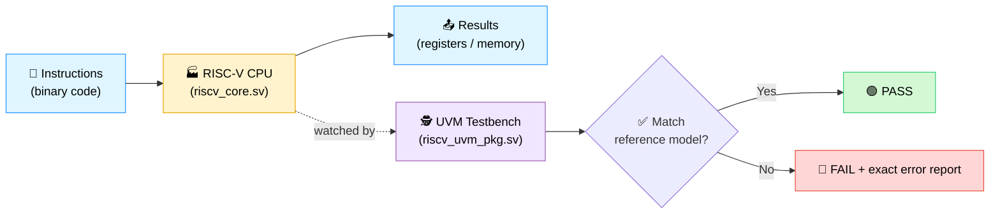
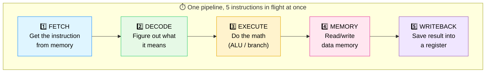
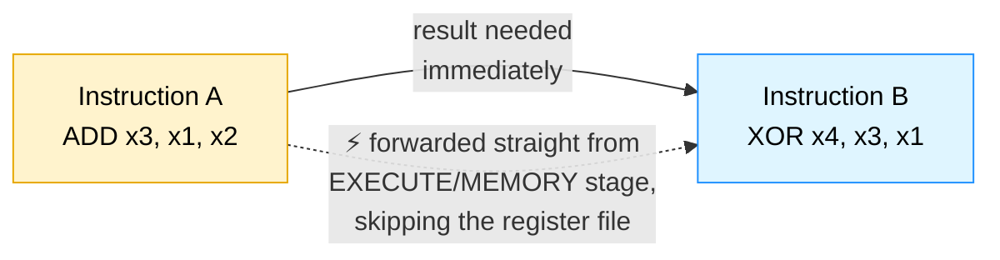
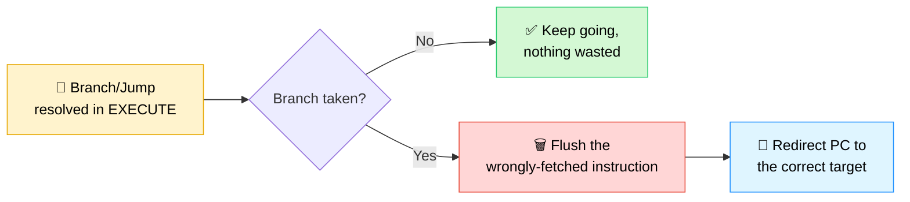
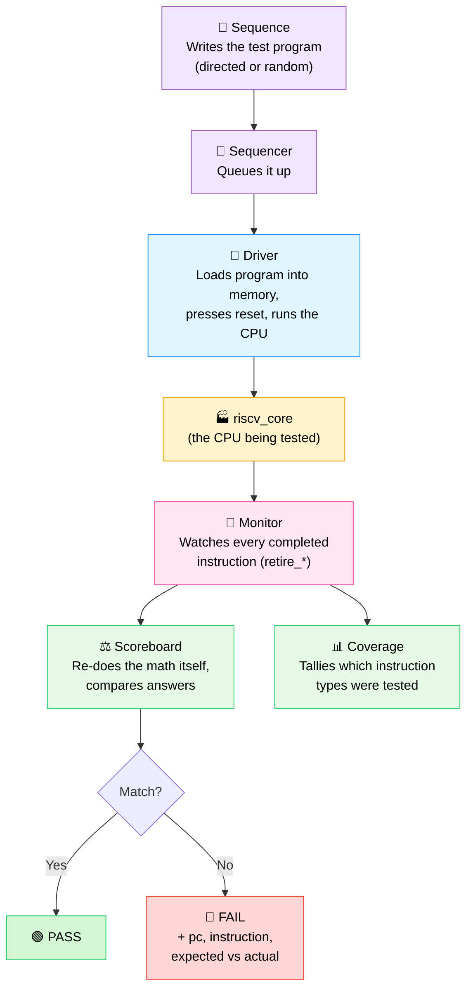
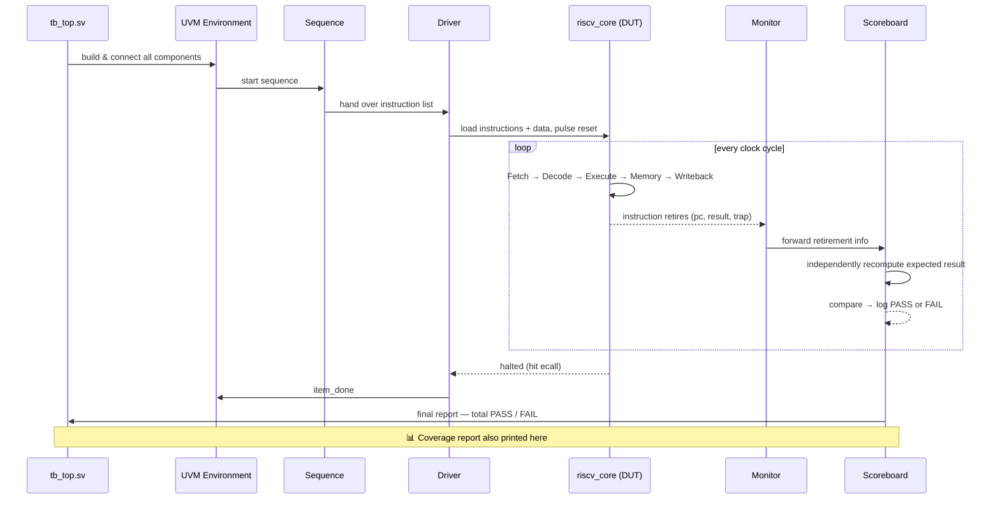

# 🧠 RISC-V 5-Stage Pipelined CPU

### *Built from scratch in SystemVerilog — and proven correct with a UVM testbench*

-orange?style=for-the-badge)

---

## 🪄 Explain it like I'm not an engineer

Imagine a CPU as a **tiny, very literal-minded factory worker**. You hand it instructions written as patterns of 1s and 0s, and it does *exactly* what they say — add these two numbers, save this value, jump somewhere else if two numbers are equal.

This repository contains:

1. 🏭 **A CPU** (`riscv_core.sv`) — the actual "factory worker" that reads instructions and executes them, five at a time, assembly-line style.
2. 🕵️ **A robotic inspector** (the UVM testbench) — that watches everything the factory worker does, independently re-does the math itself, and raises an alarm the instant the two disagree.

If you've ever double-checked a calculator's answer by doing the sum on paper yourself — that's exactly what the inspector does, every single instruction, automatically, thousands of times a second.

---

## 🗺️ The big picture (one diagram)

---

## 📂 What's in this folder

| File | Plain-English role |
|---|---|
| 🧮 [`riscv_pkg.sv`](riscv_pkg.sv) | A toolbox of helper functions — builds 32-bit instructions and decodes their hidden fields (like a translator between "human assembly" and "raw binary"). |
| 🏭 [`riscv_core.sv`](riscv_core.sv) | **The CPU itself.** The pipeline, the register file (32 numbered storage slots), the ALU (the calculator), and built-in self-checks. |
| 🔌 [`cpu_mem_if.sv`](cpu_mem_if.sv) | The "motherboard" — instruction memory + data memory + all the wires the CPU plugs into. |
| 🕵️ [`riscv_uvm_pkg.sv`](riscv_uvm_pkg.sv) | The robotic inspector — generates programs, feeds them in, watches the output, and judges pass/fail. |
| 🔝 [`tb_top.sv`](tb_top.sv) | The "power button" — wires the CPU to the motherboard and starts the inspector running. |

---

## 🏭 Concept #1 — Pipelining (the assembly line)

A non-pipelined CPU finishes one instruction *completely* before even looking at the next one — like one chef cooking an entire meal alone, start to finish, before starting the next order.

This CPU instead uses **5 stages**, like 5 chefs on an assembly line, each doing one job, passing the dish down the line. While chef 5 plates dish #1, chef 1 has already started chopping for dish #5.

This is roughly **5x faster** than doing one instruction at a time — but it creates a new headache: what if instruction #2 needs an answer that instruction #1 hasn't finished computing yet?

---

## ⚠️ Concept #2 — Hazards (when the assembly line trips over itself)

### 🔁 Data hazard → fixed with **forwarding**

> *"I need the total you just calculated — don't make me wait for you to write it down, just shout it to me directly."*

### ⏸️ Load-use hazard → fixed with a **1-cycle stall**

> *"That number is in a box on a shelf across the warehouse — I physically can't get it to you instantly. Wait one second."*

A value coming from memory (a `load`) isn't ready in time to forward, so the pipeline freezes the next instruction for exactly one cycle until the loaded value arrives.

### 🔀 Control hazard → fixed with **flush + redirect**

> *"Oops, you guessed the CPU would keep going straight, but it just took a detour (branch/jump). Throw away what you started fetching and go the right way instead."*

---

## 🛑 Concept #3 — Exceptions (knowing when to stop)

If the CPU is handed a nonsense instruction, or hits an `ecall` (a deliberate "I'm done" signal), it doesn't crash messily — it cleanly raises a `trap`, stops retiring new instructions, and halts. Think of it as the factory worker calmly putting down its tools instead of jamming the whole line.

---

## 🕵️ Concept #4 — UVM: the robotic inspector, piece by piece

UVM (**Universal Verification Methodology**) is just a standard way of structuring a "checker" out of reusable Lego-like blocks:

| Block | Job, in one sentence |
|---|---|
| 📜 **Sequence** | Decides *what program* to run — either a small fixed one (`riscv_directed_seq`) or 25 randomly chosen instruction patterns (`riscv_random_seq`) designed to specifically trigger hazards. |
| 🚦 **Sequencer** | A queue/traffic controller between the sequence and the driver. |
| 🚗 **Driver** | Actually loads the instructions into memory, resets the CPU, and lets it run until it halts or times out. |
| 👀 **Monitor** | Silently watches the CPU's output pins — every time an instruction "retires" (finishes), it records what happened. |
| ⚖️ **Scoreboard** | The judge. Keeps its *own* simple, independent model of the registers and memory, written separately from the real CPU. Re-computes what *should* have happened, and compares it field-by-field with what really happened. |
| 📊 **Coverage** | A checklist tracker — makes sure the random testing actually exercised every instruction type, not just the easy ones. Target: 90%+. |

---

## 🔄 Full end-to-end flow

---

## 🧩 The instruction set this CPU understands

| Category | Instructions | What it does |
|---|---|---|
| ➕ Arithmetic / Logic | `ADD`, `SUB`, `AND`, `OR`, `XOR` | Combine two register values |
| ➕ Immediate | `ADDI` | Add a constant baked into the instruction |
| 📥 Memory | `LW` (load word) | Read 4 bytes from memory into a register |
| 📤 Memory | `SW` (store word) | Write a register's value into memory |
| 🔀 Branch | `BEQ`, `BNE` | Jump elsewhere *if* two registers are equal / not equal |
| 🦘 Jump | `JAL` | Unconditionally jump, saving the return address |
| 🛑 System | `ECALL` | Cleanly halt the CPU |

A register named **`x0` is hard-wired to always be `0`** — no matter what you try to write into it, it stays zero. (This is a real RISC-V rule, and there's a dedicated assertion in `riscv_core.sv` that checks it every single cycle.)

---

## 🛡️ Built-in safety nets (assertions)

Even on top of the UVM scoreboard, `riscv_core.sv` carries live, always-on checks during simulation:

- ✅ `x0` never becomes non-zero.
- ✅ When a branch/jump redirects the PC, next cycle's PC *must* equal that exact target.
- ✅ During a load-use stall, the PC freezes for exactly one cycle.
- ✅ During a load-use stall, the fetched instruction also stays frozen (doesn't silently change underneath the stall).

Think of these as smoke detectors wired directly into the factory floor — independent of the inspector, and impossible to miss.

---

## 🎯 Why build this at all?

This is a hands-on way to learn how real CPUs work under the hood — not by reading about pipelining and hazards in a textbook, but by building the exact mechanisms (forwarding paths, stall logic, branch flushing) and then proving, instruction by instruction, that they actually work. It mirrors how real silicon teams verify chips before they're ever manufactured: build the design, then build an independent judge that's smarter than blind trust.
