<div align="center">

# 🧠 RISC-V 5-Stage Pipelined CPU

### 🎓 *A friendly, no-experience-needed tour of a real CPU — built in SystemVerilog, proven correct with UVM*


-orange?style=for-the-badge)


</div>

---

## 👋 Hi! Pull up a chair — let's learn this together

> [!TIP]
> **You do not need to know hardware, chip design, or SystemVerilog to read this.** Every concept here is taught from zero, the way a teacher would explain it on a whiteboard — with a story, then a picture, then (only once you're comfy) a peek at the real code.

Think of me as a teacher sitting next to you, and this README as our whiteboard. We're going to build up your understanding **one small idea at a time**:

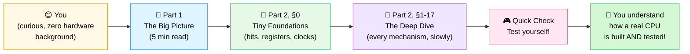

### 🎨 How to read the colors in this guide

Every diagram below uses the **same color language**, so once you learn it here, every picture in this document becomes instantly readable:

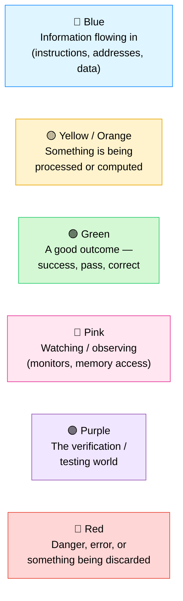

## 🪄 Explain it like I'm 10 years old

Imagine a CPU as a **tiny, very literal-minded factory worker**. You hand it instructions written as patterns of 1s and 0s, and it does *exactly* what they say — nothing more, nothing less: add these two numbers, save this value, jump somewhere else if two numbers are equal. It never gets bored, never makes a typo, and never improvises.

This repository contains **two halves of one story**:

1. 🏭 **A CPU** (`riscv_core.sv`) — the actual "factory worker" that reads instructions and executes them, five at a time, assembly-line style.
2. 🕵️ **A robotic inspector** (the UVM testbench) — that watches everything the factory worker does, independently re-does the math itself, and raises an alarm the instant the two disagree.

> [!NOTE]
> Have you ever checked a calculator's answer by doing the sum on paper yourself? That's *exactly* what the inspector does here — except it re-checks **every single instruction**, automatically, thousands of times a second, and never gets tired of double-checking.

---

## 🗺️ The big picture (one diagram)

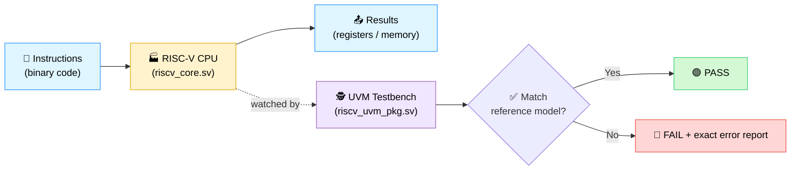

---

## 📂 What's in this folder

| File | Plain-English role |
|---|---|
| 🧮 [`riscv_pkg.sv`](riscv_pkg.sv) | A toolbox of helper functions — builds 32-bit instructions and decodes their hidden fields (like a translator between "human assembly" and "raw binary"). |
| 🏭 [`riscv_core.sv`](riscv_core.sv) | **The CPU itself.** The pipeline, the register file (32 numbered storage slots), the ALU (the calculator), and built-in self-checks. |
| 🔌 [`cpu_mem_if.sv`](cpu_mem_if.sv) | The "motherboard" — instruction memory + data memory + all the wires the CPU plugs into. |
| 🕵️ [`riscv_uvm_pkg.sv`](riscv_uvm_pkg.sv) | The robotic inspector — generates programs, feeds them in, watches the output, and judges pass/fail. |
| 🔝 [`tb_top.sv`](tb_top.sv) | The "power button" — wires the CPU to the motherboard and starts the inspector running. |

---

## 🏭 Concept #1 — Pipelining (the assembly line)

A non-pipelined CPU finishes one instruction *completely* before even looking at the next one — like one chef cooking an entire meal alone, start to finish, before starting the next order.

This CPU instead uses **5 stages**, like 5 chefs on an assembly line, each doing one job, passing the dish down the line. While chef 5 plates dish #1, chef 1 has already started chopping for dish #5.

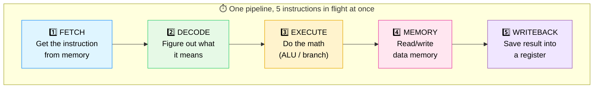

This is roughly **5x faster** than doing one instruction at a time — but it creates a new headache: what if instruction #2 needs an answer that instruction #1 hasn't finished computing yet?

---

## ⚠️ Concept #2 — Hazards (when the assembly line trips over itself)

### 🔁 Data hazard → fixed with **forwarding**

> *"I need the total you just calculated — don't make me wait for you to write it down, just shout it to me directly."*

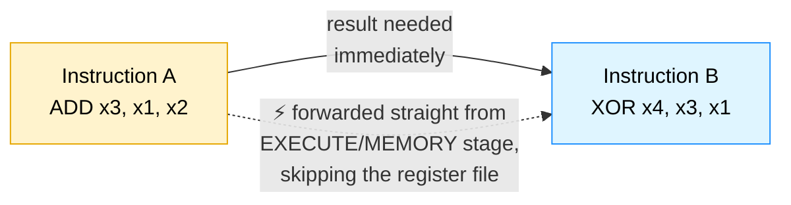

### ⏸️ Load-use hazard → fixed with a **1-cycle stall**

> *"That number is in a box on a shelf across the warehouse — I physically can't get it to you instantly. Wait one second."*

A value coming from memory (a `load`) isn't ready in time to forward, so the pipeline freezes the next instruction for exactly one cycle until the loaded value arrives.

### 🔀 Control hazard → fixed with **flush + redirect**

> *"Oops, you guessed the CPU would keep going straight, but it just took a detour (branch/jump). Throw away what you started fetching and go the right way instead."*

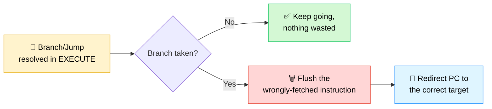

---

## 🛑 Concept #3 — Exceptions (knowing when to stop)

If the CPU is handed a nonsense instruction, or hits an `ecall` (a deliberate "I'm done" signal), it doesn't crash messily — it cleanly raises a `trap`, stops retiring new instructions, and halts. Think of it as the factory worker calmly putting down its tools instead of jamming the whole line.

---

## 🕵️ Concept #4 — UVM: the robotic inspector, piece by piece

UVM (**Universal Verification Methodology**) is just a standard way of structuring a "checker" out of reusable Lego-like blocks:

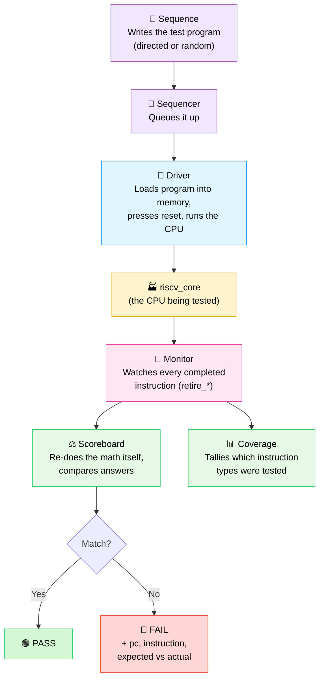

| Block | Job, in one sentence |
|---|---|
| 📜 **Sequence** | Decides *what program* to run — either a small fixed one (`riscv_directed_seq`) or 25 randomly chosen instruction patterns (`riscv_random_seq`) designed to specifically trigger hazards. |
| 🚦 **Sequencer** | A queue/traffic controller between the sequence and the driver. |
| 🚗 **Driver** | Actually loads the instructions into memory, resets the CPU, and lets it run until it halts or times out. |
| 👀 **Monitor** | Silently watches the CPU's output pins — every time an instruction "retires" (finishes), it records what happened. |
| ⚖️ **Scoreboard** | The judge. Keeps its *own* simple, independent model of the registers and memory, written separately from the real CPU. Re-computes what *should* have happened, and compares it field-by-field with what really happened. |
| 📊 **Coverage** | A checklist tracker — makes sure the random testing actually exercised every instruction type, not just the easy ones. Target: 90%+. |

---

## 🔄 Full end-to-end flow

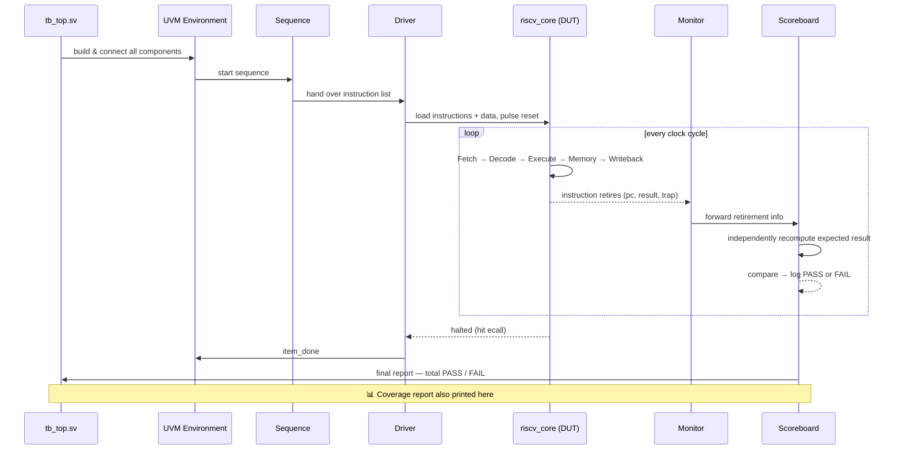

---

## 🧩 The instruction set this CPU understands

| Category | Instructions | What it does |
|---|---|---|
| ➕ Arithmetic / Logic | `ADD`, `SUB`, `AND`, `OR`, `XOR` | Combine two register values |
| ➕ Immediate | `ADDI` | Add a constant baked into the instruction |
| 📥 Memory | `LW` (load word) | Read 4 bytes from memory into a register |
| 📤 Memory | `SW` (store word) | Write a register's value into memory |
| 🔀 Branch | `BEQ`, `BNE` | Jump elsewhere *if* two registers are equal / not equal |
| 🦘 Jump | `JAL` | Unconditionally jump, saving the return address |
| 🛑 System | `ECALL` | Cleanly halt the CPU |

A register named **`x0` is hard-wired to always be `0`** — no matter what you try to write into it, it stays zero. (This is a real RISC-V rule, and there's a dedicated assertion in `riscv_core.sv` that checks it every single cycle.)

---

## 🛡️ Built-in safety nets (assertions)

Even on top of the UVM scoreboard, `riscv_core.sv` carries live, always-on checks during simulation:

- ✅ `x0` never becomes non-zero.
- ✅ When a branch/jump redirects the PC, next cycle's PC *must* equal that exact target.
- ✅ During a load-use stall, the PC freezes for exactly one cycle.
- ✅ During a load-use stall, the fetched instruction also stays frozen (doesn't silently change underneath the stall).

Think of these as smoke detectors wired directly into the factory floor — independent of the inspector, and impossible to miss.

---

## 🎯 Why build this at all?

This is a hands-on way to learn how real CPUs work under the hood — not by reading about pipelining and hazards in a textbook, but by building the exact mechanisms (forwarding paths, stall logic, branch flushing) and then proving, instruction by instruction, that they actually work. It mirrors how real silicon teams verify chips before they're ever manufactured: build the design, then build an independent judge that's smarter than blind trust.

---
---

# 📘 PART 2 — The Deep Dive

> Everything above this line is the "tour." Everything below is the "textbook" — a much slower, much more detailed walk through *every single mechanism* in this CPU and its testbench, for anyone who wants to actually understand RTL design and verification, not just skim it.

### 🧭 Table of contents

**🧱 Warm-up**
0. [Tiny foundations — bits, registers, memory, and the clock](#0-tiny-foundations--bits-registers-memory-and-the-clock)

**⚙️ How the CPU itself works**
1. [The 5 stages, in depth](#1-the-5-stages-in-depth)
2. [Pipeline registers — the conveyor belts between stages](#2-pipeline-registers--the-conveyor-belts-between-stages)
3. [Reading registers & the register file](#3-reading-registers--the-register-file)
4. [Data dependencies & the RAW hazard problem](#4-data-dependencies--the-raw-hazard-problem)
5. [Forwarding, in depth](#5-forwarding-in-depth)
6. [The load-use hazard & stalling, in depth](#6-the-load-use-hazard--stalling-in-depth)
7. [Branching & control flow, in depth](#7-branching--control-flow-in-depth)
8. [Memory ordering](#8-memory-ordering)
9. [Exception handling](#9-exception-handling)
10. [Write-back, in depth](#10-write-back-in-depth)

**🛡️ How we prove it's correct**
11. [Assertions, in depth](#11-assertions-in-depth)
12. [Functional coverage, in depth](#12-functional-coverage-in-depth)
13. [The UVM testbench, component by component](#13-the-uvm-testbench-component-by-component)
14. [The directed test, instruction by instruction](#14-the-directed-test-instruction-by-instruction)
15. [The random test — all 8 hazard patterns explained](#15-the-random-test--all-8-hazard-patterns-explained)
16. [A full worked example — one pipeline, cycle by cycle](#16-a-full-worked-example--one-pipeline-cycle-by-cycle)

**🎮 Wrap-up**
17. [Quick check — test yourself!](#quick-check--test-yourself)
18. [Glossary](#18-glossary)

---

## 0. Tiny foundations — bits, registers, memory, and the clock

> [!IMPORTANT]
> If words like "register," "clock cycle," or "binary" already feel comfortable, skip straight to [§1](#1-the-5-stages-in-depth). If not, stay right here — five minutes here will make *everything* below click much faster.

### 🔢 What's a "bit," and why does the CPU only speak in 1s and 0s?

A **bit** is the smallest piece of information possible — it can only ever be one of two things: **0** or **1**. Think of it as a single light switch: off (0) or on (1). A CPU is built entirely out of tiny electronic switches, so it can *only* ever store and move around patterns of 0s and 1s — it has no idea what a "letter" or a "number" is, except as a pattern of switches.

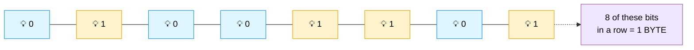

This whole CPU works with groups of **32 bits at a time** (called a **word**) — every instruction is 32 bits, every register holds 32 bits, every memory address points at 32 bits. You never need to do binary math by hand to follow this guide — just remember: **everything here is secretly a long row of light switches**, and different *patterns* of switches mean different things (sometimes a number, sometimes an instruction, sometimes an address) depending on context.

### 📦 What's a "register"?

A **register** is just a tiny, named storage box that holds exactly one 32-bit number, and can be read or overwritten almost instantly (much faster than memory). This CPU has **32 of them**, named `x0` through `x31` — think of them as 32 small lockers right next to the factory worker's hands, so close that grabbing a value from one costs essentially no time at all.

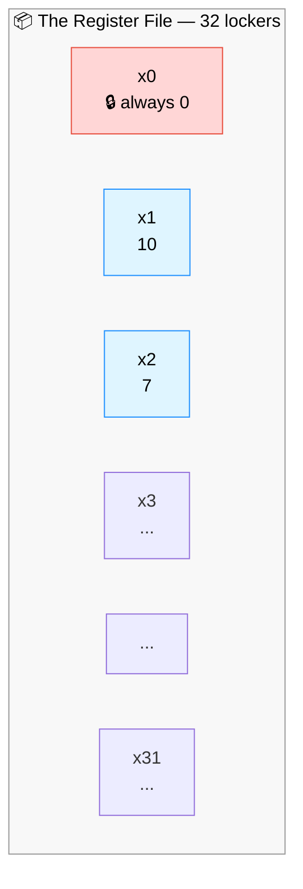

### 🗄️ What's "memory," and how is it different from a register?

If registers are lockers right next to the worker's hands, **memory** is a big warehouse shelf, further away — it can hold *far* more data (this project's toy memory holds 256 words), but reaching it takes longer. That's why a CPU always pulls data into registers first, works on it there, and only goes to memory when it specifically needs to `load` (read) or `store` (write) something.

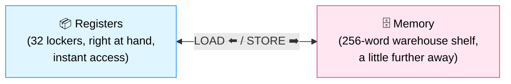

### ⏱️ What's a "clock cycle"?

Every action in this CPU happens in lockstep with a **clock** — an electrical heartbeat that ticks at a steady rate (`always #5 clk = ~clk;` in [tb_top.sv](tb_top.sv) — flips every 5 nanoseconds). Nothing "happens gradually" inside this design; instead, on every single tick, every storage element (registers, pipeline latches) is allowed to update **once**, all at the same instant, then everything holds perfectly still until the next tick.

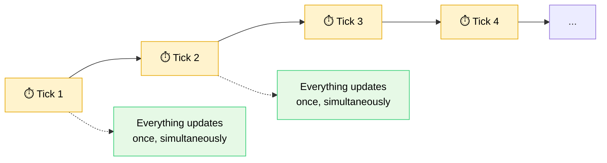

This is *why* this whole document keeps talking about "cycle 1, cycle 2, cycle 3..." — a cycle is simply **one tick of this heartbeat**, and it's the basic unit of time every diagram below measures things in.

> [!TIP]
> **🎓 In simple words:** A CPU is a box of light-switch patterns (bits), with 32 fast personal lockers (registers) and one big slower shelf (memory), and it only ever moves on a steady drumbeat (the clock). Keep these four words — **bit, register, memory, cycle** — in your back pocket; everything from here on just combines them in clever ways.

---

## 1. The 5 stages, in depth

Every instruction that runs on this CPU walks through the **same 5 rooms, in the same order**, one room per clock cycle. Think of it as a relay race with 5 runners — once runner 1 (Fetch) hands off the baton, they immediately turn around and start running again for the *next* instruction, while runner 2 (Decode) carries on with the first.

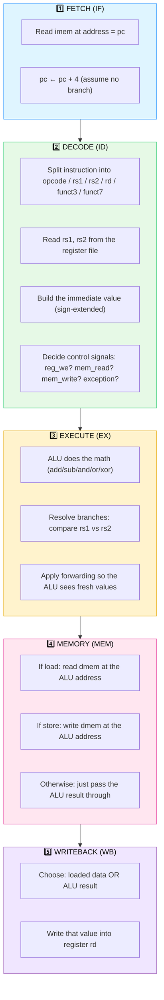

### 1️⃣ FETCH (IF) — "go get the next instruction"

**What happens:** the CPU uses its program counter (`pc`, a 32-bit number = "the address of the instruction we're about to run") to read one 32-bit word out of instruction memory (`imem`).

**In the code** ([riscv_core.sv:110](riscv_core.sv#L110)):
```systemverilog
assign imem_addr = pc;
```
That's it — fetch in this design is just "point the address bus at `pc`." The actual capture happens at the bottom of the giant `always_ff` block, where on every clock edge (unless something stalls or flushes it):
```systemverilog
pc          <= pc + 32'd4;     // move to the next instruction...
if_id_valid <= 1'b1;
if_id_pc    <= pc;             // ...but remember which pc THIS instruction had
if_id_instr <= imem_rdata;     // ...and capture the word that came back
```

**Why `pc + 4`?** Every instruction here is exactly 4 bytes (32 bits) wide, and memory is byte-addressed, so the next instruction always lives 4 addresses later — unless a branch/jump says otherwise (see [§7](#7-branching--control-flow-in-depth)).

**Why capture `pc` alongside the instruction?** Because by the time this instruction reaches later stages, the *real* `pc` register has already moved on to fetching other instructions. Each stage needs to carry its *own* copy of "which instruction am I, and what was my address" — that's the whole reason pipeline registers exist (see [§2](#2-pipeline-registers--the-conveyor-belts-between-stages)).

### 2️⃣ DECODE (ID) — "figure out what this instruction is asking for"

**What happens:** the raw 32-bit word gets taken apart, field by field, and translated into "intentions" — which registers does it read, which one does it write, what operation, what immediate constant.

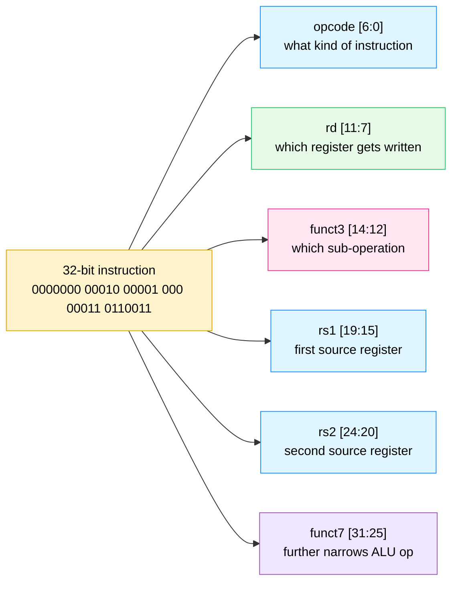

This bit-slicing happens combinationally in [riscv_core.sv:183-220](riscv_core.sv#L183-L220) (the `always_comb` block that computes all the `dec_*` signals). Concretely:
- `dec_rs1 = if_id_instr[19:15]`, `dec_rs2 = if_id_instr[24:20]`, `dec_rd = if_id_instr[11:7]` — just wire taps, no logic.
- `decode_op(...)` is a function that looks at `opcode` + `funct3` + `funct7` together and returns one tidy enum value like `OP_ADD` or `OP_LW` — this is what the rest of the pipeline actually switches on, instead of re-decoding raw bits everywhere.
- The immediate value is rebuilt and **sign-extended** here too (`imm_i`, `imm_s`, `imm_b`, `imm_j` from [riscv_pkg.sv](riscv_pkg.sv)) — RISC-V scatters the immediate bits around the instruction word in a deliberately annoying layout (to keep `rs1`/`rs2`/`rd` in the same bit positions across instruction types), so these functions exist purely to stitch the bits back into a normal signed number.
- The two source registers are read **right here**, combinationally, via `read_reg_with_wb(dec_rs1)` / `read_reg_with_wb(dec_rs2)` — see [§3](#3-reading-registers--the-register-file) for why that function exists instead of a plain array read.

### 3️⃣ EXECUTE (EX) — "do the actual math"

**What happens:** the ALU (Arithmetic Logic Unit — basically a calculator built out of logic gates) performs the operation this instruction asked for, using values that have been **forwarded** in if necessary (see [§5](#5-forwarding-in-depth)).

From [riscv_core.sv:249-282](riscv_core.sv#L249-L282), the ALU is just one big `case` statement keyed on the operation type:
```systemverilog
case (id_ex_op)
  OP_ADD:  ex_alu_result = ex_rs1_val + ex_rs2_val;
  OP_SUB:  ex_alu_result = ex_rs1_val - ex_rs2_val;
  OP_AND:  ex_alu_result = ex_rs1_val & ex_rs2_val;
  OP_OR:   ex_alu_result = ex_rs1_val | ex_rs2_val;
  OP_XOR:  ex_alu_result = ex_rs1_val ^ ex_rs2_val;
  OP_ADDI: ex_alu_result = ex_rs1_val + id_ex_imm;
  OP_LW:   ex_alu_result = ex_rs1_val + id_ex_imm;   // address calculation!
  OP_SW:   ex_alu_result = ex_rs1_val + id_ex_imm;   // address calculation!
  ...
```
Notice `LW`/`SW` also go through the *adder* here — "load from memory" doesn't have its own special hardware for computing an address, it just reuses the same adder that `ADD`/`ADDI` use (`base register + offset`). This is a classic RISC trick: reuse one ALU for everything instead of building a separate address unit.

This stage is also where **branches are decided** (`OP_BEQ`/`OP_BNE` compare `ex_rs1_val` vs `ex_rs2_val`) and where **JAL's target address** is computed (`id_ex_pc + id_ex_imm`) — see [§7](#7-branching--control-flow-in-depth) for the full story.

### 4️⃣ MEMORY (MEM) — "touch data memory, if this instruction needs to"

**What happens:** only `LW` and `SW` actually do anything here; every other instruction just coasts through this stage carrying its already-computed ALU result.

```systemverilog
assign dmem_valid = ex_mem_valid && (ex_mem_mem_read || ex_mem_mem_write);
assign dmem_we    = ex_mem_mem_write;
assign dmem_addr  = ex_mem_alu_result;   // the address EX computed last cycle
assign dmem_wdata = ex_mem_store_data;   // rs2's value, captured back in EX
```
For a **store**, `ex_mem_store_data` (a copy of `rs2`'s value made back in the EX stage, see `ex_mem_store_data <= ex_rs2_val` in the sequential block) gets written into `dmem` at `dmem_addr`.
For a **load**, `dmem_rdata` simply becomes available — but it isn't captured into the pipeline register until the *next* clock edge (`mem_wb_wb_data <= dmem_rdata`), which is conceptually the start of Writeback.

### 5️⃣ WRITEBACK (WB) — "save the final result"

**What happens:** whichever value this instruction ultimately produced — a loaded memory word, or an ALU result — gets written into the destination register `rd` in the register file, **unless `rd` is `x0`** (which is permanently zero, see [§3](#3-reading-registers--the-register-file)) or the instruction had an exception.

```systemverilog
if (mem_wb_valid && mem_wb_reg_we && (mem_wb_rd != 5'd0) && !mem_wb_exception) begin
  regs[mem_wb_rd] <= mem_wb_wb_data;
end
```
This is the very last thing that happens to an instruction — once this line executes, the instruction's effects are now **permanently visible** to every future instruction via a normal register read. Before this point, only *forwarding* (a temporary shortcut, see [§5](#5-forwarding-in-depth)) could see the result.

> [!TIP]
> **🎓 In simple words:** Every instruction walks through the same 5-room hallway — **Fetch** (grab it), **Decode** (understand it), **Execute** (do the math), **Memory** (touch the warehouse shelf if needed), **Writeback** (save the answer). Five instructions are always mid-hallway at once, each in a different room — that overlap is *the entire reason* this CPU is fast, and also the entire reason the next few sections exist (overlap creates problems that a single-room CPU would never have).

---

## 2. Pipeline registers — the conveyor belts between stages

If the 5 stages are 5 rooms, the **pipeline registers** are the conveyor belts between them — they're what physically carries an instruction's information from one room into the next, one clock edge at a time. There are 4 of them, named after the two stages they sit between:

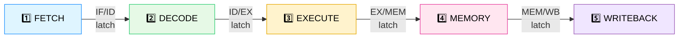

Each one is just a bundle of flip-flops that gets updated on every `posedge clk`. Here's what each conveyor belt actually carries (from [riscv_core.sv:47-85](riscv_core.sv#L47-L85)):

| Register | Carries | Why it needs to |
|---|---|---|
| **IF/ID** | `if_id_valid`, `if_id_pc`, `if_id_instr` | The raw fetched instruction and the address it came from, so Decode has something to chew on. |
| **ID/EX** | `id_ex_op`, `id_ex_rs1/rs2/rd`, `id_ex_rs1_val/rs2_val`, `id_ex_imm`, `id_ex_reg_we`, `id_ex_mem_read/write`, `id_ex_exception`, plus `id_ex_pc`/`id_ex_instr` | Everything Decode figured out — the operation, the register *numbers* (still needed for forwarding comparisons), the register *values* it read, the immediate, and all the control flags. |
| **EX/MEM** | `ex_mem_op`, `ex_mem_rd`, `ex_mem_alu_result`, `ex_mem_store_data`, `ex_mem_reg_we`, `ex_mem_mem_read/write`, `ex_mem_exception`, plus pc/instr | The ALU's answer, and (for stores) a snapshot of the value to write to memory. |
| **MEM/WB** | `mem_wb_op`, `mem_wb_rd`, `mem_wb_wb_data`, `mem_wb_reg_we`, `mem_wb_exception`, plus pc/instr | The *final* value — either the loaded memory word or the carried-through ALU result — ready to be written to the register file. |

**Why carry `valid` alongside everything else?** Because a pipeline stage can be physically occupied by a "bubble" — a fake, do-nothing instruction inserted because of a stall, flush, or just because the pipeline hasn't filled up yet (e.g. right after reset). The `*_valid` bit is how every stage tells the next one *"ignore everything else I'm carrying, there's no real instruction here."* You'll see this pattern constantly: `if (mem_wb_valid && mem_wb_reg_we && ...)`. Every side effect (register write, memory write, retirement) is gated by some `*_valid` bit upstream of it.

**Why is a "bubble" encoded as the instruction `0000_0013` (which is `ADDI x0, x0, 0` — a real, harmless RISC-V no-op)?** So that even if a `valid` bit is accidentally misread somewhere, the worst that happens is a meaningless "add zero to zero and throw it away" — not a crash or an illegal-instruction trap. It's a safety-by-construction choice, visible everywhere a register gets reset, e.g. `if_id_instr <= 32'h0000_0013;`.

> [!TIP]
> **🎓 In simple words:** Between every two rooms of the hallway sits a little clipboard (a pipeline register) that writes down everything about the instruction passing through, so the next room knows what to do — including a tiny "is this clipboard even real, or just blank paper?" checkbox (`valid`). That checkbox is how empty rooms (bubbles) don't accidentally get treated like real instructions.

---

## 3. Reading registers & the register file

The **register file** is just 32 slots of 32-bit storage (`logic [31:0] regs [0:31];`), named `x0` through `x31`. Every instruction's job, ultimately, boils down to: *read some registers, compute something, write one register.*

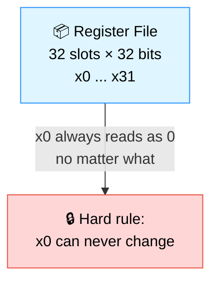

### Why is `x0` special?

RISC-V dedicates one register to permanently hold the value `0`. This sounds wasteful (one fewer register to use!) but it's actually a clever trick: it means the instruction set never needs a special "load the constant zero" instruction, or a special "discard this result" instruction — you just target `x0` and the hardware quietly throws the value away. This CPU enforces the rule in two places:
1. **Every cycle, unconditionally:** `regs[0] <= 32'h0;` ([riscv_core.sv:347](riscv_core.sv#L347)) — even if something upstream tried to write to it, this line runs *after* (overwrites) any conflicting write within the same `always_ff` block ordering... and more importantly, the writeback condition itself explicitly excludes it: `(mem_wb_rd != 5'd0)`.
2. **Whenever a register is read**, via `read_reg_with_wb()`: `if (idx == 5'd0) read_reg_with_wb = 32'h0;` — so even reads are short-circuited to zero, just in case.
3. **An always-on assertion** (see [§11](#11-assertions-in-depth)) continuously checks `regs[0] == 0` and raises a simulation error the instant it's ever violated.

### Why isn't a register read just `regs[idx]`?

Because of a subtle timing problem. Imagine instruction A is finishing Writeback in the *exact same cycle* that instruction D is starting Decode and trying to read the very register A is about to write. If Decode just read `regs[idx]` directly, it would see the **old** value — A's write doesn't land until the *next* clock edge. That's a real bug class called a **same-cycle hazard**.

The fix is the `read_reg_with_wb()` function ([riscv_core.sv:173-181](riscv_core.sv#L173-L181)):
```systemverilog
function automatic logic [31:0] read_reg_with_wb(input logic [4:0] idx);
  if (idx == 5'd0) begin
    read_reg_with_wb = 32'h0;                              // x0 is always 0
  end else if (mem_wb_valid && mem_wb_reg_we && (mem_wb_rd == idx)) begin
    read_reg_with_wb = mem_wb_wb_data;                      // "peek" the value about to be written
  end else begin
    read_reg_with_wb = regs[idx];                           // normal case: just read the array
  end
endfunction
```
This is technically the **first and simplest forwarding path** in the whole design — it forwards from the Writeback stage directly into Decode's register read, so that a register read always sees the most up-to-date value, even one that hasn't been physically written into the array yet. The remaining forwarding paths (described in [§5](#5-forwarding-in-depth)) handle the other cases, where the consuming instruction is sitting in the *Execute* stage instead of Decode.

> [!TIP]
> **🎓 In simple words:** The register file is 32 personal lockers. Locker `x0` is glued shut at the value zero, forever. And whenever someone peeks into a locker, they get a tiny sneak preview of any value that's *about* to be put there this very cycle — so nobody ever reads "yesterday's news" by accident.

---

## 4. Data dependencies & the RAW hazard problem

A **data dependency** simply means: instruction B needs a value that instruction A produces. The dangerous version of this is called **RAW — Read After Write** (B reads a register *after* A writes it) — dangerous specifically because of pipelining: A and B are now executing *at the same time*, in different stages, so "after" isn't guaranteed unless the hardware does something about it.

Picture this back-to-back pair, with **no fix applied yet** — just the raw pipeline:

```
ADD x3, x1, x2      ; x3 = x1 + x2
XOR x4, x3, x1       ; x4 = x3 + x1   <-- needs x3, produced by the line above!
```

| Cycle | 1 | 2 | 3 | 4 | 5 |
|---|---|---|---|---|---|
| `ADD` (produces x3) | IF | ID | **EX** | MEM | **WB** ← x3 finally lands here |
| `XOR` (needs x3) | | IF | ID ← **reads x3 here, too early!** | EX | MEM |

By the time `ADD` actually writes `x3` into the register file (cycle 5, Writeback), `XOR` already tried to *read* `x3` back in cycle 3 (Decode) — **two cycles too early**. Without a fix, `XOR` would silently compute garbage using `x3`'s *old, stale* value.

There are two ways to solve this, and this CPU uses **both**, depending on the situation:

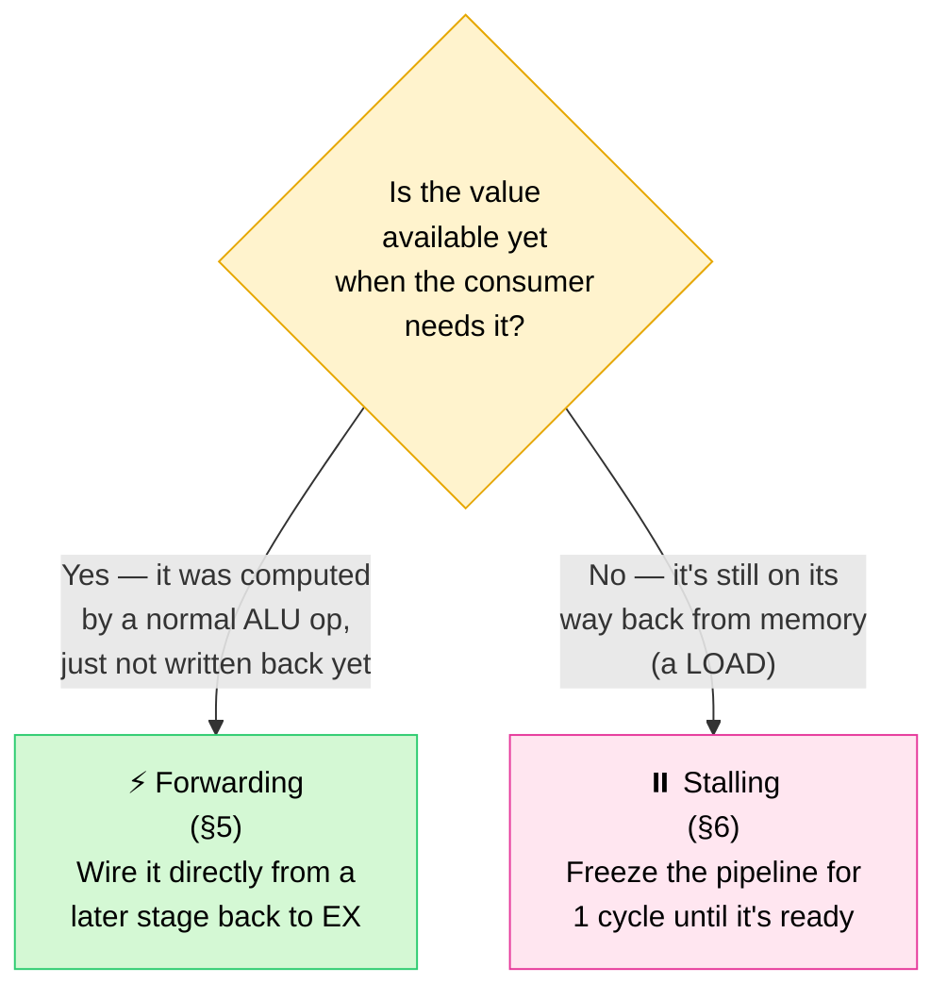

The next two sections explain each fix in full detail.

> [!WARNING]
> **🎓 In simple words:** Pipelining means several instructions are mid-flight together — so if instruction #2 needs an answer instruction #1 hasn't finished yet, naively reading too early gives a **wrong answer**, silently. This is the single biggest danger pipelining introduces, and the next two sections are entirely about defusing it.

---

## 5. Forwarding, in depth

**The idea:** a value computed by the ALU is *electrically available* the instant it's computed — it doesn't actually need to wait for the slow, multi-cycle journey through Memory and Writeback before another instruction can use it. Forwarding is just extra wiring that taps the result early and routes it straight to wherever it's needed, **bypassing** the register file entirely.

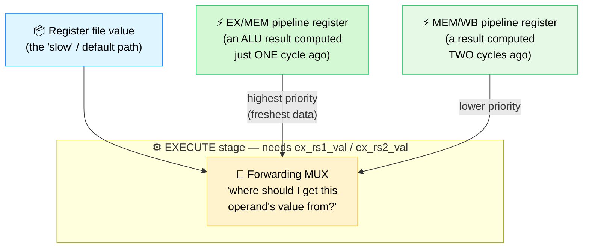

### The actual logic ([riscv_core.sv:232-247](riscv_core.sv#L232-L247))

```systemverilog
always_comb begin
  ex_rs1_val = id_ex_rs1_val;   // default: the value Decode read, cycle(s) ago
  ex_rs2_val = id_ex_rs2_val;

  // Priority 1: forward from EX/MEM (the freshest possible result)
  if (ex_mem_valid && ex_mem_reg_we && !ex_mem_mem_read &&
      (ex_mem_rd != 5'd0) && (ex_mem_rd == id_ex_rs1)) begin
    ex_rs1_val = ex_mem_alu_result;
  end
  // Priority 2: otherwise, forward from MEM/WB (one cycle older)
  else if (mem_wb_valid && mem_wb_reg_we &&
           (mem_wb_rd != 5'd0) && (mem_wb_rd == id_ex_rs1)) begin
    ex_rs1_val = mem_wb_wb_data;
  end
  // (same pattern repeated for ex_rs2_val / id_ex_rs2)
  ...
end
```

Read this as a decision tree run **fresh every single cycle**, for **both** source operands independently:

1. *"Is there an instruction currently sitting in EX/MEM that's about to write the exact register I need, and is it not itself a pending load (`!ex_mem_mem_read`)?"* → grab its `ex_mem_alu_result` directly. This is the highest-priority path because it's the most recently computed value.
2. *Else, "is there an instruction in MEM/WB about to write the register I need?"* → grab `mem_wb_wb_data` instead.
3. *Else* → no hazard, just use the value Decode originally read (`id_ex_rs1_val`/`id_ex_rs2_val`).

**Why exclude `!ex_mem_mem_read` from the EX/MEM path?** Because if the instruction in EX/MEM is a `LW`, then `ex_mem_alu_result` is just the *memory address*, not the *loaded data* — the real data (`dmem_rdata`) doesn't exist yet at this point in the pipeline! Forwarding the address by mistake would silently corrupt the result. (This is precisely the case that *can't* be solved by forwarding at all — that's the load-use hazard, see [§6](#6-the-load-use-hazard--stalling-in-depth).)

**Why does EX/MEM outrank MEM/WB when both match?** Because EX/MEM is *more recent* — if both pipeline stages happen to be carrying instructions that wrote the same register (e.g. two back-to-back `ADDI x5, ...`), the one closer to "now" (EX/MEM) holds the architecturally correct, most up-to-date value. Picking MEM/WB instead would forward a stale, overwritten value.

### Forwarding, traced cycle by cycle

Revisiting the same `ADD`/`XOR` example from [§4](#4-data-dependencies--the-raw-hazard-problem), but now *with* forwarding active:

| Cycle | `ADD x3,x1,x2` | `XOR x4,x3,x1` | What's happening |
|---|---|---|---|
| 1 | IF | | `ADD` fetched |
| 2 | ID | IF | `ADD` reads x1, x2; `XOR` fetched |
| 3 | **EX** (computes x3) | ID (reads *stale* x3 from regfile — ignored!) | `ADD`'s result for x3 is now sitting in the EX stage, about to latch into EX/MEM |
| 4 | MEM (x3 in EX/MEM now) | **EX** ← forwarding mux sees `ex_mem_rd == 3`, grabs `ex_mem_alu_result` instead of the stale value | ⚡ **Forwarding happens here** — `XOR` gets the correct, brand-new x3 value one full cycle before it would have reached the register file |
| 5 | WB (x3 written to regfile — now "officially" true) | MEM | |

Notice: `XOR` gets the *right* answer in cycle 4, a full cycle before `ADD`'s result is even written to the register file in cycle 5. **No stalling, no wasted cycles, no wrong answers** — that's the whole payoff of forwarding.

> [!TIP]
> **🎓 In simple words:** Forwarding is just a shortcut wire that says *"don't wait for me to officially write this down — here, take it directly from my hand."* It's like passing a note across the room instead of mailing it and waiting for delivery. Free speed, zero cost, as long as the value already physically exists somewhere.

---

## 6. The load-use hazard & stalling, in depth

Forwarding solves the RAW hazard *as long as the value already exists somewhere in the pipeline*. But a `LW` (load word) doesn't actually have its data yet when it's in the EX stage — EX only computes the **address**. The real data doesn't show up until the *Memory* stage reads `dmem`. That one-cycle gap is unavoidable — it's physically how long it takes a memory array to respond — and it's exactly long enough to break forwarding.

```
LW  x5, 0(x0)       ; x5 = dmem[0]      <- data only exists AFTER the MEM stage
ADD x6, x5, x1       ; x6 = x5 + x1     <- needs x5 immediately!
```

| Cycle | `LW x5` | `ADD x6,x5,x1` | What's happening |
|---|---|---|---|
| 1 | IF | | |
| 2 | ID | IF | |
| 3 | EX (computes *address*, not data!) | ID ← **tries to read x5 here — doesn't exist yet, not even via forwarding** | 😬 Even the fastest forwarding path (EX/MEM) can't help — `LW`'s real data isn't computed until next cycle |
| 4 | MEM (data finally arrives from `dmem_rdata`) | *(would be EX here, but it's too early)* | |

There is genuinely **no wire fast enough** to get the loaded value to `ADD` in time if `ADD` is allowed to proceed normally — the data simply doesn't exist yet at the moment it's needed. The only honest fix is to **buy one more cycle** by freezing the pipeline.

### Detecting the hazard ([riscv_core.sv:222-230](riscv_core.sv#L222-L230))

```systemverilog
always_comb begin
  load_use_stall = 1'b0;
  if (if_id_valid && id_ex_valid && id_ex_mem_read && (id_ex_rd != 5'd0)) begin
    if ((instr_uses_rs1(if_id_instr) && (if_id_instr[19:15] == id_ex_rd)) ||
        (instr_uses_rs2(if_id_instr) && (if_id_instr[24:20] == id_ex_rd))) begin
      load_use_stall = 1'b1;
    end
  end
end
```
In plain words: *"Is there a `LW` currently sitting in the EX stage (`id_ex_mem_read`), and does the instruction currently in Decode (`if_id_instr`) need that exact register as one of its sources?"* If yes → raise `load_use_stall`. (`instr_uses_rs1`/`instr_uses_rs2`, from [riscv_pkg.sv:126-142](riscv_pkg.sv#L126-L142), simply know which instruction types actually have an `rs1`/`rs2` field worth checking — e.g. a `JAL` doesn't read any registers at all, so it can never be stalled for this reason.)

### What a stall actually does — insert a "bubble"

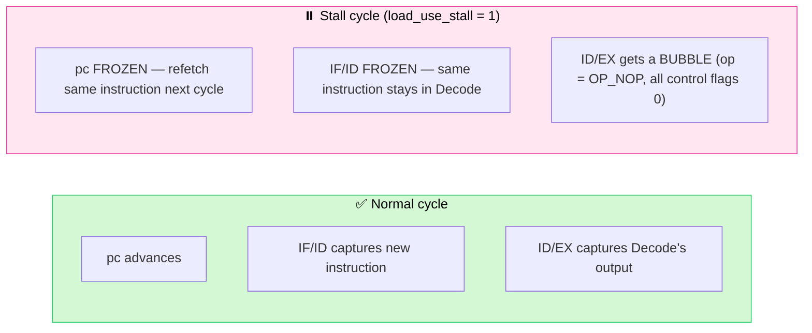

From the sequential block ([riscv_core.sv:381-433](riscv_core.sv#L381-L433)), when `load_use_stall` is true:
- **ID/EX gets cleared** to a bubble (`id_ex_valid <= 1'b0`, op forced to `OP_NOP`) — so the EX stage does nothing useful this cycle, by design.
- **`pc` and `if_id_*` are explicitly held at their current values** (`pc <= pc; if_id_valid <= if_id_valid; ...`) — Fetch and the instruction sitting in Decode are both **frozen in place** for one cycle, so the very next cycle they get to try again, by which point the load's data has arrived and forwarding *can* now do its job.

### Traced cycle by cycle, with the stall in place

| Cycle | `LW x5` | `ADD x6,x5,x1` | Note |
|---|---|---|---|
| 1 | IF | | |
| 2 | ID | IF | |
| 3 | EX | ID (stall detected — `id_ex_mem_read` ahead of it, same reg) | |
| 4 | MEM (`dmem_rdata` now valid) | **ID again** (frozen — same instruction re-decoded) | ⏸️ bubble sits in EX this cycle |
| 5 | WB | **EX** ← now forwards from MEM/WB (`mem_wb_wb_data`) successfully! | ⚡ forwarding finally succeeds, one cycle late but correct |

The cost: **one wasted cycle ("bubble")** every time a load's result is used by the very next instruction. This is the textbook tradeoff of a 5-stage in-order pipeline — and exactly why compilers for real RISC-V chips try to reorder instructions to put something unrelated right after a load, if they can.

Two of the always-on assertions in `riscv_core.sv` exist specifically to police this mechanism (see [§11](#11-assertions-in-depth)): one proves `pc` truly freezes during a stall, the other proves `if_id_instr` truly freezes too.

> [!TIP]
> **🎓 In simple words:** A `LOAD` is the one case where even the fastest shortcut wire isn't fast enough — the value is still on its way back from the warehouse shelf. So instead of a wrong answer, the CPU politely says *"hang on one second"* to the next instruction, freezes everything for exactly one tick, then lets it through once the value has actually arrived. One short pause beats a wrong answer every time.

---

## 7. Branching & control flow, in depth

**Control flow** just means "what determines which instruction runs next." Normally it's boring — `pc + 4`, every time. But `BEQ`, `BNE`, and `JAL` can redirect execution somewhere else entirely, and that's where pipelining gets painful: **the CPU doesn't know a branch is "taken" until it reaches the EX stage** — by which point it has *already* optimistically fetched the next instruction in line, assuming nothing special would happen.

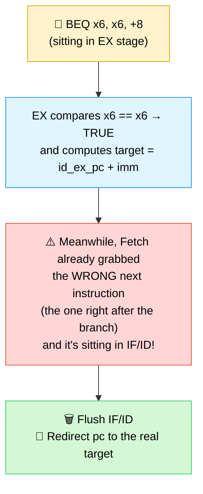

### How each branching instruction is resolved ([riscv_core.sv:249-282](riscv_core.sv#L249-L282))

```systemverilog
OP_BEQ: begin
  if (ex_rs1_val == ex_rs2_val) begin
    ex_redirect    = id_ex_valid;
    ex_redirect_pc = id_ex_pc + id_ex_imm;   // pc-relative target
  end
end
OP_BNE: begin
  if (ex_rs1_val != ex_rs2_val) begin
    ex_redirect    = id_ex_valid;
    ex_redirect_pc = id_ex_pc + id_ex_imm;
  end
end
OP_JAL: begin
  ex_alu_result  = id_ex_pc + 32'd4;          // the "return address" gets written to rd
  ex_redirect    = id_ex_valid;                // JAL ALWAYS redirects — it's unconditional
  ex_redirect_pc = id_ex_pc + id_ex_imm;
end
```

A few details worth noticing:
- **`BEQ`/`BNE` use the *forwarded* operand values** (`ex_rs1_val`/`ex_rs2_val`), not the raw ones read back in Decode — so a branch that depends on a value computed by the immediately preceding instruction still gets the *correct, fresh* comparison, thanks to the exact same forwarding muxes described in [§5](#5-forwarding-in-depth).
- **The branch target is `id_ex_pc + id_ex_imm`** — i.e. relative to the branch instruction's *own* address, not the current `pc`. This matters because the current `pc` has already raced ahead by the time EX is evaluating the branch.
- **`JAL` is unconditional** — it always redirects, no comparison needed — and it also writes a register (`rd = pc + 4`, the address of the instruction right after the jump), which is what lets RISC-V implement function calls (`rd` becomes the "return address" a function can later jump back to).

### The flush — throwing away the wrong guess ([riscv_core.sv:413-417](riscv_core.sv#L413-L417))

```systemverilog
if (ex_redirect) begin
  pc          <= ex_redirect_pc;   // 📍 jump to the real target
  if_id_valid <= 1'b0;              // 🗑️ the instruction Fetch just grabbed was WRONG — discard it
  if_id_pc    <= 32'h0;
  if_id_instr <= 32'h0000_0013;     // replace it with a harmless bubble
end
```
Only **one** instruction ever needs to be thrown away here — the one sitting in IF/ID — because EX is only one stage ahead of IF/ID. That's the **branch penalty**: exactly **1 wasted cycle** per taken branch, no more, no less, in this 5-stage design.

### Traced cycle by cycle — branch **taken**

```
BEQ x6, x6, +8        ; always true here, jumps forward 8 bytes (skips 1 instruction)
ADDI x7, x0, 99        ; <-- should NEVER execute (it's the "wrong path")
ADDI x8, x0, 123        ; <-- this is the real branch target
```

| Cycle | `BEQ` | `ADDI x7` (wrong-path) | `ADDI x8` (real target) |
|---|---|---|---|
| 1 | IF | | |
| 2 | ID | IF ← **fetched speculatively, turns out wrong** | |
| 3 | **EX** ← branch resolved: taken! `ex_redirect=1` | *(would be ID, but...)* | |
| 4 | MEM | 🗑️ **flushed — never reaches ID** | **IF** ← `pc` was redirected here instead |
| 5 | WB | | ID |

### Traced cycle by cycle — branch **not taken**

```
BNE x6, x6, +8        ; always FALSE here (x6 always equals itself)
ADDI x7, x6, 2          ; executes completely normally, no penalty at all
```

| Cycle | `BNE` | `ADDI x7` |
|---|---|---|
| 1 | IF | |
| 2 | ID | IF |
| 3 | EX ← resolved: **not taken**, `ex_redirect=0` | ID |
| 4 | MEM | EX |
| 5 | WB | MEM |

Notice: when a branch isn't taken, the pipeline never even notices anything special happened — the instruction right behind it was the correct guess all along, so it just keeps flowing through normally. The CPU here doesn't try to *predict* whether a branch will be taken (that's what "branch prediction" in real-world CPUs is for) — it simply always assumes "not taken" (keeps fetching straight ahead) and pays a fixed 1-cycle penalty whenever that guess turns out wrong.

### Interaction with exceptions

There's one more redirect-like case: `ex_exception_now` (an illegal instruction or `ecall` reaching EX). It also flushes IF/ID, but it deliberately does **not** change `pc` (`pc <= pc;`) — because once an exception is in flight, the CPU is on its way to halting altogether (see [§9](#9-exception-handling)), not jumping anywhere new.

> [!TIP]
> **🎓 In simple words:** The CPU is an optimist — it always guesses "this branch won't be taken" and keeps walking straight ahead without waiting to find out. Most of the time it's right and loses no time at all. When it's wrong, it just throws away the one wrong guess it already started on and steps onto the correct path — a 1-cycle "oops, my bad" instead of a costly stop-and-think.

---

## 8. Memory ordering

"Memory ordering" is a fancy way of asking: *if instruction A and instruction B both touch memory, are their effects guaranteed to happen in program order?* For a pipeline this matters a lot, because A and B are physically executing **at the same time**, in different stages.

This CPU sidesteps almost every classic memory-ordering bug by being a strictly **in-order, single-issue, single-memory-port** pipeline:

```mermaid
flowchart LR
    A["Instruction A\n(older)"] -->|"always enters\nMEM stage first"| MEMPORT["🔌 ONE data memory port\n(dmem_valid / dmem_we / dmem_addr)"]
    B["Instruction B\n(younger)"] -->|"always enters\nMEM stage one\ncycle later"| MEMPORT

    style A fill:#dff5ff,stroke:#1e90ff,color:#000
    style B fill:#e6f9e6,stroke:#2ecc71,color:#000
    style MEMPORT fill:#fff3cd,stroke:#e6a700,color:#000
```

A few concrete guarantees this design relies on:

- **Instructions enter and leave every stage in strict program order.** Nothing here is out-of-order or superscalar — there's exactly one instruction per stage, and they march forward in lockstep (or all freeze together, during a stall). So if `SW` (store) is older than a later `LW` (load) to the *same* address, the store is physically guaranteed to reach the MEM stage — and therefore `dmem` — one or more cycles before the load does. The load will always see the store's data.
- **Only one instruction touches `dmem` per cycle**, because only the instruction currently in EX/MEM can assert `dmem_valid` ([riscv_core.sv:112-115](riscv_core.sv#L112-L115)). There's no possibility of two in-flight memory operations racing each other.
- **Stores write synchronously, on the clock edge**, inside `cpu_mem_if.sv`:
  ```systemverilog
  always @(posedge clk) begin
    if (rst_n && dmem_valid && dmem_ready && dmem_we) begin
      dmem[dmem_addr[9:2]] <= dmem_wdata;
    end
  end
  ```
  and **loads read combinationally** (`assign dmem_rdata = dmem[dmem_addr[9:2]];`), with `dmem_ready` tied permanently high — this memory model never makes a load or store wait, which keeps timing simple but is also why this is a *teaching* memory, not a realistic cache-backed one.
- **The scoreboard's reference model relies on exactly this ordering** — it updates its own shadow memory (`ref_mem`) the instant a store retires, in the same program order the real CPU retires instructions in, which is only valid *because* the real CPU is provably in-order (see [§13](#13-the-uvm-testbench-component-by-component)).

**What this design does *not* have to worry about** (because of the in-order, single-port guarantees above): store-to-load forwarding bugs, out-of-order completion, multiple outstanding memory transactions, or cache coherency — all real headaches in bigger CPUs, all sidestepped here by being deliberately simple.

> [!TIP]
> **🎓 In simple words:** Because this CPU only ever does *one thing at a time, in order*, memory never gets confused about "who wrote what when." It's like a single-file line at a shop counter — everyone is served in the exact order they arrived, so there's never an argument about whose turn it was.

---

## 9. Exception handling

An **exception** (also called a **trap**) is the CPU's way of saying *"I was asked to do something I either can't or was told to stop, so I'm not going to silently guess — I'm going to stop cleanly instead."* Two things cause one here:

```mermaid
flowchart LR
    I["Instruction reaches\nDecode"] --> CHECK{What is it?}
    CHECK -->|"Unrecognized opcode/funct3/funct7\ncombination"| ILLEGAL["❌ OP_ILLEGAL"]
    CHECK -->|"The exact bit pattern\nfor ECALL (0x00000073)"| ECALL["🛑 OP_ECALL"]
    CHECK -->|"Anything else"| NORMAL["✅ Decoded normally,\nno exception"]
    ILLEGAL --> TRAP["dec_exception = 1"]
    ECALL --> TRAP

    style ILLEGAL fill:#ffd6d6,stroke:#e74c3c,color:#000
    style ECALL fill:#fff3cd,stroke:#e6a700,color:#000
    style NORMAL fill:#d4f8d4,stroke:#2ecc71,color:#000
    style TRAP fill:#ffe6f0,stroke:#e6399b,color:#000
```

### How the exception flag travels through the pipeline

`dec_exception` is set the instant Decode sees `OP_ECALL` or `OP_ILLEGAL` ([riscv_core.sv:214](riscv_core.sv#L214)). From there it's just **carried along like any other piece of pipeline baggage** — `id_ex_exception` → `ex_mem_exception` → `mem_wb_exception` — riding the same conveyor belts described in [§2](#2-pipeline-registers--the-conveyor-belts-between-stages), until it finally reaches Writeback, where it actually does something:

```systemverilog
assign trap_valid = mem_wb_valid && mem_wb_exception && !halted;
assign will_halt   = mem_wb_valid && mem_wb_exception && !halted;
```

**Why wait all the way until Writeback to act on it**, instead of stopping immediately in Decode? Because the pipeline needs to stay strictly in-order — older instructions already in flight (in EX, MEM) need to finish naturally first. Acting in Writeback guarantees every instruction *older* than the excepting one has fully completed, and nothing *younger* gets a chance to corrupt state — which is exactly the architectural contract real CPUs uphold for precise exceptions.

### Halting — how the CPU stops without "crashing"

```systemverilog
if (will_halt) begin
  halted <= 1'b1;
end

if (!halted && !will_halt) begin
  ... normal pipeline advance ...
end else begin
  mem_wb_valid <= 1'b0;
  ex_mem_valid <= 1'b0;
  id_ex_valid  <= 1'b0;
  if_id_valid  <= 1'b0;
end
```
Once `halted` latches to `1`, it **stays `1` forever** (there's no code path that ever clears it except reset) — and every pipeline stage's `valid` bit is forced to `0` on every subsequent cycle. The CPU is now permanently idle: no more fetches, no more retirements, no more memory traffic. This is also exactly the signal the UVM driver watches for to know a test program has finished running (`wait (vif.halted === 1'b1);`, see [§13](#13-the-uvm-testbench-component-by-component)).

**Note the subtlety in `retire_valid`:** `assign retire_valid = mem_wb_valid && !halted;` — the *excepting* instruction itself is deliberately **not** counted as "retired" (it doesn't get scored by the scoreboard as a normal instruction; instead its `trap_valid` pulse is what the scoreboard checks). This avoids double-counting: one pulse (`trap_valid`) marks "an exception happened here," rather than trying to also pretend the illegal instruction "completed normally."

> [!WARNING]
> **🎓 In simple words:** When the CPU sees an instruction it doesn't understand (or hits an `ecall`), it doesn't crash or freeze in confusion — it raises its hand, says "I can't do this safely," cleanly stops, and tells the outside world exactly where it stopped. That's all "exception handling" means here: failing **politely and predictably** instead of failing silently or randomly.

---

## 10. Write-back, in depth

Writeback looks like the simplest stage, but it's where three separate concerns all converge at once: **selecting** the right value, **gating** whether a write happens at all, and **exposing** the result to the outside world for checking.

```mermaid
flowchart TB
    Q1{"Was this a LOAD\n(mem_wb came from dmem)?"}
    Q1 -->|Yes| LOADVAL["mem_wb_wb_data\n= dmem_rdata\n(captured back in MEM stage)"]
    Q1 -->|No| ALUVAL["mem_wb_wb_data\n= ex_mem_alu_result\n(carried through from EX)"]
    LOADVAL --> GATE
    ALUVAL --> GATE
    GATE{"mem_wb_valid AND\nmem_wb_reg_we AND\nrd != x0 AND\nNOT mem_wb_exception?"}
    GATE -->|Yes| WRITE["✅ regs[mem_wb_rd] ← mem_wb_wb_data"]
    GATE -->|No| SKIP["🚫 No write happens\n(bubble / x0 target / trap)"]
    WRITE --> EXPOSE["📡 Exposed externally as\nretire_valid / retire_rd / retire_wdata\nfor the UVM monitor to observe"]

    style Q1 fill:#fff3cd,stroke:#e6a700,color:#000
    style GATE fill:#fff3cd,stroke:#e6a700,color:#000
    style WRITE fill:#d4f8d4,stroke:#2ecc71,color:#000
    style SKIP fill:#ffd6d6,stroke:#e74c3c,color:#000
    style EXPOSE fill:#f0e6ff,stroke:#9b59b6,color:#000
```

**Where the value actually comes from** ([riscv_core.sv:366-367](riscv_core.sv#L366-L367)) is decided one stage *earlier*, while the instruction is still in EX/MEM transitioning into MEM/WB:
```systemverilog
if (ex_mem_mem_read) mem_wb_wb_data <= dmem_rdata;   // LW: take the freshly-read memory word
else                 mem_wb_wb_data <= ex_mem_alu_result;  // everything else: the ALU's answer
```

**The four-way gate that decides whether a real write happens** ([riscv_core.sv:349](riscv_core.sv#L349)):
```systemverilog
if (mem_wb_valid && mem_wb_reg_we && (mem_wb_rd != 5'd0) && !mem_wb_exception) begin
  regs[mem_wb_rd] <= mem_wb_wb_data;
end
```
All four conditions must hold simultaneously: there must be a *real* instruction here (`mem_wb_valid` — not a bubble), it must actually be the kind of instruction that writes a register (`mem_wb_reg_we` — e.g. not `SW` or `BEQ`), its destination must not be `x0`, and it must not have triggered an exception.

**Why is `retire_valid`/`retire_*` exposed as a separate set of top-level ports** ([riscv_core.sv:117-122](riscv_core.sv#L117-L122)) instead of making the testbench peek directly at `regs[]`? Because this mirrors how real verification works: the **only** legitimate way to observe a CPU's behavior from outside is through its architecturally-visible interface — a "this instruction just completed, here's what it did" signal — never by reaching into internal implementation details. It also means the monitor only has to watch a handful of clean signals instead of reverse-engineering pipeline internals.

> [!TIP]
> **🎓 In simple words:** Write-back is the CPU finally saying "okay, made it through all 5 stages — let me actually save this result." Everything before this stage was just calculation; this is the one moment the result becomes permanent and visible to the rest of the program. Four safety checks all have to agree before that happens, so nothing gets written by accident.

---

## 11. Assertions, in depth

An **assertion** is a machine-checked promise: *"this property must always be true — the moment it isn't, stop and tell me immediately."* Unlike the UVM scoreboard (which checks **results**, after the fact, instruction by instruction), assertions check **internal behavior**, continuously, every single clock cycle — they catch bugs the scoreboard might never even notice, because the scoreboard only ever looks at the final outcome of each instruction, not *how* the pipeline got there.

All four live in `riscv_core.sv`, guarded by `` `ifndef SYNTHESIS `` (assertions are a simulation-only concept — real silicon doesn't carry them):

```mermaid
flowchart TB
    A1["🔒 Assertion 1\nx0 stays zero"]
    A2["📍 Assertion 2\nRedirect → PC updates correctly"]
    A3["⏸️ Assertion 3\nStall → PC freezes"]
    A4["⏸️ Assertion 4\nStall → IF/ID instruction freezes"]

    A1 -.checks every cycle.-> CORE["🏭 riscv_core internals"]
    A2 -.checks every cycle.-> CORE
    A3 -.checks every cycle.-> CORE
    A4 -.checks every cycle.-> CORE

    style A1 fill:#ffd6d6,stroke:#e74c3c,color:#000
    style A2 fill:#dff5ff,stroke:#1e90ff,color:#000
    style A3 fill:#ffe6f0,stroke:#e6399b,color:#000
    style A4 fill:#fff3cd,stroke:#e6a700,color:#000
    style CORE fill:#f0e6ff,stroke:#9b59b6,color:#000
```

### Assertion 1 — `x0` must always stay zero ([riscv_core.sv:454-459](riscv_core.sv#L454-L459))
```systemverilog
always @(posedge clk) begin
  if (rst_n) begin
    assert (regs[0] == 32'h0000_0000)
    else $error("ASSERTION FAILED: x0 register changed from zero");
  end
end
```
**What bug would this catch?** Any code path that accidentally lets a writeback target `regs[0]` — e.g. a future refactor of the gating logic in [§10](#10-write-back-in-depth) that forgets the `rd != 5'd0` check. Without this assertion, such a bug could silently corrupt *every* instruction that reads `x0` expecting zero (which, in real RISC-V code, is extremely common — `x0` is used constantly as a throwaway/zero source).

### Assertion 2 — a redirect must actually move the PC to the right place ([riscv_core.sv:464-471](riscv_core.sv#L464-L471))
```systemverilog
property p_redirect_updates_pc;
  @(posedge clk) disable iff (!rst_n)
  ex_redirect |=> (pc == $past(ex_redirect_pc));
endproperty
assert property (p_redirect_updates_pc)
else $error("ASSERTION FAILED: Branch/JAL redirect PC update is wrong");
```
This uses **SystemVerilog Assertion (SVA) temporal syntax**: `|=>` means *"if the left side is true this cycle, then the right side must be true next cycle"* — and `$past(x)` means *"the value `x` had exactly one cycle ago."* In plain English: *"whenever a branch/JAL fires a redirect, the very next cycle's `pc` must equal the target that was computed at the moment of the redirect."* **What bug would this catch?** An off-by-one in the redirect timing, or a typo that wires `ex_redirect_pc` to the wrong adder — exactly the kind of subtle timing bug that's easy to introduce and very easy to miss by eye in a waveform viewer.

### Assertion 3 — a stall must freeze the PC ([riscv_core.sv:475-482](riscv_core.sv#L475-L482))
```systemverilog
property p_load_use_stall_freezes_pc;
  @(posedge clk) disable iff (!rst_n)
  load_use_stall |=> (pc == $past(pc));
endproperty
```
*"Whenever a load-use stall is detected, next cycle's `pc` must be unchanged."* **What bug would this catch?** If someone "fixed" a merge conflict and accidentally let `pc <= pc + 4;` execute during a stall, the CPU would silently skip fetching the stalled instruction's predecessor correctly and start corrupting the instruction stream — a bug that might only show up sporadically, deep into a long random test, without this guard.

### Assertion 4 — a stall must also freeze the fetched instruction ([riscv_core.sv:486-493](riscv_core.sv#L486-L493))
```systemverilog
property p_load_use_stall_freezes_ifid;
  @(posedge clk) disable iff (!rst_n)
  load_use_stall |=> (if_id_instr == $past(if_id_instr));
endproperty
```
Freezing `pc` alone isn't enough — `if_id_instr` (the instruction currently waiting in Decode) must *also* stay exactly the same, otherwise the stalled instruction could get silently replaced or corrupted while it waits. This assertion and Assertion 3 work as a pair, checking the *two halves* of what "freeze the pipeline" needs to mean.

### Why have both assertions AND a scoreboard?

```mermaid
flowchart LR
    BUG["🐛 A hardware bug"] --> Q{"Does it change\nthe FINAL result\nof an instruction?"}
    Q -->|Yes| SCB["⚖️ Scoreboard catches it\n(wrong register value, wrong pc, etc.)"]
    Q -->|"Maybe not —\nit might 'accidentally'\nproduce the right answer\nfor THIS test"| ASSERT["🔒 Assertions catch it\n(wrong internal behavior,\neven if today's test\nhappened not to expose it)"]

    style BUG fill:#ffd6d6,stroke:#e74c3c,color:#000
    style SCB fill:#e6f9e6,stroke:#2ecc71,color:#000
    style ASSERT fill:#dff5ff,stroke:#1e90ff,color:#000
```
Assertions are a **second, independent safety net** — they catch *mechanism* bugs (the pipeline behaving incorrectly internally) even in cases where, by coincidence, the final architectural result still happens to come out correct for that particular test. This is exactly why real chip teams use both: a scoreboard alone can be "lucky," but a violated assertion never lies about what actually happened inside the design. The `final` block at the bottom of `riscv_core.sv` ([riscv_core.sv:497-504](riscv_core.sv#L497-L504)) also prints a small tally (`x0_check_count`, `redirect_check_count`, `stall_check_count`) at the end of every run — a quick sanity gauge of *how many times* each assertion's scenario was actually exercised, not just whether it passed.

> [!NOTE]
> **🎓 In simple words:** Assertions are tiny tireless watchdogs sitting inside the design itself, each one barking the instant a rule is broken — "hey, `x0` just changed!" — even if nobody was looking for that specific bug. The scoreboard checks *"did we get the right answer?"*; assertions check *"did we get there the right way?"* You want both.

---

## 12. Functional coverage, in depth

Passing every test tells you the CPU got every *attempted* instruction right. It says **nothing** about whether you actually *tried* every kind of instruction in the first place. **Functional coverage** answers that second question — it's a checklist, tallied automatically, of which interesting scenarios the test suite actually exercised.

```mermaid
flowchart TB
    RETIRE["📡 Every retired instruction\n(from the monitor)"] --> CG["📊 covergroup cg\n(riscv_coverage class)"]
    CG --> CP1["cp_opcode\nalu_reg / alu_imm / load /\nstore / branch / jal / system"]
    CG --> CP2["cp_funct3\nf0 / f1 / f2 / f4 / f6 / f7"]
    CG --> CP3["cp_reg_we\nno_write / write"]
    CG --> CP4["cp_trap\nno_trap / trap_seen"]
    CG --> CROSS["cross cp_opcode × cp_reg_we\n(combinations of the two)"]

    style RETIRE fill:#f0e6ff,stroke:#9b59b6,color:#000
    style CG fill:#fff3cd,stroke:#e6a700,color:#000
    style CP1 fill:#dff5ff,stroke:#1e90ff,color:#000
    style CP2 fill:#dff5ff,stroke:#1e90ff,color:#000
    style CP3 fill:#dff5ff,stroke:#1e90ff,color:#000
    style CP4 fill:#dff5ff,stroke:#1e90ff,color:#000
    style CROSS fill:#e6f9e6,stroke:#2ecc71,color:#000
```

### The mechanics ([riscv_uvm_pkg.sv:369-446](riscv_uvm_pkg.sv#L369-L446))

`riscv_coverage` is a `uvm_subscriber` — a component that passively listens to whatever the monitor broadcasts, with no ability to influence the test. Every time it receives a retired instruction, it pulls out the relevant fields and calls `cg.sample()`:
```systemverilog
function void write(riscv_retire_item t);
  opcode = t.instr[6:0];
  funct3 = t.instr[14:12];
  reg_we = t.reg_we;
  trap   = t.trap;
  cg.sample();   // "tick the checklist boxes that apply to THIS instruction"
endfunction
```

**Coverpoints** (`cp_opcode`, `cp_funct3`, `cp_reg_we`, `cp_trap`) each define a set of **bins** — named buckets that values get sorted into. `cp_opcode`'s `bins branch = {OPCODE_BRANCH};` means *"count at least one sample where the opcode was a branch, and remember that this bin has now been hit."* A bin only needs to be hit **once** to count as "covered" — coverage measures *breadth* (did we ever try this?), not *frequency* (how many times?).

**Cross coverage** (`cross cp_opcode, cp_reg_we`) is the genuinely powerful part: it automatically generates a bin for **every combination** of the two coverpoints — `(alu_reg, write)`, `(alu_reg, no_write)`, `(branch, write)`, `(branch, no_write)`, etc. This catches gaps that the individual coverpoints alone would miss — for instance, you might cover "branch" and separately cover "no_write" plenty of times, while never once actually covering the *combination* "a branch instruction correctly not writing a register," which is precisely the kind of subtle scenario worth confirming was tested.

### What "90% target" actually means ([riscv_uvm_pkg.sv:426-444](riscv_uvm_pkg.sv#L426-L444))

```systemverilog
cov = cg.get_inst_coverage();
if (cov < 90.0) `uvm_warning("COVERAGE", "Coverage below target")
else             `uvm_info("COVERAGE", "Coverage target achieved", UVM_LOW)
```
`get_inst_coverage()` returns the percentage of *all* bins (across every coverpoint and the cross) that were hit at least once. 90% is a conventional "good enough" bar in real verification teams — chasing the last few percent (often genuinely-impossible combinations, like "an instruction that is simultaneously a store and writes a register," which can't happen by construction) usually isn't worth the effort. Coverage is reported once, at the very end of the run, in `report_phase` — by design, *after* all randomization is done, so it reflects the entire test's contribution, not a partial snapshot.

**Why does this matter for a CPU specifically?** A random test could, by bad luck, generate 3,000 instructions that are all `ADD` and `ADDI` and never once try a `BNE` or a `store`. The scoreboard would report "100% pass" — technically true, but dangerously misleading, since huge parts of the design were never actually exercised. Coverage is what tells you whether a passing test suite is *trustworthy* or just *lucky*.

> [!TIP]
> **🎓 In simple words:** Passing tests only tells you "what we tried worked." Coverage tells you "here's what we actually tried." Without it, you could pass 100% of your tests while secretly never testing 80% of your chip — coverage is the report card that keeps that lie from happening.

---

## 13. The UVM testbench, component by component

UVM organizes a testbench as a **tree of components**, built once at the start of simulation and then left running for the whole test. Here's the actual tree this project builds, with every class named:

```mermaid
flowchart TB
    TOP["🔝 tb_top\n(plain SystemVerilog module)"]
    TOP -->|"instantiates"| IF["🔌 cpu_mem_if\n(memories + wires)"]
    TOP -->|"instantiates"| DUT["🏭 riscv_core\n(the CPU)"]
    TOP -->|"uvm_config_db::set\n'here is the virtual interface'"| TEST["🧪 riscv_base_test\n(or _directed_test / _random_test)"]
    TEST --> ENV["📦 riscv_env"]
    ENV --> SQR["🚦 riscv_sequencer"]
    ENV --> DRV["🚗 riscv_driver"]
    ENV --> MON["👀 riscv_monitor"]
    ENV --> SCB["⚖️ riscv_scoreboard"]
    ENV --> COV["📊 riscv_coverage"]
    TEST -.starts.-> SEQ["📜 riscv_directed_seq\nor riscv_random_seq"]
    SEQ -.items flow through.-> SQR
    SQR -.items flow through.-> DRV
    DRV -.drives signals onto.-> IF
    IF -.connected to.-> DUT
    DRV -.signals read back from.-> MON
    MON -.retire_ap analysis port.-> SCB
    MON -.retire_ap analysis port.-> COV

    style TOP fill:#dff5ff,stroke:#1e90ff,color:#000
    style DUT fill:#fff3cd,stroke:#e6a700,color:#000
    style ENV fill:#f0e6ff,stroke:#9b59b6,color:#000
    style SQR fill:#f0e6ff,stroke:#9b59b6,color:#000
    style DRV fill:#dff5ff,stroke:#1e90ff,color:#000
    style MON fill:#ffe6f0,stroke:#e6399b,color:#000
    style SCB fill:#e6f9e6,stroke:#2ecc71,color:#000
    style COV fill:#e6f9e6,stroke:#2ecc71,color:#000
```

### How `tb_top` hands the interface to UVM

UVM components are built generically — they have no idea, at compile time, which exact wires they'll talk to. The bridge is the **config database**, a global key-value store:
```systemverilog
// in tb_top.sv — "here is the interface, anyone who asks for 'vif' may have it"
uvm_config_db#(virtual cpu_mem_if)::set(null, "*", "vif", mem_if);
```
```systemverilog
// in riscv_driver / riscv_monitor build_phase — "give me whatever was stored under 'vif'"
if (!uvm_config_db#(virtual cpu_mem_if)::get(this, "", "vif", vif)) begin
  `uvm_fatal("NOVIF", "virtual cpu_mem_if was not set")
end
```
This indirection is what lets the *same* driver/monitor code run against different physical setups without ever being rewritten — a core UVM idea (reusability) that pays off enormously on large, real chip projects with many testbenches sharing components.

### `riscv_instr_mem_item` & `riscv_retire_item` — the two "envelope" data types

These are plain `uvm_sequence_item`s — just structured packets of data passed between components:
- **`riscv_instr_mem_item`**: carries a *whole program* — `bit [31:0] instr_mem[$]` (a queue/dynamic array of instructions) plus `max_cycles` (a timeout). One of these represents one entire test run, start to finish.
- **`riscv_retire_item`**: carries *one completed instruction's* observable result — `valid`, `pc`, `instr`, `rd`, `wdata`, `reg_we`, `trap`. One of these is created every time the CPU finishes an instruction.

### `riscv_sequencer` — the traffic controller

```systemverilog
class riscv_sequencer extends uvm_sequencer #(riscv_instr_mem_item);
```
This class has almost no custom code at all — that's intentional. A UVM sequencer's whole job is queuing: it sits between a sequence (which *decides* what to send) and a driver (which *consumes* what's sent), handling the handshake (`get_next_item`/`item_done`) so neither side needs to know anything about the other's timing.

### `riscv_driver` — turns a program into real pin wiggles ([riscv_uvm_pkg.sv:42-94](riscv_uvm_pkg.sv#L42-L94))

```mermaid
flowchart TD
    GET["1️⃣ get_next_item()\nreceive a riscv_instr_mem_item"] --> CLEAR["2️⃣ vif.clear_mem()\nwipe imem (fill with ECALL) and dmem (zero)"]
    CLEAR --> LOADI["3️⃣ write_imem() for every\ninstruction in the program"]
    LOADI --> LOADD["4️⃣ pre-load dmem[0..63]\nwith known values\n(0x1000_0000 + i)"]
    LOADD --> RESET["5️⃣ apply_reset(5)\npulse rst_n low, then high"]
    RESET --> WAIT["6️⃣ fork/join_any: wait for\nEITHER vif.halted==1\nOR max_cycles timeout"]
    WAIT --> DONE["7️⃣ item_done()\nready for the next program"]

    style GET fill:#f0e6ff,stroke:#9b59b6,color:#000
    style CLEAR fill:#dff5ff,stroke:#1e90ff,color:#000
    style LOADI fill:#dff5ff,stroke:#1e90ff,color:#000
    style LOADD fill:#dff5ff,stroke:#1e90ff,color:#000
    style RESET fill:#fff3cd,stroke:#e6a700,color:#000
    style WAIT fill:#ffe6f0,stroke:#e6399b,color:#000
    style DONE fill:#d4f8d4,stroke:#2ecc71,color:#000
```
**Why pre-load `dmem[0..63]` with `0x1000_0000 + i`** rather than leaving it all zero? So that `LW` instructions have *distinguishable, recognizable* values to load — if a bug ever caused the CPU to read from the wrong address, the value it got back would obviously look wrong (e.g. `0x1000_002A` instead of an expected nearby value) rather than silently matching by coincidence (which an all-zero memory would risk).

**Why `fork ... join_any ... disable fork`?** This runs two competing waits at once — "the CPU halts" vs. "we hit the cycle budget" — and whichever happens *first* wins, immediately cancelling the other (`disable fork`). This is what prevents a genuinely broken CPU (one that never halts, e.g. stuck in an infinite mis-fetch loop) from hanging the simulation forever — it gets flagged with a clear `uvm_error("TIMEOUT", ...)` instead.

### `riscv_monitor` — a passive observer ([riscv_uvm_pkg.sv:96-134](riscv_uvm_pkg.sv#L96-L134))

```systemverilog
task run_phase(uvm_phase phase);
  forever begin
    @(posedge vif.clk);
    if (vif.rst_n && vif.retire_valid) begin
      riscv_retire_item item = riscv_retire_item::type_id::create("item", this);
      item.valid = vif.retire_valid; item.pc = vif.retire_pc; ...
      retire_ap.write(item);   // broadcast to anyone listening
    end
  end
endtask
```
The monitor **never drives anything** — it only *reads* signals and packages them up. This separation (driver drives, monitor observes) is a deliberate UVM discipline: it means the same monitor could, in principle, be reused to passively watch a *real chip* running the same protocol, with zero changes — only the driver would need to change (or be removed entirely, if there's nothing left to stimulate). The `retire_ap` (analysis port) is a broadcast mechanism — `mon.retire_ap.connect(scb.retire_export)` *and* `mon.retire_ap.connect(cov.analysis_export)` both subscribe to the exact same stream of retirements, completely independently of each other.

### `riscv_scoreboard` — the independent judge, in full detail ([riscv_uvm_pkg.sv:136-368](riscv_uvm_pkg.sv#L136-L368))

This is the most important piece of the whole testbench, so it's worth walking through exactly what it does for **one single instruction**:

```mermaid
flowchart TB
    IN["📥 Receives a riscv_retire_item\n(what the REAL cpu did)"] --> DECODE["🔍 Decodes opcode/funct3/funct7\nfrom t.instr — completely\nindependently of riscv_core.sv"]
    DECODE --> READ["📖 Reads ITS OWN shadow\nregisters (ref_regs[]) for\nrs1/rs2 — NOT the real CPU's"]
    READ --> COMPUTE["🧮 Recomputes, by hand, in a\ncase statement, what the\nresult SHOULD be"]
    COMPUTE --> COMPARE["⚖️ Compares: pc, reg_we,\nwdata, trap — field by field"]
    COMPARE -->|all match| PASS["✅ pass_count++"]
    COMPARE -->|any mismatch| FAIL["❌ fail_count++\n`uvm_error` with full detail"]
    PASS --> UPDATE["📝 Updates ITS OWN shadow\nstate (ref_regs / ref_mem / ref_pc)\nto stay in sync for the NEXT instruction"]
    FAIL --> UPDATE

    style IN fill:#f0e6ff,stroke:#9b59b6,color:#000
    style DECODE fill:#dff5ff,stroke:#1e90ff,color:#000
    style READ fill:#dff5ff,stroke:#1e90ff,color:#000
    style COMPUTE fill:#fff3cd,stroke:#e6a700,color:#000
    style COMPARE fill:#ffe6f0,stroke:#e6399b,color:#000
    style PASS fill:#d4f8d4,stroke:#2ecc71,color:#000
    style FAIL fill:#ffd6d6,stroke:#e74c3c,color:#000
    style UPDATE fill:#e6f9e6,stroke:#2ecc71,color:#000
```

**Why does the scoreboard keep its *own* `ref_regs[]`/`ref_mem[]`/`ref_pc`, instead of just reading the real CPU's internal `regs[]` directly?** This is the single most important design decision in the whole testbench, so it's worth being explicit: if the scoreboard read the DUT's *own* internal state, a bug that corrupts the DUT's register file would corrupt the "expected" value too — the bug would compare against itself and silently pass! By keeping a **completely independent model**, written by a different (much simpler) piece of logic, the scoreboard can only ever agree with the DUT if the DUT is *actually* correct, not merely *self-consistent*.

**A concrete worked example — checking one `ADD x3, x1, x2`:**
```systemverilog
src1_val = read_ref_reg(rs1);            // scoreboard's OWN copy of x1
src2_val = read_ref_reg(rs2);            // scoreboard's OWN copy of x2
case ({funct7, funct3})
  {7'b0000000, 3'b000}: expected_wdata = src1_val + src2_val;   // re-derives the ADD, independently
...
if (t.wdata !== expected_wdata) begin
  `uvm_error("WDATA_MISMATCH", $sformatf("pc=0x%08h ... DUT_wdata=0x%08h EXPECTED_wdata=0x%08h", ...));
end
...
write_ref_reg(rd, expected_wdata);       // keep the shadow model in sync, using the EXPECTED value
ref_pc = expected_next_pc;               // advance the shadow pc too
```
Four things get checked on **every single retirement**, not just the result: `t.pc` (did the CPU execute the instruction it was *supposed* to, at the *address* it was supposed to — this alone catches branch/redirect bugs), `t.reg_we` (did it correctly decide whether to write a register at all), `t.wdata` (is the computed value correct), and `t.trap` (did it correctly recognize — or not recognize — an exception). A mismatch in *any one* of these four is enough to fail that instruction, with a precise, self-describing error message ( `PC_MISMATCH` / `REGWE_MISMATCH` / `WDATA_MISMATCH` / `TRAP_MISMATCH` ) telling you exactly which property broke and what value was expected versus seen.

### `riscv_env` — wiring it all together ([riscv_uvm_pkg.sv:447-474](riscv_uvm_pkg.sv#L447-L474))

`build_phase` constructs every component; `connect_phase` wires their ports together (`drv.seq_item_port.connect(sqr.seq_item_export)`, `mon.retire_ap.connect(scb.retire_export)`, `mon.retire_ap.connect(cov.analysis_export)`). This two-phase split (build everything, *then* connect everything) is a standard UVM pattern that avoids ordering problems — no component ever needs to exist before another one it depends on.

### The tests — `riscv_base_test` / `riscv_directed_test` / `riscv_random_test` ([riscv_uvm_pkg.sv:649-695](riscv_uvm_pkg.sv#L649-L695))

```mermaid
flowchart LR
    BASE["riscv_base_test\nbuilds env,\nruns riscv_directed_seq\nby default"]
    DIRECTED["riscv_directed_test\n(inherits base as-is)"]
    RANDOM["riscv_random_test\n(overrides run_phase\nto run riscv_random_seq\ninstead)"]
    BASE -->|extends| DIRECTED
    BASE -->|extends, overrides run_phase| RANDOM

    style BASE fill:#dff5ff,stroke:#1e90ff,color:#000
    style DIRECTED fill:#d4f8d4,stroke:#2ecc71,color:#000
    style RANDOM fill:#fff3cd,stroke:#e6a700,color:#000
```
`run_test()` (called from `tb_top.sv`) picks which test class to instantiate — normally passed on the simulator's command line (e.g. `+UVM_TESTNAME=riscv_random_test`), which is *also* a deliberate UVM pattern: which test runs is a runtime choice, not something baked into the compiled testbench.

`raise_objection()`/`drop_objection()` are what tell UVM's phasing engine *"don't end the run_phase yet, I'm still working"* / *"okay, I'm done now"* — without them, UVM would consider the test instantly finished before the sequence ever got a chance to run.

> [!TIP]
> **🎓 In simple words:** Think of the testbench as a tiny factory line: the **sequencer** writes the work orders, the **driver** actually loads the instructions into memory, the **monitor** watches everything happen and reports it, the **scoreboard** double-checks the math against its own private calculator, and **coverage** keeps a checklist of which kinds of instructions have been tried. Five specialists, one job each — much easier to trust than one giant tangled script.

---

## 14. The directed test, instruction by instruction

`riscv_directed_seq` ([riscv_uvm_pkg.sv:476-510](riscv_uvm_pkg.sv#L476-L510)) is a small, fixed, hand-written program — its whole point is being **predictable**, so a human can verify the expected outcome by hand before ever running the simulation. Here's every instruction, traced one at a time:

| # | PC | Instruction | What it does | Registers / memory after |
|---|---|---|---|---|
| 1 | `0x00` | `ADDI x1, x0, 10` | x1 = 0 + 10 | **x1 = 10** |
| 2 | `0x04` | `ADDI x2, x0, 7` | x2 = 0 + 7 | **x2 = 7** |
| 3 | `0x08` | `ADD x3, x1, x2` | x3 = 10 + 7 | **x3 = 17** |
| 4 | `0x0C` | `SUB x4, x3, x2` | x4 = 17 − 7 | **x4 = 10** |
| 5 | `0x10` | `SW x3, 0(x0)` | dmem[0] = x3 | **dmem[0] = 17** |
| 6 | `0x14` | `LW x5, 0(x0)` | x5 = dmem[0] | **x5 = 17** |
| 7 | `0x18` | `ADD x6, x5, x1` | x6 = 17 + 10 | **x6 = 27** |
| 8 | `0x1C` | `BEQ x6, x6, +8` | x6 == x6 → always taken, jump to `0x1C + 8 = 0x24` | pc → `0x24` |
| ~~9~~ | ~~`0x20`~~ | ~~`ADDI x7, x0, 99`~~ | 🗑️ **never executes — flushed**, this is the "wrong path" the CPU speculatively fetched | **x7 stays 0** |
| 10 | `0x24` | `ADDI x8, x0, 123` | the real branch target | **x8 = 123** |
| 11 | `0x28` | `ECALL` | clean halt | `halted = 1` |

**Final state, and exactly what the scoreboard will check against:** `x1=10, x2=7, x3=17, x4=10, x5=17, x6=27, x7=0 (unchanged), x8=123`, with `dmem[0]=17`. This single short program already exercises: immediate arithmetic, register-register ALU ops, a register forwarding chain (x3 feeds SUB one instruction later), a full store→load round trip through memory, a second forwarding chain (x5 feeds ADD immediately), a *taken* branch with a flush, and a clean halt — a deliberately dense, deterministic stress test packed into 11 instructions.

> [!NOTE]
> **🎓 In simple words:** The directed test is a hand-written "exam" with a known correct answer key — every register's final value is predicted in advance. If the CPU disagrees with the answer key even slightly, something is definitely broken. It's the most basic, most trustworthy kind of test there is.

---

## 15. The random test — all 8 hazard patterns explained

`riscv_random_seq` ([riscv_uvm_pkg.sv:512-647](riscv_uvm_pkg.sv#L512-L647)) first sets up 8 known register values (`x1=5` through `x8=40`), then loops **25 times**, each iteration randomly picking one of 8 "kinds" of instruction patterns, before finally appending `ECALL`. Each kind is hand-designed to deliberately provoke one specific pipeline mechanism:

```mermaid
flowchart TB
    R["🎲 $urandom_range(0,7)\npicked 25 times"] --> K0
    R --> K1
    R --> K2
    R --> K3
    R --> K4
    R --> K5
    R --> K6
    R --> K7

    K0["Kind 0\n⚡ RAW forwarding"]
    K1["Kind 1\n⏸️ Load-use stall"]
    K2["Kind 2\n⚡ Store-after-ALU forwarding"]
    K3["Kind 3\n🔀 Branch taken"]
    K4["Kind 4\n➡️ Branch NOT taken"]
    K5["Kind 5\n🦘 JAL redirect"]
    K6["Kind 6\n⚡ ADDI→OR forwarding"]
    K7["Kind 7\n⚡⚡ Double/chained forwarding"]

    style R fill:#f0e6ff,stroke:#9b59b6,color:#000
    style K0 fill:#dff5ff,stroke:#1e90ff,color:#000
    style K1 fill:#ffe6f0,stroke:#e6399b,color:#000
    style K2 fill:#dff5ff,stroke:#1e90ff,color:#000
    style K3 fill:#fff3cd,stroke:#e6a700,color:#000
    style K4 fill:#d4f8d4,stroke:#2ecc71,color:#000
    style K5 fill:#fff3cd,stroke:#e6a700,color:#000
    style K6 fill:#dff5ff,stroke:#1e90ff,color:#000
    style K7 fill:#dff5ff,stroke:#1e90ff,color:#000
```

| Kind | Pattern (code) | What it actually tests |
|---|---|---|
| **0** — RAW forwarding ([:570-573](riscv_uvm_pkg.sv#L570-L573)) | `ADD rd,rs1,rs2` → `XOR use_rd,rd,rs1` | The result of `ADD` is consumed by the *very next* instruction — forces the EX/MEM forwarding path described in [§5](#5-forwarding-in-depth). |
| **1** — Load-use ([:577-583](riscv_uvm_pkg.sv#L577-L583)) | `SW rs2,imm(x0)` → `LW rd,imm(x0)` → `ADD use_rd,rd,rs2` | A value is stored, immediately reloaded, and immediately consumed — forces the exact stall scenario from [§6](#6-the-load-use-hazard--stalling-in-depth). |
| **2** — Store-after-ALU ([:587-593](riscv_uvm_pkg.sv#L587-L593)) | `ADDI rs2,rs2,1` → `SW rs2,imm(x0)` → `LW rd,imm(x0)` | `SW` needs `rs2`'s *brand-new* value from the immediately preceding `ADDI` (forwarding into a store's data operand, not just an ALU operand) — then a `LW` proves the stored value round-trips through memory correctly. |
| **3** — Branch taken ([:597-601](riscv_uvm_pkg.sv#L597-L601)) | `BEQ rs1,rs1,+8` → `ADDI (skipped)` → `ADDI (target)` | `rs1 == rs1` is always true, guaranteeing a taken branch every time — forces the flush/redirect mechanism from [§7](#7-branching--control-flow-in-depth). |
| **4** — Branch not taken ([:605-608](riscv_uvm_pkg.sv#L605-L608)) | `BNE rs1,rs1,+8` → `ADDI rd,rs1,2` | `rs1 != rs1` is always false, guaranteeing the branch is *never* taken — proves the "boring" no-penalty path also works, not just the exciting one. |
| **5** — JAL redirect ([:612-616](riscv_uvm_pkg.sv#L612-L616)) | `JAL rd,+8` → `ADDI (skipped)` → `ADDI (target)` | Unconditional jump — also checks that `rd` correctly receives the return address (`pc+4`), on top of the same flush/redirect mechanism as a taken branch. |
| **6** — ADDI→OR forwarding ([:619-624](riscv_uvm_pkg.sv#L619-L624)) | `ADDI rd,rs1,imm` → `OR use_rd,rd,rs2` | Same forwarding idea as Kind 0, but starting from an *immediate* instruction instead of a register-register one — covers a different opcode feeding the hazard. |
| **7** — Mixed ALU / chained forwarding ([:627-631](riscv_uvm_pkg.sv#L627-L631)) | `AND rd,rs1,rs2` → `OR use_rd,rd,rs1` → `XOR rnz(),use_rd,rs2` | **Two forwarding hazards back to back** — `OR` needs `AND`'s result immediately, *and* `XOR` needs `OR`'s result immediately. This is the closest thing in the suite to a worst-case forwarding stress test. |

**Why 8 specifically hand-curated patterns instead of pure unconstrained randomness?** This is a deliberate verification technique called **constrained-random testing**. Fully unconstrained random instructions would mostly generate *boring*, independent instructions with no hazards at all — statistically unlikely to stress the exact mechanisms that are hardest to get right. By constraining the randomness to 8 patterns that are *each guaranteed* to trigger a specific hazard, every single one of the 25 random picks per test run is guaranteed to be a meaningful test, while *which* pattern, *which* registers, and *which* immediates are used still varies randomly across runs — giving both reliability (you always test the hard cases) and breadth (you never test the exact same values twice).

> [!TIP]
> **🎓 In simple words:** Pure randomness is like shuffling a deck and hoping you draw something interesting — most of the time you won't. So instead, this test stacks the deck: it builds 8 little "trick plays" that are *guaranteed* to be tricky (forwarding, stalls, branches...), then randomly shuffles *which* trick play happens and with *which* numbers. Best of both worlds — always hard, never predictable.

---

## 16. A full worked example — one pipeline, cycle by cycle

This is the classic "pipeline diagram" — instructions down the side, clock cycles across the top, each cell showing which stage that instruction occupies that cycle. Let's trace instructions **1 through 7 of the directed test** (see [§14](#14-the-directed-test-instruction-by-instruction)) all the way through the real pipeline, including the load-use stall that happens right at the end:

| Instruction | C1 | C2 | C3 | C4 | C5 | C6 | C7 | C8 | C9 | C10 | C11 | C12 |
|---|---|---|---|---|---|---|---|---|---|---|---|---|
| `ADDI x1,x0,10` | IF | ID | EX | MEM | WB | | | | | | | |
| `ADDI x2,x0,7` | | IF | ID | EX | MEM | WB | | | | | | |
| `ADD x3,x1,x2` | | | IF | ID | EX | MEM | WB | | | | | |
| `SUB x4,x3,x2` | | | | IF | ID | EX | MEM | WB | | | | |
| `SW x3,0(x0)` | | | | | IF | ID | EX | MEM | WB | | | |
| `LW x5,0(x0)` | | | | | | IF | ID | EX | MEM | WB | | |
| `ADD x6,x5,x1` | | | | | | | IF | ID | **ID** 🧊 | EX | MEM | WB |
| *(bubble)* | | | | | | | | | | EX | MEM | WB |

🧊 = **frozen** — `ADD x6,x5,x1` sits in Decode for *two* cycles in a row (C8 and C9) because `load_use_stall` is asserted: at cycle 8, `LW x5` is in EX (it's a load) and `ADD x6,x5,x1` (sitting in Decode) needs `x5`. The pipeline can't let `ADD` proceed into EX with a stale value, so it freezes `pc` and `if_id` for one cycle and lets a harmless bubble flow into EX instead at cycle 10... 

Let's read what's actually happening at each interesting cycle:
- **Cycle 3:** `SUB x4,x3,x2` would need x3 — but it isn't even fetched until cycle 4, by which point `ADD x3` is already past Decode, so this particular pair doesn't even need forwarding by coincidence of spacing. (Compare this with [§5](#5-forwarding-in-depth)'s `ADD`/`XOR` example, where the consumer *is* immediately adjacent — that's when forwarding actually has to do work.)
- **Cycle 8:** `LW x5` is in EX (computing the load address); `ADD x6,x5,x1` is in Decode, reads a *stale* x5 from the register file — irrelevant, because the stall logic has already detected the hazard combinationally this same cycle.
- **Cycle 9:** Because of the stall, `ADD x6` is *re-decoded*, frozen in place; meanwhile `LW x5` moves into MEM and its real data (`dmem_rdata`) becomes available. A bubble (not `ADD x6`) is what enters EX this cycle.
- **Cycle 10:** `LW x5` is now in WB (`mem_wb` stage) carrying the loaded value; `ADD x6,x5,x1` finally enters EX — and the forwarding mux (described in [§5](#5-forwarding-in-depth)) sees `mem_wb_rd == 5` matches `id_ex_rs1`, and forwards `mem_wb_wb_data` instead of the stale register-file value. **Correct result, exactly one cycle later than it would've been without the load.**

One more subtlety: because `pc` froze during the stall, the *next* instruction after this sequence (`BEQ`, see [§14](#14-the-directed-test-instruction-by-instruction)) also gets delayed by exactly one cycle — it's fetched twice (the second fetch is the one that "sticks"), landing in Decode at cycle 10 instead of cycle 9. The stall's cost ripples forward by exactly one cycle and then disappears — it never compounds or grows.

> [!TIP]
> **🎓 In simple words:** This is the whole book in one worked example — watch a handful of real instructions flow through all 5 stages, hit a real stall, take a real branch, and land on real final register values. If every other section made sense, this is where it all clicks together into one picture.

---

## Quick check — test yourself! 🎮

You made it through the whole deep dive — nice work. 🎉 Before you go, try these 8 quick questions. No pressure, no grading — just click each one open after you've made a guess and see how you did. If you get one "wrong," that's not a failure, that's just a sign of exactly which section is worth a second read.

<details>
<summary><strong>1. Why does the pipeline have exactly 5 stages instead of, say, 1 big stage?</strong></summary>

<br>

Splitting the work into 5 small stages (Fetch → Decode → Execute → Memory → Write-back) means a new instruction can start every single cycle instead of waiting for the previous one to fully finish — like a 5-station assembly line instead of one person building a whole car alone. See [§1](#1-the-5-stages-in-depth).

</details>

<details>
<summary><strong>2. What is a "bubble," and why is it sometimes injected on purpose?</strong></summary>

<br>

A bubble is a fake "do-nothing" instruction inserted into the pipeline. It's injected on purpose during a stall (e.g. load-use hazard, [§6](#6-the-load-use-hazard--stalling-in-depth)) or a flush (branch/JAL redirect, [§7](#7-branching--control-flow-in-depth)) so that a real instruction doesn't get acted on before it's safe to do so.

</details>

<details>
<summary><strong>3. What's the difference between a hazard and forwarding?</strong></summary>

<br>

A **hazard** is the *problem*: a later instruction needs a value that an earlier, still-in-flight instruction hasn't officially written back yet. **Forwarding** is the *fix*: a shortcut wire that hands the value over directly the moment it's computed, instead of waiting for the slow, official register-file write. See [§4](#4-data-dependencies--the-raw-hazard) and [§5](#5-forwarding-in-depth).

</details>

<details>
<summary><strong>4. Why can't a load-use hazard be solved by forwarding alone — why does it need a stall too?</strong></summary>

<br>

Forwarding can only hand over a value that *already exists somewhere* in the pipeline. For a `LOAD`, the value is still on its way back from memory when the very next instruction needs it — it simply doesn't exist yet to forward. So the pipeline has no choice but to freeze for one cycle until the loaded value actually arrives. See [§6](#6-the-load-use-hazard--stalling-in-depth).

</details>

<details>
<summary><strong>5. When the CPU guesses wrong about a branch, what actually happens?</strong></summary>

<br>

The one wrong-path instruction that was already fetched gets turned into a bubble (flushed), and the very next cycle, fetching restarts from the correct address. It costs exactly **1 wasted cycle** — no more, no less. See [§7](#7-branching--control-flow-in-depth).

</details>

<details>
<summary><strong>6. What's the difference between what the scoreboard checks and what assertions check?</strong></summary>

<br>

The **scoreboard** checks the *final answer* — did this instruction produce the right register/memory value? **Assertions** check the *internal behavior* — did the pipeline follow its own rules along the way (e.g. did `x0` ever change, did `pc` truly freeze during a stall)? A design could get lucky and pass the scoreboard while still breaking an internal rule — assertions catch that. See [§11](#11-assertions-in-depth).

</details>

<details>
<summary><strong>7. If all your tests pass, does that guarantee the CPU has no bugs?</strong></summary>

<br>

No! It only proves the bugs that your tests happened to *trigger* were caught. **Coverage** is what tells you whether your tests actually exercised every instruction, every hazard, every corner case — or whether you just got lucky and never tried the thing that would've exposed a bug. See [§12](#12-functional-coverage-in-depth).

</details>

<details>
<summary><strong>8. Why does the testbench keep its own separate "shadow" copy of the registers and memory?</strong></summary>

<br>

So the checker can't accidentally "agree with a bug." If the scoreboard calculated expected results using the *same* logic as the CPU, a shared mistake in that logic would never be caught — both sides would confidently agree on the wrong answer. An independent reference model means the two sides can only match if the CPU is genuinely correct. See [§13](#13-the-uvm-testbench-component-by-component).

</details>

> [!IMPORTANT]
> **🎓 If most of these felt familiar — congratulations, you now understand how a real CPU pipeline works *and* how professional engineers prove it's correct.** That's genuinely the same mental model used to verify chips that ship in real phones, laptops, and cars. Nicely done. 🎉

---

## 18. Glossary

| Term | Meaning |
|---|---|
| **PC (Program Counter)** | The address of the instruction currently being fetched. Normally `+4` every cycle; redirected by branches/jumps. |
| **Opcode** | The bottom 7 bits of an instruction — the primary "what kind of instruction is this" field. |
| **funct3 / funct7** | Extra bits that narrow down *which* operation within a given opcode (e.g. distinguishing `ADD` from `SUB`, both opcode `OP`). |
| **Immediate (imm)** | A constant value baked directly into the instruction's bits, instead of coming from a register. |
| **Register file** | The CPU's 32 numbered scratch-pad storage slots (`x0`-`x31`), `x0` permanently wired to zero. |
| **ALU (Arithmetic Logic Unit)** | The hardware "calculator" — does add/sub/and/or/xor and address calculations. |
| **Pipeline / pipelining** | Splitting instruction execution into stages so multiple instructions overlap in flight, like an assembly line. |
| **Pipeline register** | A bank of flip-flops between two stages that "remembers" one instruction's in-progress state from one cycle to the next. |
| **Hazard** | Any situation where pipelining alone would produce a wrong answer if left unhandled. |
| **RAW (Read-After-Write) hazard** | An instruction needs a value that an earlier, still-in-flight instruction hasn't finished producing yet. |
| **Forwarding (bypassing)** | Wiring a freshly-computed result directly from a later pipeline stage back to an earlier one that needs it now, skipping the register file. |
| **Load-use hazard** | The one RAW hazard forwarding can't fully solve, because a loaded value isn't ready until one cycle after a normal ALU result would be. |
| **Stall / bubble** | Freezing part of the pipeline for one cycle and inserting a harmless "do-nothing" instruction to buy time for a load-use hazard. |
| **Control hazard** | The pipeline doesn't know a branch/jump will redirect execution until it's already fetched the (possibly wrong) next instruction. |
| **Flush** | Discarding a wrongly-fetched, in-flight instruction after a branch/jump turns out to redirect execution. |
| **Redirect** | Setting the PC to a new target address because of a taken branch or jump. |
| **Branch penalty** | The number of cycles wasted whenever a branch is taken (1, in this design). |
| **Retire** | An instruction "retiring" means it has fully completed Writeback and its effects are now permanent/visible. |
| **Exception / trap** | A clean, controlled stop triggered by an illegal instruction or an explicit `ECALL`. |
| **DUT (Device Under Test)** | The thing being verified — here, `riscv_core`. |
| **UVM (Universal Verification Methodology)** | A standardized, component-based way of building reusable SystemVerilog testbenches. |
| **Sequence** | Decides *what* stimulus (which instructions) to generate. |
| **Sequencer** | Queues sequence items and hands them to the driver on request. |
| **Driver** | Converts abstract sequence items into real pin-level activity on the DUT. |
| **Monitor** | Passively watches DUT outputs and packages them into observed items — never drives anything. |
| **Scoreboard** | Independently recomputes the expected result for each observed item and compares it to reality. |
| **Reference model / shadow model** | The scoreboard's own simplified copy of CPU state (registers + memory), kept deliberately separate from the DUT's internal state so it can't "agree with a bug." |
| **Functional coverage** | Automated tracking of which interesting scenarios/value-combinations a test suite actually exercised. |
| **Covergroup / coverpoint / bin** | A coverage container / one tracked variable or expression / one named bucket of values within it. |
| **Cross coverage** | Coverage of *combinations* of two or more coverpoints together, not just each one individually. |
| **Assertion (SVA)** | A continuously-checked, always-on property about internal design behavior — independent of the scoreboard's result-only checking. |
| **`uvm_config_db`** | UVM's global key-value store, used here to hand the one shared virtual interface to every component that needs it. |
| **Objection** | A UVM mechanism (`raise_objection`/`drop_objection`) that keeps a test phase alive until explicitly told it's safe to end. |
| **Constrained-random testing** | Randomizing *within* a set of hand-designed patterns, so randomness still reliably triggers the scenarios that matter most. |

---

<p align="center">
<b>🏁 That's the whole machine — from a single wire carrying <code>pc</code>, up to a fully autonomous UVM environment proving 25 random hazard-packed instructions execute exactly right, every single run.</b>
</p>
